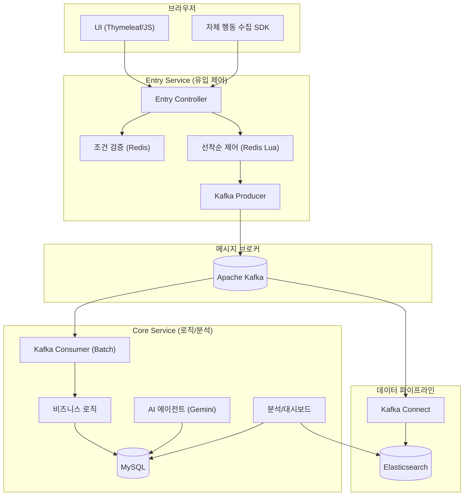
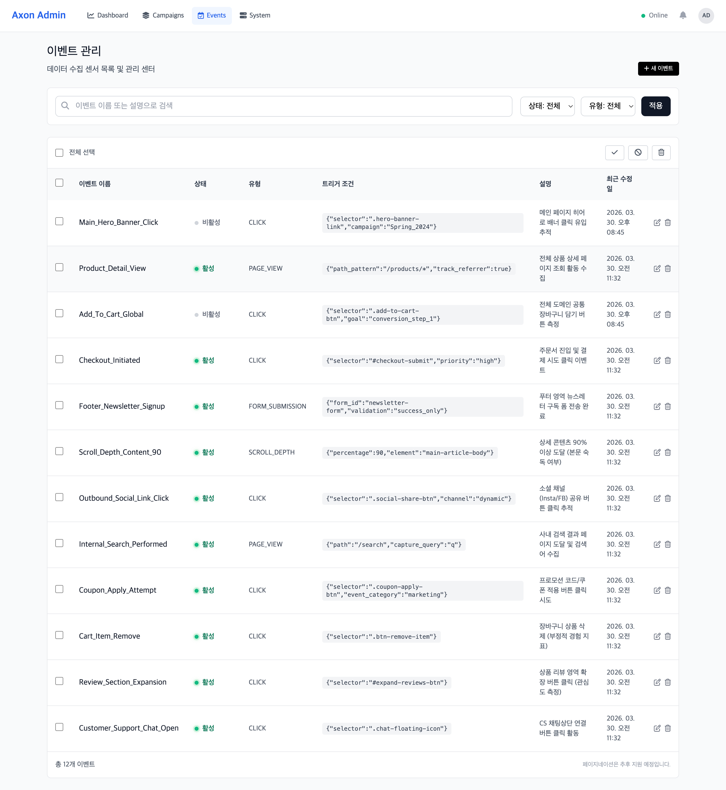

<h1 align="center">Axon: 마케팅 인텔리전스 및 실시간 분석 플랫폼</h1>
<p align="center">
  <b>선착순 이벤트 제어와 고객 생애 가치(LTV) 분석을 결합한 통합 CRM 솔루션</b><br>
  대규모 트래픽 환경에서의 데이터 정합성 보장 및 비동기 파이프라인 구축
</p>

<p align="center">
  
  
  
  
  
</p>

---

## 프로젝트 개요
Axon은 대규모 프로모션 시 발생하는 **급격한 접속자 유입 상황에서도 시스템 안정성을 유지**하고, 유입된 고객 데이터를 실시간으로 분석하여 **마케팅 의사결정을 돕는 지능형 플랫폼**입니다. 요청 수집과 비즈니스 로직 처리를 물리적으로 분리한 **부하 충격 완화 구조**를 통해 대규모 스파이크 트래픽을 안정적으로 수용합니다.

---

## 비즈니스 시나리오 및 성과
> "3,000명의 접속자가 2초 만에 200개의 한정 상품에 응모하며 대량의 행동 로그를 생성하는 극한 상황"을 가정하여 검증을 수행했습니다.

| 측정 항목 | 결과 수치 | 비고 |
| :--- | :---: | :--- |
| **최대 가용량** | **2,900 RPS / 3,000 VU** | 스파이크 구간 피크 처리량 실측 |
| **응답 품질** | **Avg 1.2s / p95 3.99s** | 극한 부하 상황의 지연 시간 관리 |
| **통합 로그 처리량** | **20,000+ EPS** | 인프라/미들웨어/애플리케이션 로그 통합 적재 |
| **선착순 정합성** | **오버부킹 0건** | 10,655건 응모 중 정확히 200건만 당첨 |
| **데이터 무결성** | **Loss 0%** | 21,310건의 행동 로그 전량 유실 없이 적재 완료 |
| **시스템 안정성** | **에러율 0.00%** | 비즈니스 응답(410, 409) 제외 서버 에러 0건 |

<details>
<summary><b>부하 테스트 데이터 상세 해석</b></summary>

- **꼬리 지연 시간(Tail Latency) 방어**: 3,000명의 동시 접속자가 쏟아지는 상황에서도 p95 지연 시간을 3.99s 이내로 관리하여, 시스템 응답 불능 없이 모든 요청을 완주했습니다.
- **복합 워크로드 수용**: 전체 트래픽의 62%를 차지하는 행동 로그 수집과 31%의 정밀 선착순 제어가 혼재된 상황에서도, 서버 붕괴 없이 모든 요청을 안정적으로 처리했습니다.
- **의도된 비즈니스 응답**: k6 결과상의 `http_req_failed(30.4%)`는 시스템 오류가 아닌, 품절(410) 및 중복 참여 차단(409)이라는 설계된 비즈니스 로직의 정상 작동 결과입니다.
</details>

---

## 시스템 아키텍처

### 서비스 논리 구조
요청 수집(Entry)과 비즈니스 처리(Core) 서비스를 분리하여 부하 충격을 완화하고, Kafka를 통해 데이터 처리 속도를 조절하는 **배압 조절(Backpressure)** 구조를 채택했습니다.



### 인프라 및 클라우드 구성
<p align="center">
  
</p>

- **Cloud Platform**: KT Cloud K2P (Kubernetes to Production) 환경 기반.
- **Network & Security**: Public IP를 특정 워커 노드에 1:1 매핑(Static NAT)하고, 방화벽 설정을 통해 특정 포트만 허용하는 구조.
- **배포 자동화 (CI/CD)**: GitHub Actions를 통해 메인 브랜치 푸시 시 Docker 이미지 빌드 및 K2P 클러스터 자동 배포 수행.

---

## 핵심 엔지니어링 사례
> 상세한 기술적 의사결정 과정은 **[Architecture Deep-Dive 포트폴리오](./docs/PORTFOLIO_DIAGRAMS.md)**에서 확인하실 수 있습니다.

### 1. 동시성 제어: 비동기 환경의 순서 정합성 해결
- **[Problem]** 초기 설계 시 선착순 판단을 Core 서비스에 두었으나, Kafka 비동기 소비 특성상 요청 순서와 처리 순서가 뒤바뀌는 정합성 오류 발견.
- **[Solution]** 검증 로직을 시스템 최전방인 **Entry 서비스로 전진 배치**하여 유입 시점에 즉각 당첨을 확정하는 구조로 개선.
- **[Optimization]** Redis Lua 스크립트를 도입하여 중복 체크와 수량 차감을 단일 원자적 연산으로 처리함으로써 동시성 이슈 근본 해결.

### 2. 데이터 신뢰성: 장애 파급 차단 및 지연 동기화
- **[Problem]** 대량의 벌크 저장 중 단 1건의 오류가 전체 배치(20건)를 롤백시켜, 정상 데이터 적재까지 지연되는 '배치 오염' 현상 확인.
- **[Solution]** `REQUIRES_NEW` 전파 속성을 적용하여 개별 트랜잭션을 물리적으로 분리하고, 실패 건만 **Dead Letter Queue(DLQ)**로 격리하는 폴백 전략 구축.
- **[Result]** 비정상 데이터 유입 시에도 파이프라인 중단 없이 데이터 유실 0% 실증.

### 3. 성능 최적화: 쓰기 병목 해소를 위한 지연 동기화
- **[Problem]** 구매 확정 시 상품 재고와 유저 요약 정보를 실시간 업데이트할 때 발생하는 DB Row Lock 경합이 시스템 응답 마비의 주범임을 파악.
- **[Solution]** 메인 트랜잭션에서는 구매 로그만 남기고, 재고 차감 등 무거운 쓰기 작업은 스케줄러가 사후 정산하는 **결과적 일관성(Eventual Consistency)** 모델 채택.
- **[Result]** DB 락 경합 원천 제거를 통해 커넥션 풀 가동률 안정화 및 동일 자원 대비 처리량 극대화.

### 4. 데이터 분석: 수집 시점 역정규화를 통한 조회 성능 개선
- **[Problem]** 여러 테이블에 분산된 로그를 조인하여 실시간 퍼널 통계를 산출할 때 발생하는 심각한 조회 지연 및 N+1 문제.
- **[Solution]** 데이터 수집 단계에서 메타데이터를 결합하여 전송하는 **의도적 역정규화(Denormalization)** 설계 적용.
- **[Result]** Elasticsearch 단일 인덱스 쿼리만으로 통계를 산출하여 대시보드 조회 성능 **440% 향상**.

---

## 주요 기능

### 1. 마케팅 인텔리전스 (Analytics & AI)

#### 계층형 성과 대시보드
<p align="center">
  
</p>

- **다각도 지표 분석**: 전역 성과(Global), 캠페인 단위, 개별 활동(Activity)으로 이어지는 계층형 분석 환경 제공.
- **코호트 및 LTV 추적**: 유입 고객의 재구매율, 고객 생애 가치(LTV), 리텐션 히트맵을 통한 장기적 수익성 지표 시각화.

#### 하이브리드 AI 전략 에이전트 (Gemini 2.5 Flash-lite)
<p align="center">
  
</p>

- **데이터 기반 리포팅**: 실시간 지표(RAG)와 분석 도구(Tool Calling)를 결합하여 "LTV/CAC 기반 예산 재분배 전략" 등 구체적인 리포트 자동 생성.
- **시스템 최적화**: 필요한 데이터만 선택 호출하는 구조를 통해 전수 주입 방식 대비 **토큰 소모량 80% 절감** 및 DB 조회 부하 경감.

#### 실시간 지표 스트리밍
<p align="center">
  
</p>

- **지연 없는 가시성**: SSE(Server-Sent Events) 프로토콜을 활용하여 이벤트 발생부터 대시보드 반영까지의 파이프라인 정합성 실시간 유지.

### 2. 운영 및 시스템 검증 (Operation & Verification)

#### CRM 운영 관리 및 동적 이벤트 수집
<p align="center">
  
</p>

- **코드 수정 없는 추적**: 자체 개발한 JS SDK와 연동하여 관리자 화면에서 클릭, 페이지 뷰 등 수집 조건을 동적으로 등록 및 제어.
- **캠페인 생명주기 관리**: 마케팅 활동의 상태(활성/비활성), 한정 수량, 예산 등을 실시간으로 관리하는 운영 콘솔 제공.

#### 대규모 트래픽 수용성 검증
<p align="center">
  
</p>

- **극한 환경 테스트**: 3,000 VU(Peak 2,900 RPS) 부하 상황에서도 시스템 붕괴 없이 모든 요청을 안정적으로 처리하는 가용성 실증.
- **데이터 정합성 보장**: 10,000건 이상의 선착순 응모 시도 중 정확히 한정 수량만큼만 당첨을 확정하는 무결성 검증 완료.

---

## 기술 스택
- **Application**: Java 21, Spring Boot 3.x, Virtual Threads
- **Messaging**: Apache Kafka (KRaft), Redis
- **Storage**: MySQL 8 (Master-Slave), Elasticsearch 8
- **Infrastructure**: Kubernetes (K2P), Nginx Ingress Controller
- **Monitoring**: Prometheus, Grafana, Fluent Bit, Kibana

---

## 빠른 시작 (Getting Started)
본 프로젝트는 클라우드 환경(K2P)을 기반으로 설계되었으나, 로컬 검증을 위해 Docker Compose를 통한 원클릭 인프라 구축을 지원합니다.

1. **인프라 환경 구성**
   ```bash
   docker-compose up -d
   ```
2. **서비스 실행**
   ```bash
   ./gradlew :entry-service:bootRun
   ./gradlew :core-service:bootRun
   ```
3. **대시보드 접속**
   - 브라우저에서 `http://localhost:8080/admin/dashboard/1` 접속 시 실시간 지표 및 AI 분석 기능을 확인할 수 있습니다.
