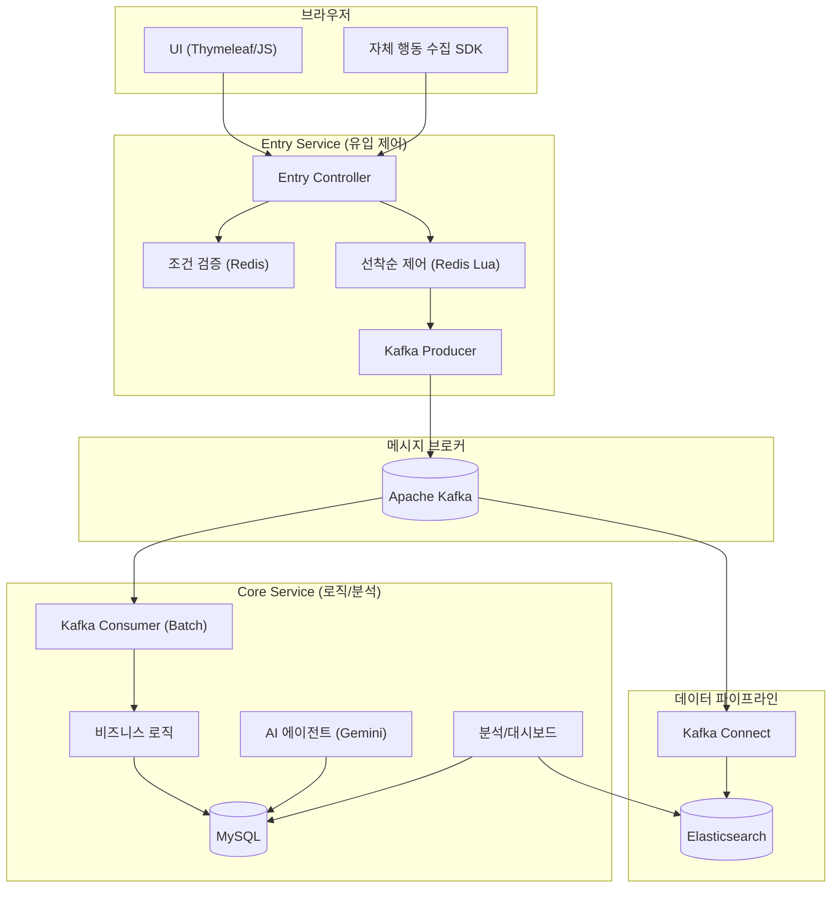
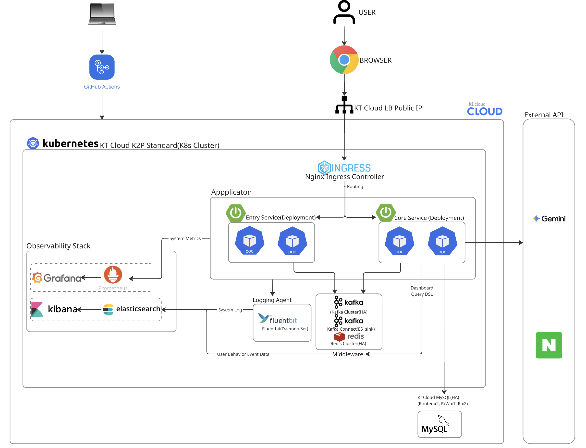
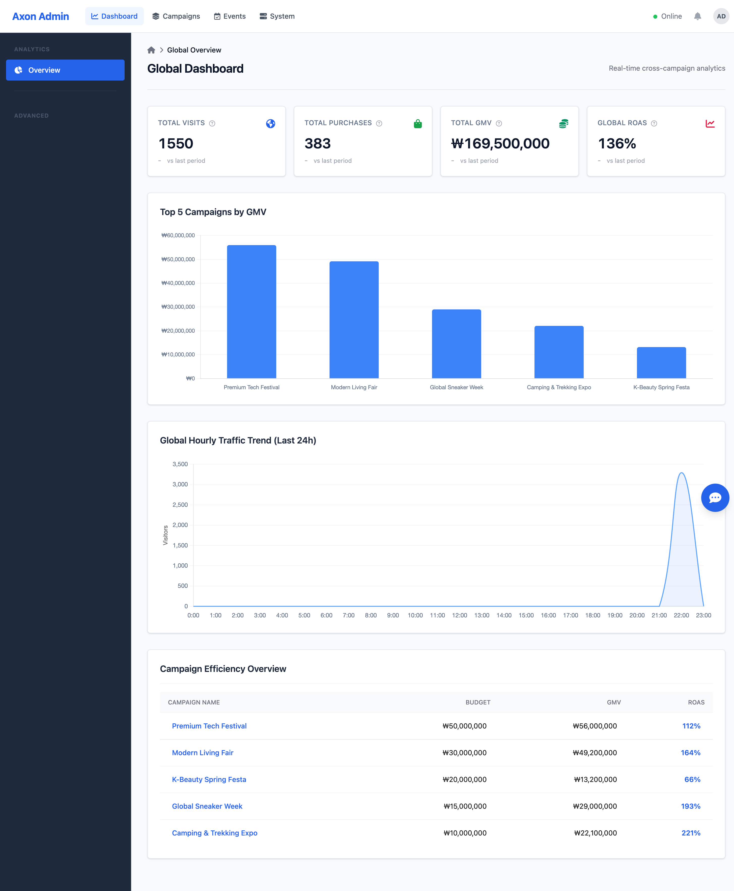
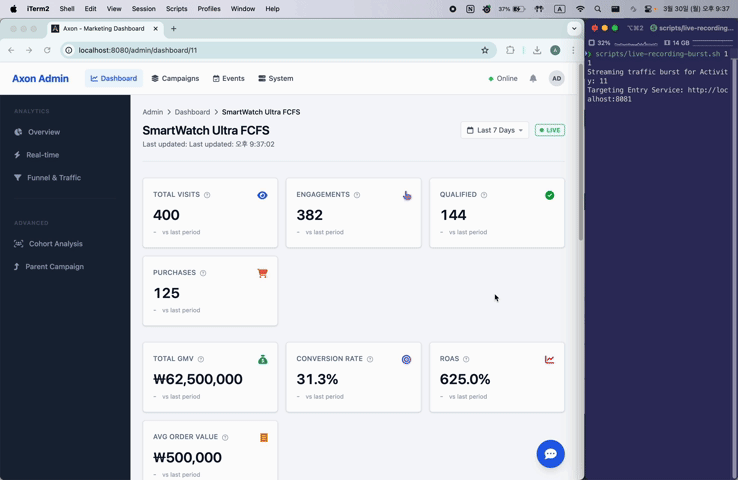
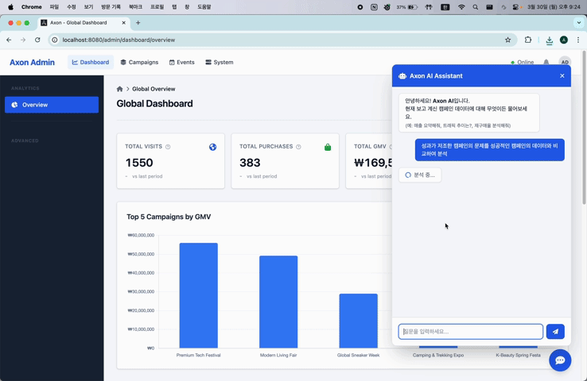
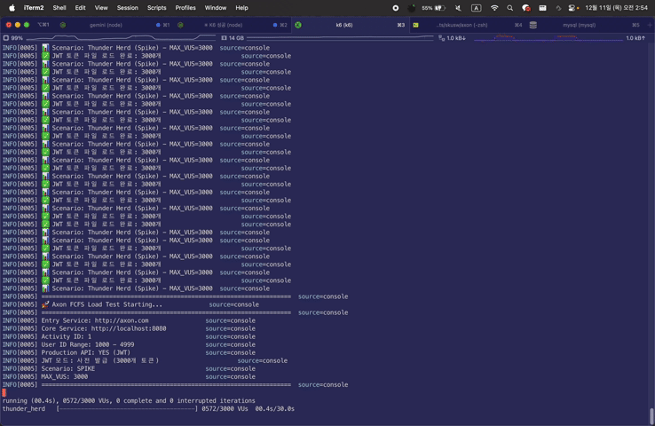
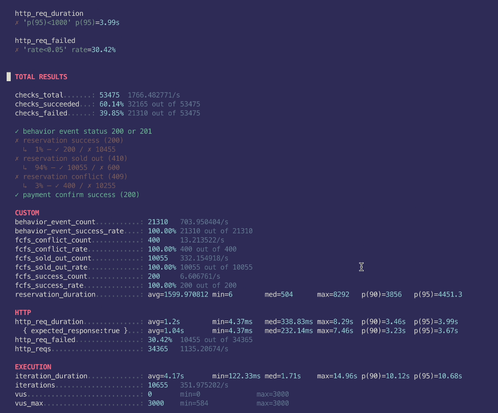
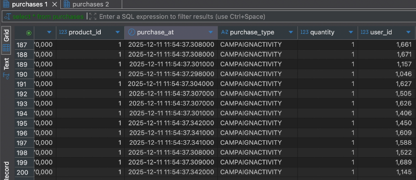

# Axon: 실시간 대규모 트래픽 처리 및 마케팅 분석 플랫폼
> **선착순 이벤트 제어와 고객 생애 가치(LTV) 분석을 결합한 통합 CRM 솔루션**
> *(IITP 과기정통부 대학기업협력형 SW아카데미 — 오브젠 기업 연계 프로젝트)*

Axon은 대규모 프로모션 시 발생하는 **급격한 접속자 유입 상황에서도 시스템 안정성을 유지**하고, 유입된 고객 데이터를 실시간으로 분석하여 **마케팅 의사결정을 돕는 지능형 플랫폼**입니다. 요청 수집과 비즈니스 로직 처리를 물리적으로 분리한 **부하 충격 완화 구조**를 통해 대규모 스파이크 트래픽을 안정적으로 수용합니다.

---

## 비즈니스 시나리오 및 성과
"3,000명의 접속자가 2초 만에 200개의 한정 상품에 응모하며 대량의 행동 로그를 생성하는 극한 상황"을 가정하여 시스템의 성능과 정합성을 검증했습니다.

| 측정 지표 | 결과 | 비고 |
| :--- | :--- | :--- |
| **최대 가용량** | **2,900 RPS / 3,000 VU** | 스파이크 구간 피크 처리량 실측 |
| **응답 품질** | **Avg 1.2s / p95 3.99s** | 3,000 VU 극한 부하 상황의 지연 시간 관리 |
| **통합 로그 처리량** | **20,000+ EPS** | 인프라/미들웨어/애플리케이션 로그 통합 적재 |
| **선착순 정합성** | **오버부킹 0건** | 10,655건의 응모 중 정확히 200건만 당첨 확정 |
| **데이터 무결성** | **Loss 0%** | 21,310건의 행동 로그 전량 유실 없이 적재 |
| **시스템 안정성** | **에러율 0.00%** | 전체 34,365건 요청 중 5XX 서버 에러 0건 |

> [!NOTE]
> **부하 테스트 데이터 해석**  
> - **꼬리 지연 시간(Tail Latency) 방어**: 3,000명의 동시 접속자가 쏟아지는 상황에서도 p95 지연 시간을 3.99s 이내로 관리하여, 시스템 응답 불능 없이 모든 요청을 완주했습니다.
> - **복합 워크로드 수용**: 전체 트래픽의 62%를 차지하는 행동 로그 수집과 31%의 정밀 선착순 제어가 혼재된 상황에서도, 서버 붕괴 없이 모든 요청을 안정적으로 처리했습니다.
> - **의도된 비즈니스 응답**: k6 결과상의 http_req_failed(30.4%)는 시스템 오류가 아닌, 품절(410) 및 중복 참여 차단(409)이라는 설계된 비즈니스 로직의 정상 작동 결과입니다.

---

## 시스템 아키텍처

### 1. 서비스 논리 구조
사용자의 요청이 각 서비스를 거쳐 데이터베이스와 AI 엔진으로 전달되는 흐름입니다. 트래픽 진입부와 로직 처리부 사이에 Kafka를 배치하여 **배압 조절(Backpressure)**이 가능하도록 설계했습니다.



### 2. 인프라 및 클라우드 구성
네트워크 격리 및 K8s 클러스터링을 통한 운영 환경 구성도입니다.

<p align="center">
  
</p>

- **Cloud Platform**: KT Cloud K2P (Kubernetes to Production) 환경 기반.
- **Network & Security**: Public IP를 특정 워커 노드에 1:1 매핑(Static NAT)하고, 방화벽 설정을 통해 특정 포트만 허용하는 폐쇄망 구조 지향.
- **Middleware Cluster**: 고가용성을 위해 Kafka(KRaft), Redis, Elasticsearch를 K8s 내부 ClusterIP 서비스로 연동.
- **배포 자동화 (CI/CD)**: GitHub Actions를 통해 메인 브랜치 푸시 시 Docker 이미지 빌드 및 K2P 클러스터로의 자동 배포를 수행하도록 구성했습니다.

---

## 핵심 엔지니어링 및 기술적 의사결정

상세한 설계 의도와 트러블슈팅 과정은 **[Architecture Deep-Dive 포트폴리오](./docs/PORTFOLIO_DIAGRAMS.md)**에서 확인하실 수 있습니다.

### 1. 동시성 제어: 비동기 환경의 순서 정합성 해결 및 Lock-free 설계
*   **검증 로직의 전진 배치**: 초기 설계 시 선착순 판단을 Core 서비스에 두었으나, Kafka 비동기 소비 특성상 요청 순서와 처리 순서가 뒤바뀌는 정합성 오류를 발견했습니다. 이를 해결하기 위해 **검증 로직을 요청 진입점(Entry)으로 전진 배치**하여 유입 즉시 당첨을 확정하는 구조로 개선했습니다.
*   **Redis Lua Script 도입**: Redisson 분산 락의 네트워크 오버헤드를 극복하기 위해, 중복 체크와 수량 차감을 Redis 내부에서 단일 연산으로 처리하는 Lua 스크립트를 도입했습니다. 락 대기 시간을 제거하여 **응답 속도를 Sub-ms 단위로 개선**하고, 10,000건 이상의 동시 요청 속에서 **오버부킹 0건**을 달성했습니다.
*   **JDK 21 가상 스레드(Virtual Threads)**: 대규모 커넥션 처리를 위해 WebFlux 도입을 검토했으나, 비즈니스 로직의 복잡도와 디버깅 난이도를 고려하여 **동기식 코드 스타일을 유지하면서도 리소스를 최적화**할 수 있는 가상 스레드 기반의 논블로킹 통신을 채택했습니다.

### 2. 데이터 신뢰성: 장애 파급 차단 및 지연 동기화
*   **트랜잭션 격리 및 배치 폴백**: 대량의 벌크 저장 중 단 1건의 오류가 전체 배치를 롤백시켜 데이터 적재가 지연되는 '배치 오염'을 막기 위해, **`REQUIRES_NEW` 전파 속성과 Dead Letter Queue(DLQ)**를 결합했습니다. 실패 건만 격리하고 나머지 데이터는 보존하는 폴백 전략을 구축하여 데이터 유실 0%를 실증했습니다.
*   **지연 재고 동기화(Deferred Sync)**: 구매 확정 시 상품 재고와 유저 요약 정보를 실시간 업데이트할 때 발생하는 DB Row Lock 경합을 제거하기 위해, 구매 로그를 기반으로 스케줄러가 사후 정산하는 **결과적 일관성(Eventual Consistency)** 모델을 도입했습니다.
*   **비동기 배압 조절**: 폭발적인 유입 트래픽이 메인 DB에 직접적인 충격을 주지 않도록 **Kafka를 완충재로 활용**했습니다. DB가 가용 자원에 맞춰 메시지를 소비하게 함으로써 시스템 전체의 가용성을 유지합니다.

### 3. 데이터 파이프라인: 수집 시점 역정규화 및 분석 최적화
*   **경량 파이프라인 설계**: 사용자 행동 로그가 **자체 SDK → 서버 → Kafka → Kafka Connect → Elasticsearch** 인덱스에 적재되는 경량 파이프라인을 구현하여 인프라 의존성을 낮추고 성능을 높였습니다.
*   **수집 시점 역정규화(Denormalization)**: 수백만 건의 로그를 대시보드에서 조인하여 조회할 때 발생하는 성능 저하를 해결하기 위해, SDK 단계에서 메타데이터를 결합하여 전송하는 구조를 설계했습니다. Elasticsearch 단일 인덱스 쿼리만으로 통계를 산출하여 **조회 성능을 440% 향상**시켰습니다.
*   **SSE(Server-Sent Events) 스트리밍**: 리소스가 무거운 WebSocket이나 서버 부하가 심한 Polling 대신, 단방향 스트리밍인 SSE를 선택하여 대규모 접속 환경에서도 실시간 지표 가시성을 최적화했습니다.

### 4. 인프라 최적화: 커넥션 폭증 대응
*   **네트워크 계층 최적화**: 3,000 VU 스파이크 테스트 시 발생하는 Connection Reset에 대응하기 위해 리눅스 커널의 **`net.core.somaxconn`** 및 **`tcp_max_syn_backlog`** 파라미터를 1024로 증설했습니다.
*   **가용성 확보**: Ingress의 연결 유지(Keep-alive) 및 Accept-count 설정을 조정하여, 단시간 내에 몰리는 대량의 TCP 핸드셰이크 부하를 완화하고 서버 도달률을 극대화했습니다.

---

## 주요 기능

### 계층형 데이터 분석
<p align="center">
  
</p>

#### 실시간 지표 스트리밍 및 파이프라인
<p align="center">
  
</p>

- 서버 사이드 푸시(SSE) 기반의 전용 지표 스트리밍 구현.
- 이벤트 수집부터 대시보드 반영까지의 전체 데이터 파이프라인 정합성 확보.

<details>
<summary>계층형 대시보드 상세 보기 (Global/Campaign/Activity)</summary>

| 분석 레벨 | 주요 분석 데이터 및 기능 | 상세 지표 | 상세 화면 |
| :--- | :--- | :--- | :--- |
| **Level 1: 전역 (Global)** | 전체 캠페인 통합 성과 | 매출/방문자 랭킹, 통합 ROAS | [상세 보기](./docs/assets/recordings/dashboard_overview.png) |
| **Level 2: 캠페인 (Campaign)** | 소속 활동(Activity) 성과 요약 | 퍼널 전환율, 성과 기여도 | [상세 보기](./docs/assets/recordings/campaign_admin.png) |
| **Level 3: 활동 (Activity)** | 개별 활동 심층 및 코호트 분석 | 전환 퍼널, LTV, Retention 히트맵 | [[지표 보기]](./docs/assets/recordings/dashboard_11.png) [[코호트 보기]](./docs/assets/recordings/dashboard_cohort.png) |
</details>

### 하이브리드 AI 에이전트 (Gemini 2.5 Flash-lite)
<p align="center">
  
</p>

- 현재 페이지 데이터를 지식(RAG)으로 참조하고, 필요 시 도구(Tool-calling)를 통해 외부 지표를 탐색하는 하이브리드 엔진 구축.
- 수집된 정량 데이터를 바탕으로 "LTV/CAC 기반 예산 재분배 전략" 등 구체적인 분석 리포트 생성.

### CRM 운영 프레임워크
<details>
<summary>CRM 운영 화면 상세 (Campaign/Event Management)</summary>

| 관리 항목 | 주요 기능 및 운영 명세 | 상세 화면 |
| :--- | :--- | :--- |
| **캠페인 및 활동 관리** | 캠페인/활동의 상태 제어, 신규 등록 및 생명주기 관리 | [상세 보기](./docs/assets/recordings/campaign_admin.png) |
| **동적 이벤트 추적 관리** | 코드 수정 없는 분석 지표 및 사용자 행동 수집 조건 등록 | [상세 보기](./docs/assets/recordings/event_admin.png) |
</details>

---

## 부하 테스트 결과 (Verified)

<p align="center">
  
</p>

| 측정 항목 | 결과 | 비고 |
| :--- | :--- | :--- |
| **최대 가용량** | **2,900 RPS / 3,000 VU** | k6 부하 테스트 기준 |
| **로그 처리량** | **20,000+ EPS** | Kafka 및 Elasticsearch 실시간 적재량 |
| **선착순 정합성** | **오버부킹 0건** | 한정 수량 원자적 차감 검증 |
| **데이터 무결성** | **유실률 0%** | 유입 대비 처리량 일치 확인 |

<table>
  <tr>
    <td></td>
    <td></td>
  </tr>
  <tr align="center">
    <td><b>[k6 최종 결과] 3,000 VU 에러율 0%</b></td>
    <td><b>[정합성 검증] 유입 대비 처리량 일치 확인</b></td>
  </tr>
</table>

---

## 기술 스택
*   **Application**: Java 21, Spring Boot 3.x, Virtual Threads
*   **Messaging**: Apache Kafka (KRaft), Redis
*   **Storage**: MySQL 8 (Master-Slave), Elasticsearch 8
*   **Infrastructure**: Kubernetes (K2P), Nginx Ingress Controller
*   **Monitoring**: Prometheus, Grafana, Fluent Bit, Kibana

---

## 빠른 시작 (Getting Started)

1. **인프라 환경 구성**
   ```bash
   docker-compose up -d
   ```
2. **서비스 실행**
   ```bash
   ./gradlew :entry-service:bootRun
   ./gradlew :core-service:bootRun
   ```
3. **대시보드 접속**
   * 브라우저에서 `http://localhost:8080/admin/dashboard/1` 로 접속하여 실시간 지표 및 AI 분석 기능을 확인할 수 있습니다.
