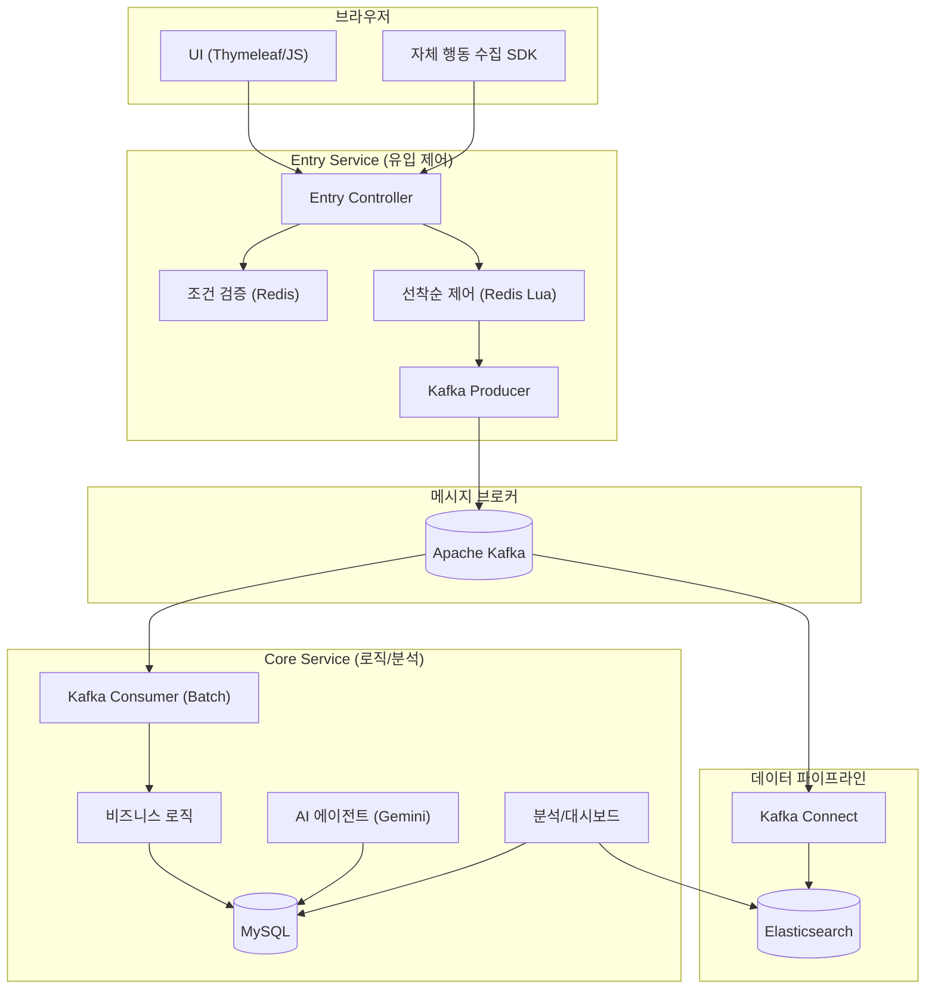
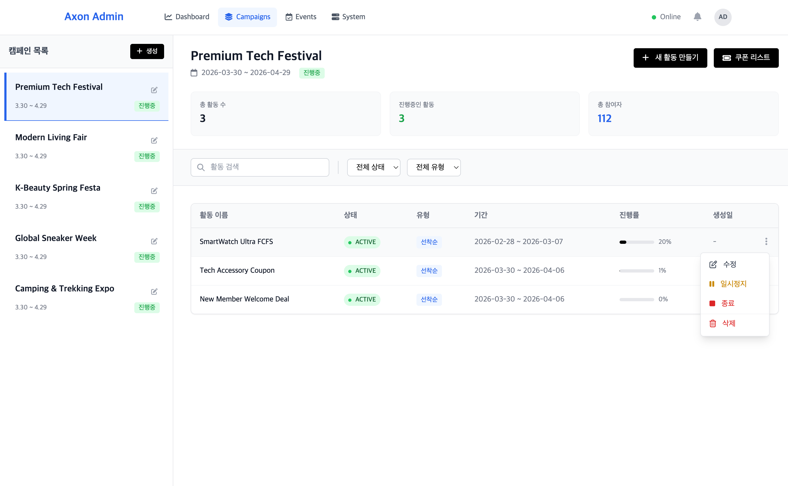
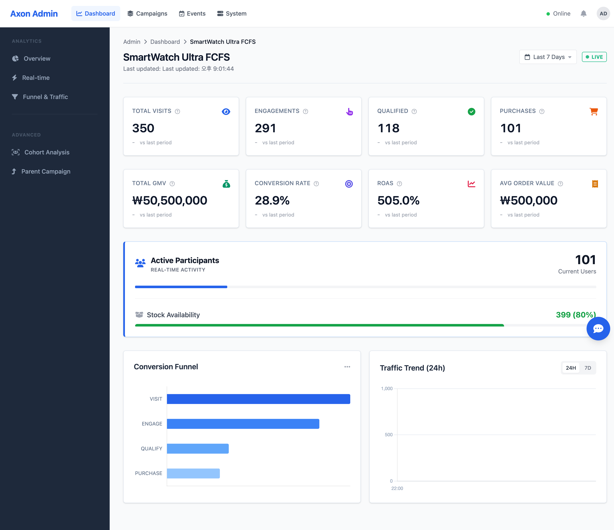
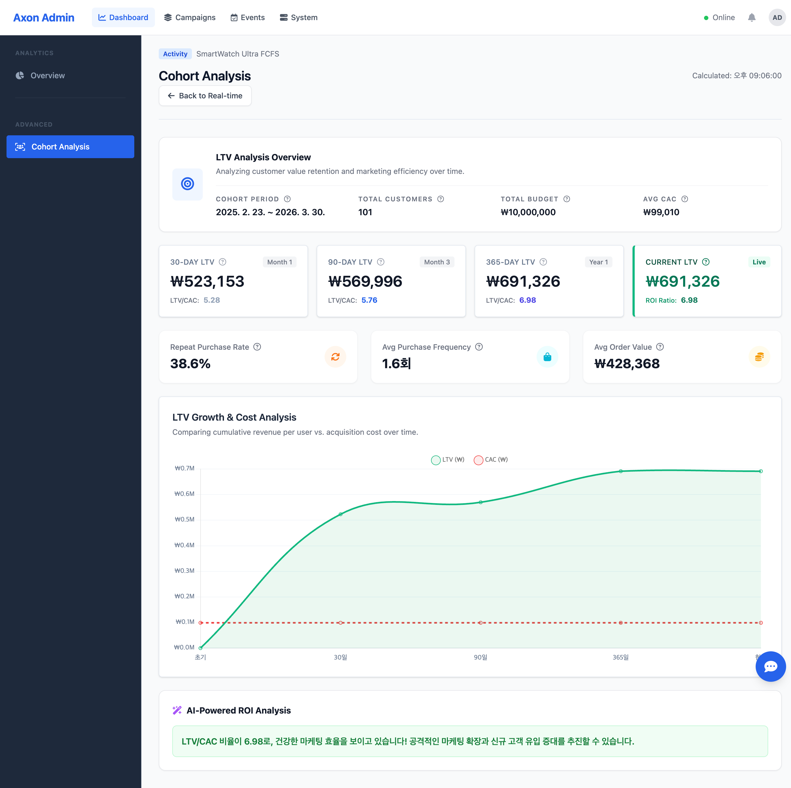

<h1 align="center">Axon: 이벤트 기반 캠페인/트래픽 처리 백엔드 플랫폼</h1>
<p align="center">
  <b>스파이크 트래픽, 비동기 정합성, 행동 데이터 분석을 다루는 MSA 기반 백엔드 프로젝트</b><br>
  Redis 원자 처리, Kafka 이벤트 파이프라인, MySQL 정합성 보정, 운영 대시보드를 중심으로 설계했습니다.
</p>

<p align="center">
  
  
  
  
  
</p>

---

## 프로젝트 개요
Axon은 선착순 참여, 결제 확정, 행동 이벤트 수집, 실시간 대시보드처럼 짧은 시간에 몰리는 이벤트 흐름을 안정적으로 처리하기 위한 백엔드 플랫폼입니다.

Entry 서비스는 사용자 요청을 빠르게 수용하고 Redis 기반 원자 연산으로 선착순 결과를 즉시 판정합니다. Core 서비스는 Kafka를 통해 전달된 후속 이벤트를 처리하고, MySQL/Elasticsearch에 분석 가능한 형태로 저장합니다. 이를 통해 요청 수신부와 비즈니스 처리부를 분리하고, 트래픽 집중·비동기 처리·데이터 정합성 문제를 함께 다룹니다.

---

## 해결한 백엔드 문제

| 문제 | 해결 방향 | 확인한 결과 |
| :--- | :--- | :--- |
| 스파이크 트래픽에서 선착순 오버부킹 위험 | DB Row Lock 대신 Redis Lua 원자 연산으로 중복 참여와 수량 차감을 단일 처리 | 200개 한정 수량에서 오버부킹 없이 200건 성공 |
| 요청 수신부가 결제/저장 지연까지 떠안는 구조 | Entry/Core 분리와 Kafka 기반 후속 처리로 수신부와 처리부 책임 분리 | Entry는 Redis 중심 경량 경로, Core는 구매/분석 저장 전담 |
| Kafka 배치 처리 중 단건 실패가 전체 롤백으로 전파될 위험 | 개별 재시도, 실패 격리, MySQL Unique Key, Reconciliation 흐름으로 보정 | 정상 데이터 보존과 중복 적재 방어 경로 확보 |
| 캠페인별 이벤트가 흩어져 운영 지표화가 어려운 문제 | VISIT/ENGAGE/QUALIFY/PURCHASE 공통 퍼널 단계로 집계 | 활동별 이탈 지점과 구매 전환 흐름 비교 가능 |
| JVM 루프 기반 집계로 인한 배치 성능 저하 | SQL 집계와 인덱스 기반 조회로 오프로딩 | 코호트/LTV 배치 처리 시간 68% 단축 |

---

## 비즈니스 시나리오 및 성과
> 대표 성능 검증은 KT Cloud K2P 기반 Kubernetes 환경에서 수행했습니다. "3,000명의 접속자가 2초 만에 200개의 한정 상품에 응모하며 대량의 행동 로그를 생성하는 상황"을 가정했습니다.

| 측정 항목 | 결과 수치 | 비고 |
| :--- | :---: | :--- |
| **최대 가용량** | **2,900 RPS / 3,000 VU** | 스파이크 구간 피크 처리량 실측 |
| **응답 품질** | **Avg 1.2s / p95 3.99s** | 스파이크 부하 상황의 지연 시간 관리 |
| **통합 로그 처리량** | **20,000+ EPS** | 인프라/미들웨어/애플리케이션 로그 통합 적재 |
| **선착순 정합성** | **오버부킹 0건** | 10,655건 응모 중 정확히 200건만 당첨 |
| **데이터 무결성** | **Loss 0%** | 21,310건 행동 로그 적재 결과 기준 |
| **시스템 안정성** | **서버 에러 0건** | 품절(410), 중복 참여(409) 등 의도된 비즈니스 응답 제외 |

<details>
<summary><b>부하 테스트 데이터 상세 해석</b></summary>

- **꼬리 지연 시간(Tail Latency) 방어**: 3,000명의 동시 접속자가 쏟아지는 상황에서도 p95 지연 시간을 3.99s 이내로 관리하여, 시스템 응답 불능 없이 모든 요청을 완주했습니다.
- **복합 워크로드 수용**: 전체 트래픽의 93%를 차지하는 행동 로그 수집(62%)과 선착순 응모(31%)가 혼재된 상황에서, 나머지 7%의 결제 및 인증 트래픽까지 함께 처리했습니다.
- **의도된 비즈니스 응답**: k6 결과상의 `http_req_failed(30.4%)`는 시스템 오류가 아닌, 품절(410) 및 중복 참여 차단(409)이라는 설계된 비즈니스 로직의 정상 작동 결과입니다.
- **캡처 해석 기준**: 아래 k6 캡처는 당시 일반 HTTP threshold(`p95<1s`, `http_req_failed<5%`)가 남아 있던 실행 결과라 threshold 실패 표시가 포함되어 있습니다. 이후 선착순 테스트 목적에 맞게 성공 기준을 `정확히 200명 성공`, `알 수 없는 예약 에러 0건`, `행동 이벤트 성공률 100%`, `예약 p95 5s 이하`로 재정의했습니다.
</details>

---

## 시스템 아키텍처

### 서비스 논리 구조
요청 수집(Entry)과 비즈니스 처리(Core) 서비스를 분리하여 부하 충격을 완화하고, Kafka를 통해 데이터 처리 속도를 조절하는 **배압 조절(Backpressure)** 구조를 채택했습니다.



### 인프라 및 클라우드 구성
<p align="center">
  
</p>

### 실행 및 검증 환경

- **대표 검증 환경**: KT Cloud K2P(Kubernetes to Production) 기반. Core/Entry 서비스 분리 배포, Kafka/Redis/MySQL/Elasticsearch, Prometheus/Grafana, Fluent Bit/Kibana 구성을 통해 3,000 VU 스파이크 시나리오를 검증했습니다.
- **현재 재현 환경**: Oracle Cloud A1 Flex VM + Docker Compose. Core/Entry/MySQL/Redis/Kafka를 단일 VM에서 실행하고, k6 baseline과 Pinpoint/Actuator 기반 병목 분석을 위한 경량 실행 경로로 사용합니다.
- **Network & Security**: K2P 환경에서는 Public IP를 특정 워커 노드에 1:1 매핑(Static NAT)하고, 방화벽 설정으로 필요한 포트만 허용했습니다.
- **배포 자동화**: K2P용 GitHub Actions/Kubernetes 매니페스트는 `Legacy Manual` 경로로 보존하고, 현재 VM 배포는 `compose.app.yml` 기반 GitHub Actions workflow로 운영합니다.

---

## 핵심 엔지니어링 사례
> 상세한 기술적 의사결정 과정은 [Architecture Deep-Dive 포트폴리오](./docs/PORTFOLIO_MASTER.md)에서 확인하실 수 있습니다.

### 1. 비동기 환경의 순서 정합성 해결을 위한 로직 전진 배치
초기 설계 시 선착순 판단을 Core 서비스에 두었으나, Kafka 비동기 소비 특성상 요청-처리 순서 불일치 현상이 발견되었습니다. 이를 해결하기 위해 검증 로직을 시스템 최전방인 **Entry 서비스로 전진 배치**하여 유입 시점에 즉각 당첨을 확정하는 구조로 개선했습니다. 더불어 Redis Lua 스크립트를 도입하여 중복 체크와 수량 차감을 단일 연산으로 처리함으로써 오버부킹 0건을 달성했습니다.

### 2. 트랜잭션 격리 및 장애 파급 차단을 통한 데이터 신뢰성 확보
대량 저장 중 단 1건의 오류가 전체 배치를 롤백시키는 '배치 오염'을 방지하기 위해 `REQUIRES_NEW` 속성을 적용하여 개별 트랜잭션을 물리적으로 분리했습니다. 실패 건은 격리하고 나머지 데이터는 보존하는 폴백 전략을 구축하여, 비정상 데이터 유입 시에도 파이프라인 전체가 중단되지 않도록 설계했습니다.

### 3. 쓰기 병목 해소를 위한 지연 동기화 설계
구매 확정 시 상품 재고와 유저 요약 정보를 실시간 업데이트할 때 발생하는 DB Row Lock 경합을 해결하기 위해 **결과적 일관성(Eventual Consistency)** 모델을 채택했습니다. 메인 트랜잭션에서는 구매 로그만 남기고, 재고 차감 등 무거운 쓰기 작업은 스케줄러가 사후 정산하게 하여 커넥션 풀 안정화 및 처리량 극대화에 성공했습니다.

### 4. 수집 시점 역정규화를 통한 조회 성능 개선
수백만 건의 로그를 대시보드에서 조인 조회할 때 발생하는 N+1 문제를 해결하기 위해, 데이터 수집(SDK) 단계에서 메타데이터를 결합하여 전송하는 **의도적 역정규화(Denormalization)** 설계를 적용했습니다. 이를 통해 Elasticsearch 단일 인덱스 쿼리만으로 통계를 산출하여 대시보드 조회 성능을 **440% 향상**시켰습니다.

### 5. 데이터 무결성 최후의 보루: 사후 대사(Reconciliation) 아키텍처
사용자 응답 경로와 후속 영속성 처리를 분리하면서 생길 수 있는 트랜잭션 롤백 시차와 누락 가능성을 보완하기 위해, 유휴 시간대에 작동하는 비동기 대사(Reconciliation) 스케줄러를 구축했습니다. `REQUIRES_NEW` 기반 개별 재시도와 백그라운드 정합성 점검을 함께 두어 가용성과 무결성 사이의 타협점을 관리했습니다.

---

## 주요 기능

### 1. 마케팅 인텔리전스 (Analytics & AI)

#### 계층형 성과 대시보드
<p align="center">
  
  <br><em>Level 1: 전역 성과 - 전체 캠페인 통합 매출 및 효율 지표</em>
</p>

<p align="center">
  
  <br><em>Level 2: 캠페인 성과 - 개별 캠페인 내 활동들의 성과 기여도 비교</em>
</p>

<p align="center">
  
  <br><em>Level 3: 활동 심층 분석 - 실시간 참여 지표 및 유입 트렌드 모니터링</em>
</p>

<p align="center">
  
  <br><em>코호트 및 LTV 분석 - 유입 고객의 재구매율 및 장기 가치 추적</em>
</p>

- **코호트 및 LTV 분석**: 마케팅 유입 시점(Cohort)을 기준으로 생애 가치(LTV)와 획득 비용(CAC)을 장기 추적하는 의사결정 지표 제공.
- **RFM 세그먼테이션 스케줄러**: 최근성(Recency), 구매 빈도(Frequency), 누적 금액(Monetary) 데이터를 기반으로 매일 유저 등급(VIP, 이탈 우려 등)을 재분류하는 자동화 파이프라인.

#### 하이브리드 AI 전략 에이전트 (Gemini 2.5 Flash-lite)
<p align="center">
  
</p>

- **데이터 기반 리포팅**: 실시간 지표(RAG)와 분석 도구(Tool Calling)를 결합하여 "LTV/CAC 기반 예산 재분배 전략" 등 구체적인 리포트 생성.
- **최적화 성과**: 필요한 데이터만 선택 호출하는 구조를 통해 데이터 전수 주입 방식 대비 **토큰 소모량 80% 절감** 및 DB 조회 부하 경감.

#### 실시간 지표 스트리밍
<p align="center">
  
</p>

- **지연 없는 가시성**: SSE 프로토콜을 활용하여 이벤트 발생부터 대시보드 반영까지의 파이프라인 정합성 실시간 유지.

### 2. 운영 및 시스템 검증 (Operation & Verification)

#### 운영 관리 및 행동 기반 동적 쿠폰 트리거
<p align="center">
  
</p>

- **코드 수정 없는 추적**: 자체 개발한 JS SDK를 통해 관리자 화면에서 클릭, 페이지 뷰 등 수집 조건을 동적으로 등록 및 제어.
- **행동 기반 쿠폰 트리거 (Behavior Trigger)**: "특정 상품 5회 이상 열람" 등 유저의 고관여 행동 패턴을 집계하고, 조건 달성 시 Kafka 이벤트로 쿠폰 발급 흐름을 연결하는 마케팅 자동화 루프 구현.
- **캠페인 생명주기 관리**: 마케팅 활동의 상태, 한정 수량, 예산 등을 실시간으로 관리하는 통합 운영 콘솔.

#### 대규모 트래픽 수용성 검증
<p align="center">
  
</p>

- **스파이크 트래픽 시나리오 수행**: K2P 환경에서 3,000 VU(Peak 2,900 RPS) 부하 상황을 재현하고, 5XX 서버 에러 없이 선착순/행동 이벤트 흐름을 처리했습니다.
- **결과 해석 주의**: 캡처의 `http_req_failed`와 threshold 실패 표시는 품절(410)·중복(409)을 HTTP 실패로 집계한 결과입니다. 선착순 도메인 기준에서는 성공 200건, sold out, 중복 차단, 서버 오류를 분리해 해석합니다.

<table>
  <tr>
    <td></td>
    <td></td>
  </tr>
  <tr align="center">
    <td><b>[k6 최종 결과] 3,000 VU 완주</b></td>
    <td><b>[정합성 검증] 유입 대비 처리량 일치</b></td>
  </tr>
</table>

---

## 기술 스택
- **Application**: Java 21, Spring Boot 3.x, Virtual Threads
- **Messaging**: Apache Kafka (KRaft), Redis
- **Storage**: MySQL 8, Elasticsearch 8
- **Infrastructure**: Kubernetes (K2P), Docker Compose, Nginx / Nginx Ingress
- **Monitoring**: Prometheus, Grafana, Fluent Bit, Kibana, Actuator

---

## 빠른 시작 (Getting Started)
대표 성능 검증은 K2P/Kubernetes 환경에서 수행했지만, 현재 저장소는 Oracle VM 또는 로컬 환경에서 Docker Compose로 주요 서비스를 재현할 수 있도록 구성되어 있습니다.

1. **환경 변수 준비**
   ```bash
   cp .env.compose.example .env
   ```
2. **애플리케이션 스택 실행**
   ```bash
   docker compose -f compose.app.yml up -d --build
   ```
3. **헬스 체크**
   ```bash
   curl http://127.0.0.1:8080/actuator/health
   curl http://127.0.0.1:8081/actuator/health
   ```
4. **대시보드 접속**
   - 브라우저에서 `http://localhost:8080/admin/dashboard/1` 접속 시 실시간 지표 및 AI 분석 기능을 확인할 수 있습니다.

### 선택 실행

- 분석 파이프라인(Elasticsearch/Kibana/Kafka Connect): `docker compose -f compose.app.yml -f compose.analytics.yml up -d`
- 메트릭(Prometheus/Grafana): `docker compose -f compose.app.yml -f compose.metrics.yml up -d`
- Compose baseline 부하 테스트: `./scripts/load-test/run-baseline-compose.sh 1000 1`
- K2P/Kubernetes 배포 파일: `k8s/`, `helm/`, `.github/workflows/deploy.yml`에 보존되어 있습니다. 최신 코드로 재배포하려면 현재 멀티모듈 Docker build context와 런타임 profile을 환경에 맞게 점검해야 합니다.
