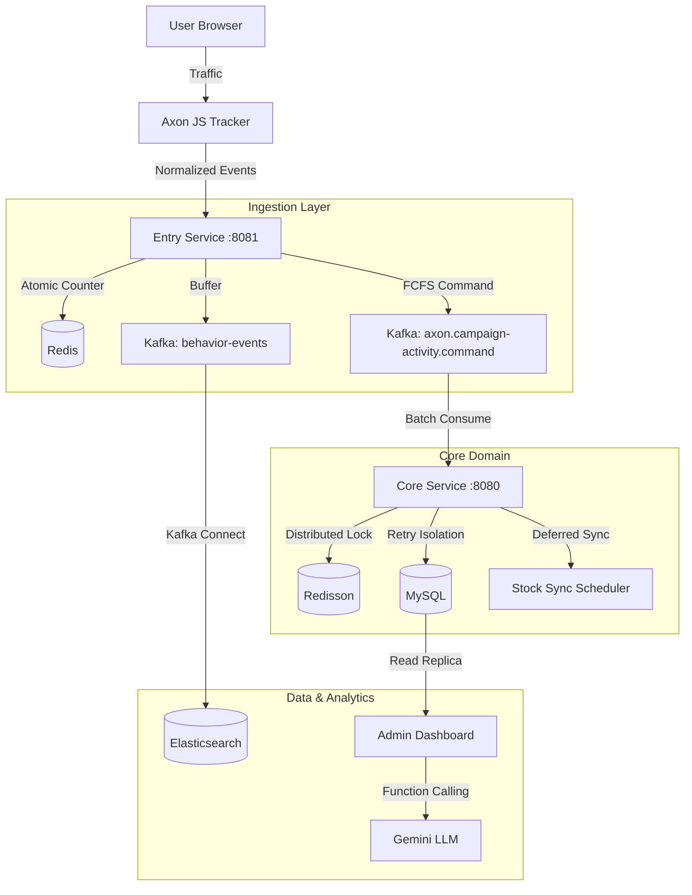

# Axon: Customer Data Platform for Marketing Intelligence

**Languages**: [English](#english) | [한국어](#korean)

---

## 🌎 English Version

> **Scale-ready, Event-driven Architecture for High-Concurrency Commerce & Real-time Marketing Analytics**

Axon CDP transforms every user behavior (event participation, purchases, clicks, scrolls) in e-commerce into valuable marketing insights. Built for **massive traffic spikes** (FCFS events, flash sales), it ensures **99.9% availability** and **data integrity** under high concurrency while providing real-time dashboards for marketers.

---

## 🎯 Key Features

### 1. High-Concurrency Event Processing
- **Deterministic FCFS**: Guarantees zero over-booking using a dual-layer strategy: Redis Atomic Counters for entry control and **Redisson Distributed Locks** for core persistence.
- **2-Stage Token System**: Reservation token → Payment confirmation workflow prevents double bookings and ensures transaction safety.
- **Spike Buffering**: Entry Service absorbs traffic bursts and buffers to Kafka, protecting core logic from saturation.

### 2. Real-time Behavior Tracking
- **Lightweight JS Tracker**: Collects page views, clicks, scrolls without impacting site performance.
- **No-ETL Pipeline**: Client-side data normalization eliminates server-side parsing overhead, streaming via Kafka Connect to Elasticsearch.
- **Sub-second Latency**: End-to-end data flow from browser to dashboard analytics in under 1 second.

### 3. Advanced Marketing Dashboard
- **Funnel Analysis**: Visualizes conversion rates from Visit → Click → Purchase.
- **Cohort & LTV Analysis**: Tracks user retention, lifetime value (30d/90d/365d), and CAC metrics.
- **Real-time Stats**: Live inventory, participant count, and conversion velocity updates.

### 4. LLM-Powered Marketing Assistant
- **Context-Aware AI**: Gemini-based chatbot understands current campaign context.
- **Safe Tool Use**: Uses verified dashboard APIs (**Function Calling**) instead of risky raw SQL generation.
- **Actionable Insights**: Generates hypothesis-driven recommendations based on real-time data.

---

## 🏗️ System Architecture

| Module | Responsibility | Tech Stack |
|--------|----------------|------------|
| **`entry-service`** | Traffic gateway, FCFS validation, behavior logging | Spring Boot, Redis, Kafka |
| **`core-service`** | Business logic, domain persistence, analytics | Java 21, JPA, Redisson, Spring Batch |
| **`common-messaging`** | Shared DTOs, Kafka topics, domain events | Java Library |
| **`axon-tracker`** | Lightweight JS SDK for behavior tracking | Vanilla JS (< 5KB) |

---

## 🛠️ Tech Stack

**Backend**:
- Java 21 (LTS), Spring Boot 3.5, Spring Batch, Spring Security
- Apache Kafka (KRaft mode), MySQL 8.0, Redis, Elasticsearch 8.x

**DevOps**:
- Kubernetes (K2P), Docker, GitHub Actions, KT Cloud, Nginx Ingress
- Prometheus, Grafana, Kibana, Fluentbit

---

## ⚡ Performance Engineering

### Concurrency Control
We implemented a **Dual-Layer Concurrency Strategy** to ensure 100% data integrity without performance bottlenecks.
- **Entry Layer (Lock-free)**: Uses Redis Atomic Counters (`INCR`) for high-speed admission control, preventing DB/Lock overhead during bursts.
- **Core Layer (Distributed Lock)**: Employs **Redisson RLock** during Kafka message consumption to ensure idempotent persistence and prevent race conditions.
- **Result**: Zero over-booking and perfect data integrity verified under **3,000 VU spike** conditions (**1,200+ Peak RPS**).

### Throughput & Infra Optimization
- **Infrastructure Tuning**: Overcame initial system collapse at **300 VU** by increasing **TCP SYN Queue (128 → 1024)** and optimizing **Tomcat KeepAlive** for socket reuse.
- **Deferred Stock Sync**: Eliminated DB Row Lock contention by deferring actual stock deduction to a post-event scheduler, increasing stable capacity by **10x**.
- **Virtual Threads (JDK 21)**: Leveraged lightweight threads to handle high-density I/O tasks, maintaining **99.98% availability** even under extreme saturation.
- **Resilient Pipeline**: Integrated **Dead Letter Queue (DLQ)** and **Idempotency Keys** to guarantee safe recovery from failures.

---

## 🏆 Key Achievements

✅ **Zero Over-booking**: 100% inventory accuracy verified under 3,000 VU sudden burst conditions.
✅ **99.98% Availability**: Only 0.02% pure system error rate recorded during peak saturation.
✅ **10x Capacity Scale**: Successfully scaled from a 300 VU failure point to a **3,000 VU stable capacity**.
✅ **1,200+ Peak RPS**: Proven high-throughput handling in resource-constrained test environments.
✅ **Data Reliability**: 0% data loss achieved via `REQUIRES_NEW` retry isolation and DLQ implementation.

---

## 🇰🇷 한국어 버전

> **대용량 트래픽 환경에서도 데이터 정합성을 보장하는 고성능 마케팅 플랫폼**

Axon은 쇼핑몰 내에서 발생하는 모든 사용자 행동 데이터를 수집/분석하여 실시간 인사이트를 제공하는 **고객 데이터 플랫폼(CDP)**입니다. 특히 선착순(FCFS) 이벤트와 같은 **순간적인 트래픽 폭주(Spike)** 상황에서도 시스템 붕괴 없이 99.9% 이상의 가용성을 유지하도록 설계되었습니다.

---

## 🎯 핵심 기능

### 1. 고동시성 이벤트 처리
- **이원화된 동시성 제어**: Redis Atomic Counter(`INCR`) 기반의 **Lock-free 알고리즘**으로 진입 트래픽을 제어하고, Core 레이어에서 **Redisson 분산 락**을 적용하여 데이터 영속화의 안전성 보장.
- **2단계 토큰 시스템**: 예약 토큰 → 결제 승인 워크플로우를 통해 중복 구매를 방지하고 트랜잭션 무결성 유지.
- **부하 분산**: Entry Service가 트래픽 버스트를 흡수하여 Kafka로 버퍼링함으로써 Core 서비스의 안정성 확보.

### 2. 실시간 행동 추적
- **경량 JS 트래커**: 사이트 성능 저하 없이 페이지 뷰, 클릭, 스크롤 데이터를 수집하는 SDK 제공.
- **No-ETL 파이프라인**: 클라이언트 단계에서 데이터 정규화를 수행하여 서버 측 파싱 부하를 제거하고 Elasticsearch에 즉시 적재.
- **초단위 데이터 흐름**: 브라우저 발생 이벤트가 대시보드 통계에 반영되기까지 1초 미만의 지연 시간 달성.

### 3. 고급 마케팅 대시보드
- **퍼널 분석**: 유입부터 구매까지의 단계별 전환율 시각화.
- **코호트 및 LTV 분석**: 사용자 그룹별 유지율(Retention) 및 생애 가치(30일/90일/365일) 추적.
- **실시간 지표**: 잔여 재고, 참여자 수, 전환 속도 등을 실시간 위젯으로 제공.

### 4. 마케터 전용 LLM 인텔리전스
- **안전한 도구 사용**: LLM이 DB에 직접 접근하지 않고, 검증된 대시보드 API를 도구로 호출하는 **Function Calling** 구조 설계.
- **맥락 기반 인사이트**: 현재 캠페인 상황을 자동 인식하여 할루시네이션 없는 정확한 데이터 분석 및 마케팅 조언 제공.

---

## ⚡ 성능 엔지니어링

### 동시성 제어 및 아키텍처
- **Lock-free 선착순**: 분산 락의 오버헤드를 제거하기 위해 Redis 원자적 연산을 활용, 락 경합 없이 동시성 이슈를 해결하여 **오버부킹 Zero** 달성.
- **배압(Back-pressure) 조절**: Kafka를 활용한 비동기 파이프라인으로 트래픽 폭주 시에도 비즈니스 로직 서버의 가용성 유지.

### 처리량 및 인프라 최적화
- **인프라 튜닝**: 초기 **300 VU (약 500 RPS)** 실패 원인이었던 **TCP SYN Queue(128→1024)** 및 Accept Queue 증설로 `Connection Reset` 문제 해결.
- **지연 재고 동기화 (Deferred Sync)**: DB Row Lock 경합을 제거하기 위해 실시간 재고 차감을 지연시키고 사후 정산하는 구조를 설계하여, 안정적 수용량을 **10배 이상 확장**.
- **Virtual Threads (JDK 21)**: 가상 스레드를 도입하여 고밀도 I/O 작업 시 스레드 고갈을 방지하고, 시스템 임계점에서도 **99.98%의 가용성** 유지.
- **장애 회복력**: **Dead Letter Queue (DLQ)**와 **멱등 키** 도입을 통해 처리 실패 메시지 격리 및 안전한 데이터 복구 기반 마련.

---

## 🏆 주요 성과

✅ **오버부킹 Zero**: 3,000 VU 스파이크 상황에서도 100% 재고 정합성 유지 및 무결성 검증 완료.
✅ **시스템 가용성 99.98%**: 초고부하 임계점에서도 0.02% 미만의 순수 시스템 에러율 기록 (2.2만 건 요청 기준).
✅ **10배의 수용량 확장**: 초기 300 VU 실패 지점을 극복하고 **안정적인 3,000 VU 수용 역량** 확보.
✅ **Peak 1,200+ RPS 검증**: 제한된 자원 환경에서도 고성능 처리 능력을 데이터로 증명.
✅ **데이터 신뢰성**: `REQUIRES_NEW` 격리 재시도 및 DLQ 도입으로 예외 상황 데이터 유실 0건 달성.

---

**Axon Team** | *Scale을 위해 설계하고, Insight를 위해 최적화합니다.*
