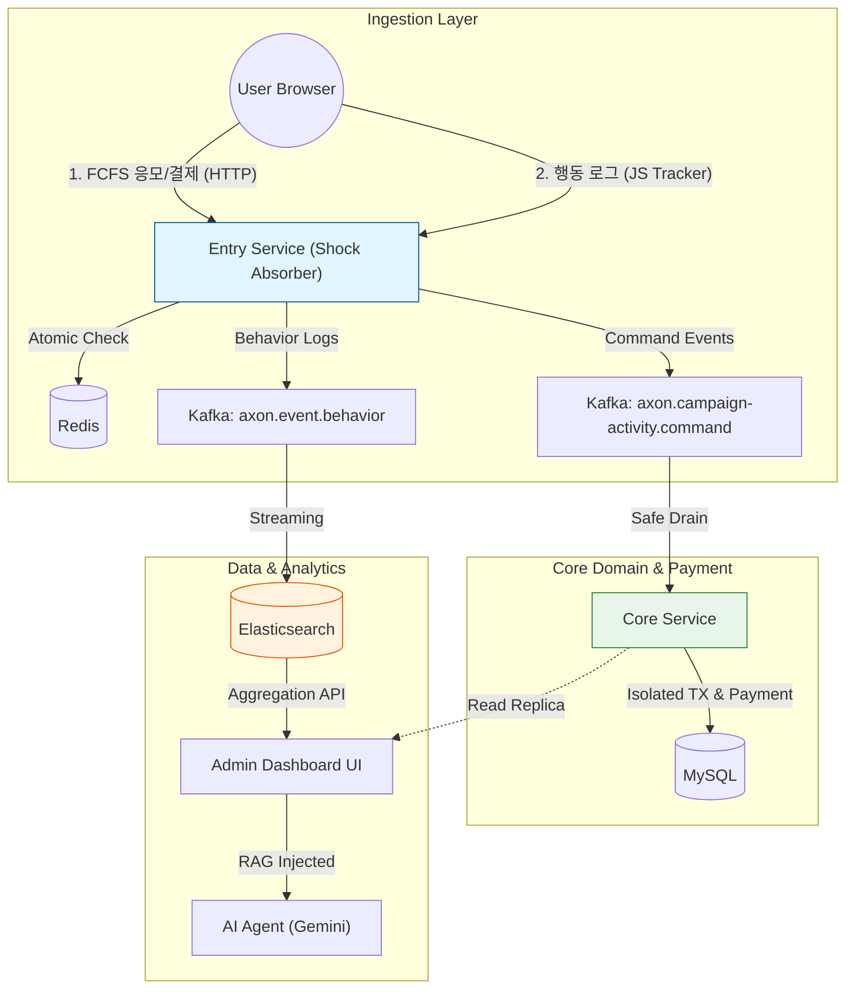

# Axon: High-Performance Customer Data Platform (CDP)

Axon은 이커머스 환경에서 발생하는 대규모 선착순(FCFS) 트래픽을 지연 없이 처리하고, 사용자의 행동 로그를 실시간으로 수집/분석하기 위해 설계된 **이벤트 기반 통계 및 캠페인 플랫폼**입니다. 비즈니스 파이프라인(명령)과 데이터 파이프라인(로그)을 구조적으로 분리하여, 어떠한 트래픽 스파이크 상황에서도 기업의 핵심 시스템 스레드를 고갈시키지 않도록 완충(Shock Absorber)하는 것을 핵심 목표로 개발되었습니다.

---

## 🛠️ 기술 스택 (Tech Stack)

*   **Backend Application**: Java 21, Spring Boot 3.5.5, Virtual Threads
*   **Data & Messaging**: MySQL 8.0, Redis, Elasticsearch 8.x, Apache Kafka (KRaft Mode)
*   **Infrastructure**: Kubernetes (K2P), Docker Compose
*   **Observability**: Prometheus, Grafana, Fluent Bit, Kibana
*   **Frontend & AI**: Thymeleaf, Vanilla JS (Tracker SDK), Chart.js, TailwindCSS, Gemini 2.0 Flash

---

## 🌟 핵심 기능 (Key Features)

### 1. 고동시성 선착순 예약 (FCFS Campaign)
*   수천 명의 동시 접속자가 몰리는 캠페인 이벤트에서 데이터베이스 락(Lock) 경합 없이 빠르고 정확하게 선착순 응모 및 결제 인가를 처리합니다.
> *(실제 동작 데모: ``)*

### 2. 실시간 마케팅 대시보드 및 지표 분석
*   페이지 뷰, 클릭, 진입, 예약, 구매로 이어지는 풀 퍼널(Funnel) 전환율과 일자별 리텐션(Cohort), LTV(고객 생애 가치)를 시각화합니다.
> *(대시보드 데모: ``)*

### 3. AI 기반 캠페인 어시스턴트
*   RAG(Retrieval-Augmented Generation) 패턴을 활용하여, 대시보드의 실시간 집계 데이터를 기반으로 마케터의 자연어 질의에 답변하고 의사결정을 돕는 챗봇 어시스턴트를 제공합니다.

---

## 🏗️ 시스템 아키텍처 (Architecture)



---

## ⚙️ 트러블슈팅 및 기술적 의사결정 (Troubleshooting & Engineering)

대용량 트래픽 상황에서 한정된 컴퓨팅 리소스의 효율을 극대화하기 위해 치열하게 고민한 문제 해결 및 아키텍처 의사결정 기록입니다. 상세 코드는 **[Architecture Deep-Dive 포트폴리오](./docs/PORTFOLIO_DIAGRAMS.md)** 에서 확인 가능합니다.

### 🚨 1. 트러블슈팅 (Problem Solving)

*   **[부하 방어] 300 VU 접속 불가 현상을 3,000 VU 환경으로 확장**
    *   **문제**: 초기 초당 500건 수준의 요청에서 Connection Reset과 Timeout이 대량 발생하여 시스템이 붕괴됨.
    *   **해결**: Linux 커널의 `net.core.somaxconn` 파라미터 및 웹 서버(Tomcat)의 Accept Count 튜닝을 통해 TCP SYN Queue 수용량을 대폭 확장.
    *   **성과**: k6 스파이크 테스트 기준 **3,000명 동시 접속(Peak 2,900 RPS)** 환경에서 **에러율(5XX) 0.00% 달성** 및 병목 지점 해소.

*   **[동시성 제어] DB 락 경합 제거를 위한 Redis Lock-free 알고리즘**
    *   **문제**: 200명 한정 선착순 이벤트에 다수 접근 시 MySQL 비관적 락(Pessimistic Lock)으로 인한 스레드 대기 및 커넥션 스톨 현상 발생.
    *   **해결**: Redisson 기반의 무거운 분산 락 대신, Redis의 `SADD`와 `INCR`을 하나로 묶은 **Lua 스크립트를 활용하여 단일 스레드 기반 원자적 상태 변경(Lock-free)** 아키텍처로 전환.
    *   **성과**: 10,655건의 치열한 동시 요청 속에서 **오버부킹 0건** 검증 완료.

*   **[장애 격리] 물리 트랜잭션 오염 방지를 위한 `REQUIRES_NEW` 예외 격리**
    *   **문제**: Kafka 컨슈머가 Batch 단위로 메시지를 DB에 영속화할 때, 1건의 오류가 전체 배치를 롤백시키고 무한 재시도 큐에 빠지는 트랜잭션 좀비화 감지.
    *   **해결**: Spring의 `Propagation.REQUIRES_NEW`를 사용하여 개별 건을 물리 트랜잭션으로 강제 분리하고, 실패 건만 **Dead Letter Queue (DLQ)** 로 즉각 유배시켜 롤백 전파 차단.

*   **[조회 성능] Elasticsearch 역정규화를 통한 실시간 대시보드 N+1 해결**
    *   **문제**: MySQL에 적재된 다형성(Polymorphism) 이벤트를 조인하여 통계를 구성할 때 심각한 N+1 문제와 조회 지연 발생.
    *   **해결**: 데이터 수집 단계부터 역정규화(Denormalization)된 Flat 데이터를 ES로 전송하고, 단일 `Terms Aggregation`으로 다차원 통계를 추출하여 **렌더링 성능 440% 향상**.

---

### 💡 2. 기술적 의사결정 (Technical Architecture Decisions)

#### [데이터 파이프라인 설계]
*   **MSA 통신을 위한 공통 모듈(common-messaging)**: Entry Service와 Core Service 간의 강결합을 막기 위해, DTO와 토픽 상수만 분리한 멀티 모듈 MSA 구조를 설계.
*   **어댑터 패턴(Adapter Pattern)**: 퍼널 데이터를 ES로 쏠 때, Purchase/Entry/Behavior 등 출처가 다른 이벤트의 다형성을 제어하고 단일 규격화하기 위해 어댑터 패턴 도입.
*   **이원화된 파이프라인 (Command vs Behavior)**: 무거운 행동 로그 적재 지연이 결제 시스템(Command) 마비로 이어지는 것을 막기 위해 Kafka Topic을 분리하여 장애 격리.
*   **Kafka (vs RabbitMQ)**: 단순한 메시지 전달이 아닌, 장애 복구 시 재처리와 DB/ES 다중 컨슈머 파이프라이닝을 위해 디스크 기반 영속성을 보장하는 Kafka(KRaft) 채택.
*   **자체 JS SDK (vs GA4/Matomo)**: 서드파티 툴의 샘플링/딜레이를 없애고, 우리 비즈니스 도메인 식별자를 즉각 ES로 쏘아 올려 완전한 No-ETL 파이프라인을 구축하기 위함.
*   **SSE (Server-Sent Events) 도입**: 실시간 대시보드의 갱신을 위해 무거운 WebSocket이나 서버 부하가 심한 Polling 대신, 단방향 스트리밍인 SSE를 선택해 리소스 최적화.

#### [병목 원천 차단 및 트래픽 방어]
*   **Redis 재고 처리 전략**: DB 레벨의 동시성 제어는 풀 고갈을 야기하므로, Spike 트래픽의 98%를 Entry 레이어(Redis API)에서 쳐내는 전면 방어탑 역할로 사용.
*   **Redis Gating 바이패스 최적화**: 선착순 확정 후 Core 결제로 넘어온 데이터는 불필요한 Redis 조회를 건너뛰도록(Bypass) 튜닝하여 백엔드 처리량 극대화.
*   **극단적인 Lock Contention 회피**: 부하 테스트 결과를 반영하여 DB의 UserSummary 및 재고 차감을 동기 처리에서 비동기 지연 처리(Eventual Consistency)로 과감히 분리.
*   **동기형 논블로킹 (RestClient)**: JDK 21 가상 스레드(Virtual Threads)의 이점을 취하기 위해 기존 WebClient 대신 동기형 프로그래밍 방식을 유지하며 RestClient로 전면 마이그레이션.
*   **투트랙 동시성 제어 (Redis INCR + Redisson)**: 빠른 속도가 필요한 최초 진입 검증은 Redis Lua로 처리하고, 최후의 결제 정합성이 보장되어야 하는 부분만 Redisson의 분산락으로 보호하여 책임 분리.
*   **전략 패턴(Strategy Pattern)**: 쉴 새 없이 변하는 이벤트/쿠폰 검증 로직을 OCP 원칙에 맞게 확장하기 위해 동적인 Validation Engine으로 설계.

#### [고가용성 인프라 구축]
*   **데이터베이스 Read-Only Replica**: 대시보드의 무거운 통계 조회 쿼리(Table Lock)가 사용자 쇼핑몰 결제(OLTP)를 파괴하지 않도록 마스터-슬레이브 분리.
*   **코호트 배치의 증분 처리(Incremental)**: 전체 스캔 배치가 DB를 장악하지 않도록 변경분만 색출하여 집계하는 로직을 결합해 LTV 통계 배치 연산 속도 82% 향상.

---

## 🚀 빠른 시작 (Getting Started)

1. **인프라 실행 (Kafka, MySQL, Redis, ES)**
   ```bash
   docker-compose up -d
   ```
2. **서비스 배포 및 실행**
   ```bash
   ./gradlew :entry-service:bootRun
   ./gradlew :core-service:bootRun
   ```
3. **대시보드 UI 접속**
   * 브라우저에서 `http://localhost:8080/admin/dashboard/1` 로 접속하여 실시간 차트 및 AI 에이전트를 확인할 수 있습니다.
