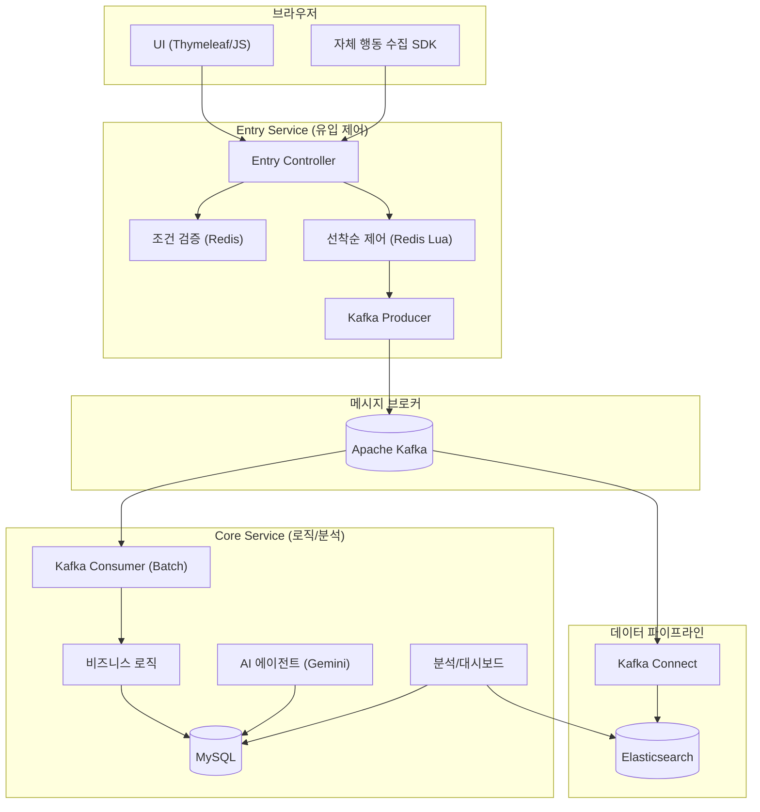
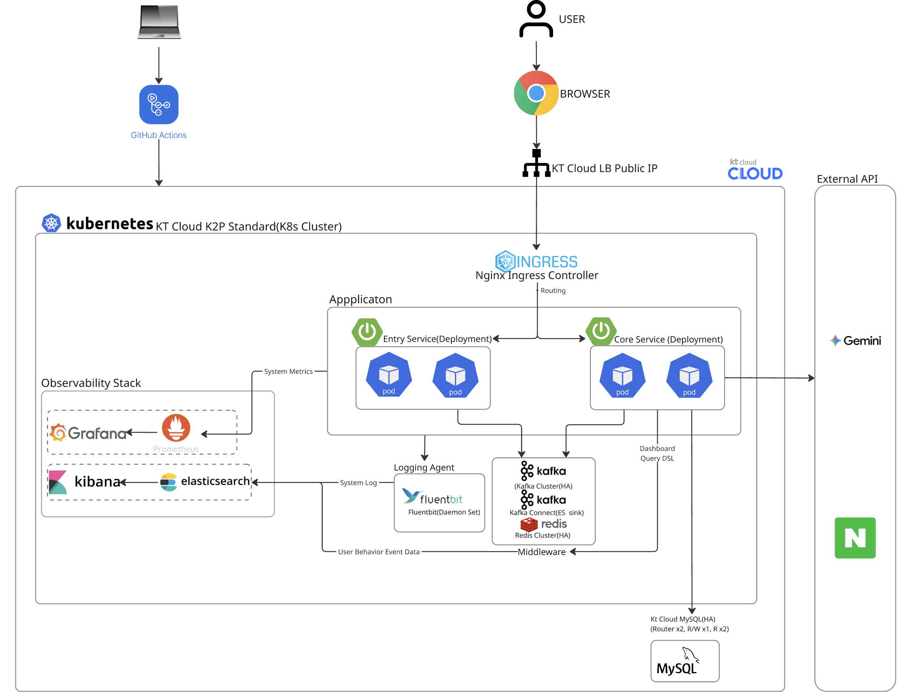
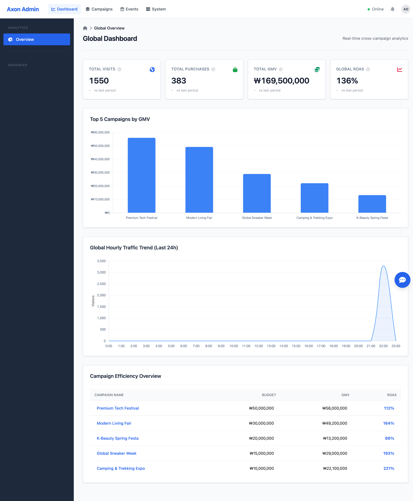
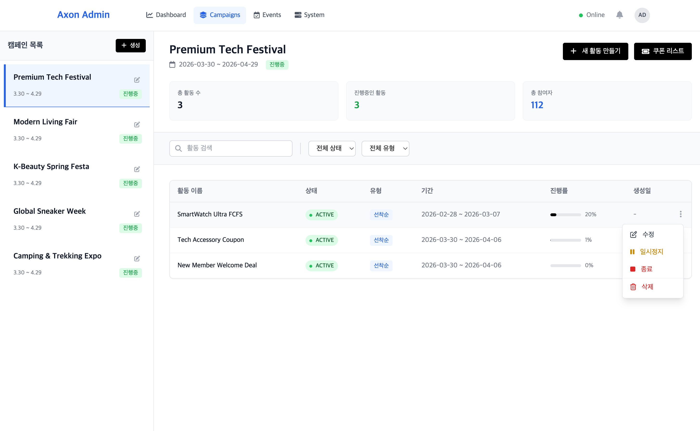
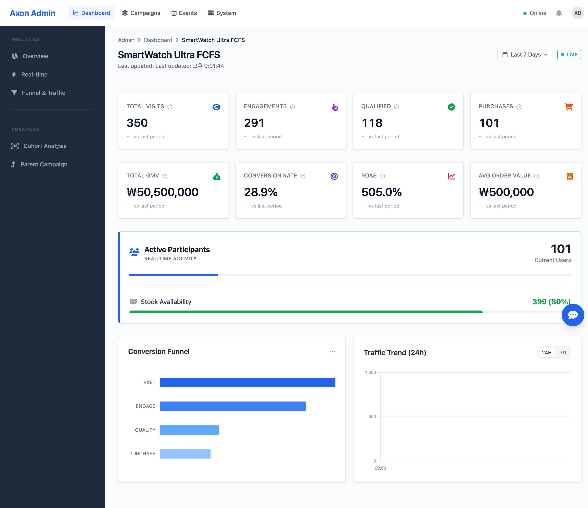
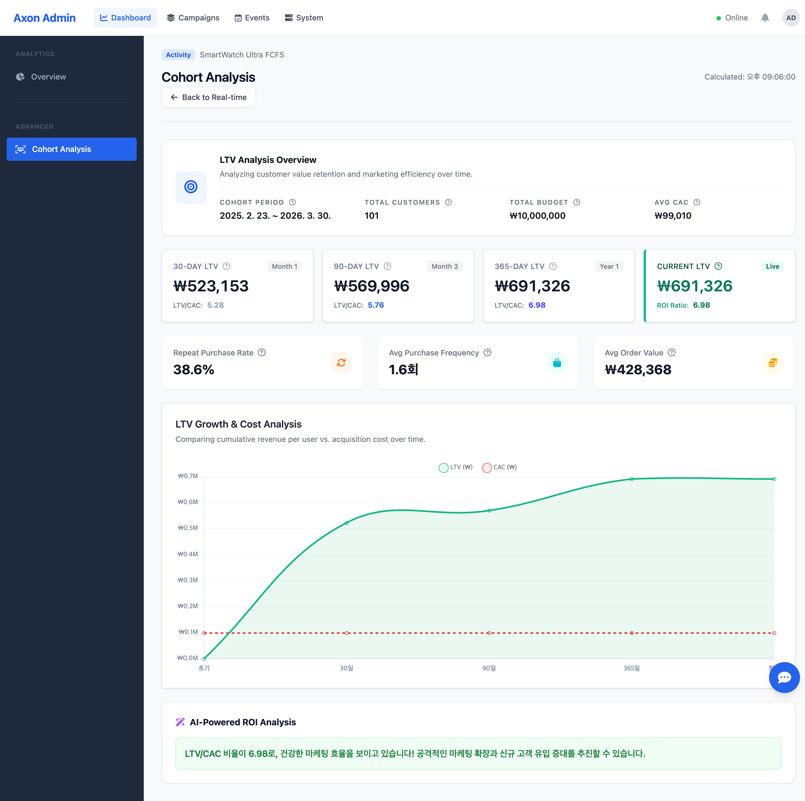
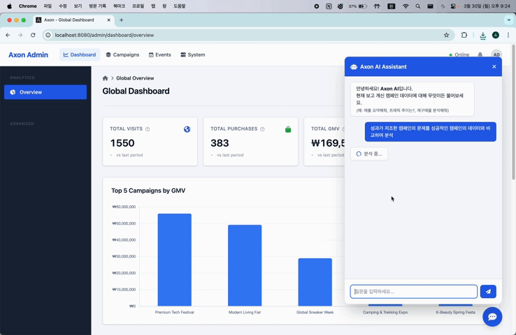
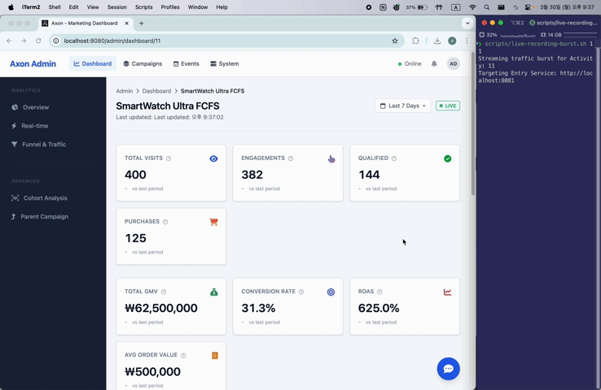
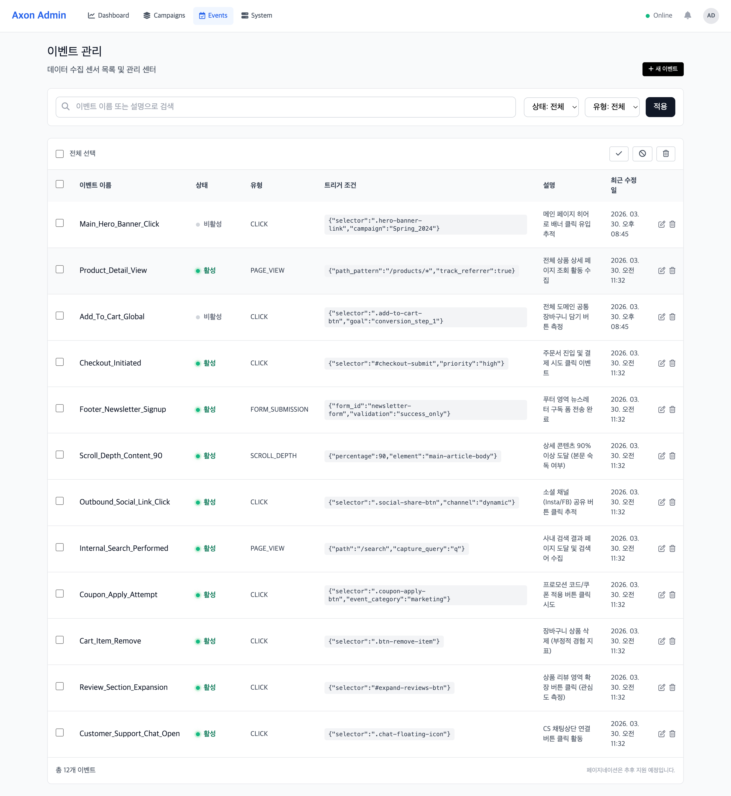
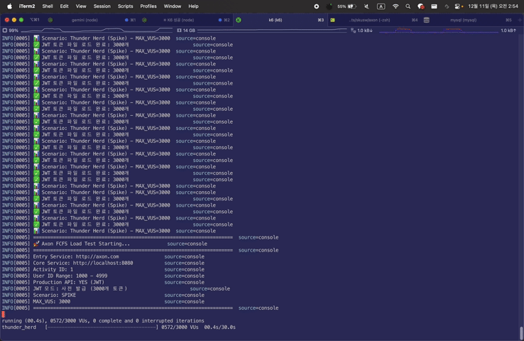

<h1 align="center">Axon: 이벤트 기반 커머스·마케팅 연동 백엔드</h1>
<p align="center">
  <b>선착순 거래 요청을 즉시 판정하고, 거래·행동 이벤트를 분석·마케팅 액션으로 연결하는 Entry/Core 분리 커머스 백엔드</b><br>
  Redis Lua로 유입 권한을 확정하고, Kafka 이벤트를 MySQL 거래 원장과 Elasticsearch 행동 로그로 분기해 대시보드·조건 기반 마케팅 액션에 활용합니다.
</p>

<p align="center">
  
  
  
  
  
</p>

---

## 프로젝트 개요
Axon은 선착순 이벤트로 발생한 거래·행동 데이터를 안정적으로 처리하고, 이를 분석과 조건 기반 마케팅 액션으로 연결하는 커머스 백엔드입니다.

Entry 서비스는 Redis Lua로 중복 참여와 한정 수량을 한 번에 판정해 사용자에게 즉시 결과를 반환합니다. 승인·행동 이벤트는 Kafka로 전달하고, Core 서비스가 거래 원장(MySQL), 행동 분석(Elasticsearch), 쿠폰·Webhook 같은 후속 액션으로 처리합니다. 이 경계로 유입 hot path를 후속 저장·분석 작업과 분리합니다.

---

## 대표 검증
> Oracle VM + Docker Compose에서 `payment / waiting_burst`로 검증했습니다. `VU`는 k6의 동시 실행 상한이며, RPS는 VU 환산값이 아닌 Axon nginx access log의 예약 요청 1초 완료 건수로 집계했습니다.

| 시나리오 | 결과 |
| :--- | :--- |
| **3,000 users / 600 VUs / FCFS 1,000** | 성공 1,000/1,000, 오류 0, DB entries/purchases 1,000/1,000, 수렴 0초, reservation p95 659ms |
| **이벤트 오픈: 3,000 users / 3,000 VUs / FCFS 800** | 외부 실행 2회 연속 성공 800/800, 오류 0, DB entries/purchases 800/800, 측정 당시 Axon nginx 예약 완료 peak **1,108 req/s** |

선착순 결과는 품절(410)·중복 참여(409)를 시스템 오류와 분리해 해석합니다. 현재 기준의 자세한 부하 진단 과정과 측정 한계는 `docs/devlog/dev-log-2026-07-10-fcfs-3000vu-bottleneck.md`에 기록합니다.

---

## 시스템 아키텍처

### 서비스 논리 구조
요청 수집(Entry)과 비즈니스 처리(Core)를 분리하고, Kafka로 승인·행동 이벤트를 후속 저장·분석·마케팅 처리와 분리했습니다. Kafka는 hot path와 후속 처리를 분리하는 전달 경계이며, 현재 애플리케이션 큐에 명시적 backpressure 제어를 구현한 것은 아닙니다.


```mermaid
graph TB
    subgraph Client["브라우저"]
        Browser["UI (Thymeleaf/JS)"]
        JSTracker["자체 행동 수집 SDK"]
    end

    subgraph Entry["Entry Service (유입 제어)"]
        EntryController["Entry Controller"]
        FastValidation["조건 검증 (Redis)"]
        FCFSLogic["선착순 제어 (Redis Lua)"]
        EntryKafka["Kafka Producer"]
    end

    subgraph MQ["메시지 브로커"]
        Kafka[("Apache Kafka")]
    end

    subgraph Core["Core Service (로직/분석)"]
        KafkaConsumer["Kafka Consumer (Batch)"]
        CampaignLogic["비즈니스 로직"]
        LLMController["AI 에이전트 (Gemini)"]
        DashboardLogic["분석/대시보드"]
        MySQL[("MySQL")]
    end

    subgraph Pipeline["데이터 파이프라인"]
        KafkaConnect["Kafka Connect"]
        ES[("Elasticsearch")]
    end

    %% Flow
    Browser --> EntryController
    JSTracker --> EntryController
    EntryController --> FastValidation
    EntryController --> FCFSLogic
    FCFSLogic --> EntryKafka
    EntryKafka --> Kafka
    Kafka --> KafkaConsumer
    KafkaConsumer --> CampaignLogic
    CampaignLogic --> MySQL
    Kafka --> KafkaConnect
    KafkaConnect --> ES
    LLMController --> MySQL
    DashboardLogic --> ES
    DashboardLogic --> MySQL
```

### 인프라 및 클라우드 구성
<p align="center">
  
</p>

### 실행 및 검증 환경

- **현재 환경**: Oracle Cloud A1 Flex VM + Docker Compose. Entry/Core, Redis, Kafka, MySQL, Elasticsearch를 단일 VM에서 구성하고 k6 baseline과 APM 진단을 수행합니다.
- **관측·검증**: OpenTelemetry Java Agent·Jaeger trace, Spring Actuator/Micrometer 지표, nginx·애플리케이션 로그, k6 결과와 DB 수렴을 함께 봅니다.
- **배포 경로**: VM Compose 배포와 baseline 실행은 GitHub Actions 수동 workflow(`workflow_dispatch`)로 재현합니다.
- **과거 환경**: K2P Kubernetes 매니페스트는 역사적 배포 참고용으로 `k8s/`, `helm/`에 보존합니다. 현재 대표 수치와 혼용하지 않습니다.

---

## 핵심 설계 및 검증

### 1. 유입 시점 선착순 판정
Entry에서 Redis Lua로 중복 참여(`SADD`)와 수량 점유(`INCR`), 한도 초과 롤백을 한 원자 연산으로 처리합니다. 선착순 권한을 Kafka 소비 순서가 아닌 요청 유입 시점에 확정해 오버부킹과 중복 참여를 막습니다.

### 2. 응답 경로와 후속 처리 분리
Entry는 사용자 응답 뒤 승인·행동 이벤트를 Kafka로 전달하고, Core는 거래 원장·행동 분석·마케팅 액션을 처리합니다. Core 저장은 실패 건을 DLT로 격리하며, `Purchase`를 원장으로 먼저 보존한 뒤 `UserSummary` 같은 파생 정보를 갱신합니다.

### 3. 계층별 관측으로 병목 범위 축소
k6 요약 수치만으로 원인을 단정하지 않고, OTel trace·Actuator/Micrometer·nginx 로그·Kafka lag·DB 수렴을 경로별로 대조했습니다. host nginx의 `768 worker_connections are not enough` 오류를 확인해 연결 한도를 4,096, 파일 한도를 16,384으로 조정했습니다.

### 4. 행동 데이터에서 마케팅 액션까지
JS SDK 행동 이벤트를 Elasticsearch에 적재해 대시보드·세그먼트 분석에 사용하고, MarketingRule의 조건 충족 시 쿠폰 발급 또는 Webhook 알림을 Kafka 기반 후속 액션으로 연결합니다.

---

## 주요 기능

### 1. 마케팅 인텔리전스 (Analytics & AI)

#### 계층형 성과 대시보드
<p align="center">
  
  <br><em>Level 1: 전역 성과 - 전체 캠페인 통합 매출 및 효율 지표</em>
</p>

<p align="center">
  
  <br><em>Level 2: 캠페인 성과 - 개별 캠페인 내 활동들의 성과 기여도 비교</em>
</p>

<p align="center">
  
  <br><em>Level 3: 활동 심층 분석 - 실시간 참여 지표 및 유입 트렌드 모니터링</em>
</p>

<p align="center">
  
  <br><em>코호트 및 LTV 분석 - 유입 고객의 재구매율 및 장기 가치 추적</em>
</p>

- **코호트 및 LTV 분석**: 마케팅 유입 시점(Cohort)을 기준으로 생애 가치(LTV)와 획득 비용(CAC)을 월간 배치로 집계해 조회하는 의사결정 지표 제공.
- **RFM 세그먼테이션 스케줄러**: 최근성(Recency), 구매 빈도(Frequency), 누적 금액(Monetary) 데이터를 기반으로 매일 유저 등급(VIP, 이탈 우려 등)을 재분류하는 자동화 파이프라인.

#### AI 리포팅 에이전트 (Gemini 2.5 Flash-lite)
<p align="center">
  
</p>

- **데이터 기반 리포팅**: 현재 대시보드 지표와 Function Calling을 결합해 리포트를 생성합니다. 코호트 도구는 실시간 DB 집계 대신 월간 배치 결과만 조회합니다.

#### 실시간 지표 스트리밍
<p align="center">
  
</p>

- **실시간 지표 반영**: SSE 프로토콜을 활용하여 이벤트 발생부터 대시보드 반영까지의 파이프라인 상태를 실시간으로 확인할 수 있도록 구성.

### 2. 운영 및 시스템 검증 (Operation & Verification)

#### 운영 관리 및 행동 기반 동적 쿠폰 트리거
<p align="center">
  
</p>

- **코드 수정 없는 추적**: 자체 개발한 JS SDK를 통해 관리자 화면에서 클릭, 페이지 뷰 등 수집 조건을 동적으로 등록 및 제어.
- **행동 기반 마케팅 트리거 (Behavior Trigger)**: "특정 상품 5회 이상 열람" 등 유저의 고관여 행동 패턴을 집계하고, 조건 달성 시 Kafka 이벤트로 쿠폰 발급 또는 Webhook 알림을 연결하는 마케팅 자동화 루프 구현.
- **캠페인 생명주기 관리**: 마케팅 활동의 상태, 한정 수량, 예산 등을 실시간으로 관리하는 통합 운영 콘솔.

#### 스파이크 트래픽 수용성 검증
<p align="center">
  
</p>

- **현재 baseline**: `payment / 3,000 users / 600 VUs / FCFS 1,000`에서 성공 건수·알 수 없는 오류·Redis/DB 수렴을 함께 검증합니다.
- **이벤트 오픈 검증**: `3,000 users / 3,000 VUs / FCFS 800` 외부 실행을 2회 연속 성공했으며, 각 실행에서 Redis/DB 수렴을 확인했습니다.
- **결과 해석**: 410(품절)·409(중복)은 비즈니스 응답이며, 5xx·timeout·DB 미수렴을 별도 실패로 판단합니다.

---

## 기술 스택
- **Application**: Java 21, Spring Boot 3.x, Virtual Threads (Entry-service)
- **Messaging**: Apache Kafka (KRaft), Redis
- **Storage**: MySQL 8, Elasticsearch 8
- **Infrastructure**: Oracle VM, Docker Compose, Nginx (host + container), GitHub Actions
- **Observability & Test**: OpenTelemetry, Jaeger, Spring Actuator/Micrometer, Prometheus/Grafana (optional Compose), k6

---

## 빠른 시작 (Getting Started)
현재 저장소는 Oracle VM 또는 로컬 환경에서 Docker Compose로 주요 서비스를 재현할 수 있도록 구성되어 있습니다. K2P/Kubernetes 파일은 과거 배포 참고용입니다.

1. **환경 변수 준비**
   ```bash
   cp .env.compose.example .env
   ```
2. **애플리케이션 스택 실행**
   ```bash
   docker compose -f compose.app.yml up -d --build
   ```
3. **헬스 체크**
   ```bash
   curl http://127.0.0.1:8080/actuator/health
   curl http://127.0.0.1:8081/actuator/health
   ```
4. **대시보드 접속**
   - 브라우저에서 `http://localhost:8080/admin/dashboard/1` 접속 시 실시간 지표 및 AI 분석 기능을 확인할 수 있습니다.

### 선택 실행

- 분석 파이프라인(Elasticsearch/Kibana/Kafka Connect): `docker compose -f compose.app.yml -f compose.analytics.yml up -d`
- 메트릭(Prometheus/Grafana): `docker compose -f compose.app.yml -f compose.metrics.yml up -d`
- APM 진단(OpenTelemetry/Jaeger): `docker compose -f compose.app.yml -f compose.resources.yml -f compose.otel.yml up -d --build`
- Compose baseline 부하 테스트: `./scripts/load-test/run-baseline-compose.sh 1000 1`
- K2P/Kubernetes 배포 파일: `k8s/`, `helm/`, `.github/workflows/deploy.yml`에 보존되어 있습니다. 최신 코드로 재배포하려면 현재 멀티모듈 Docker build context와 런타임 profile을 환경에 맞게 점검해야 합니다.
