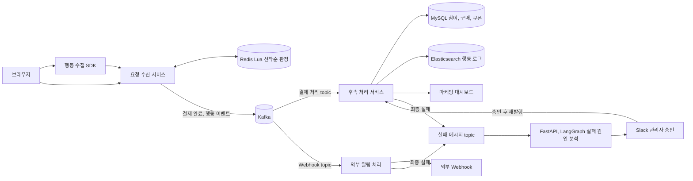
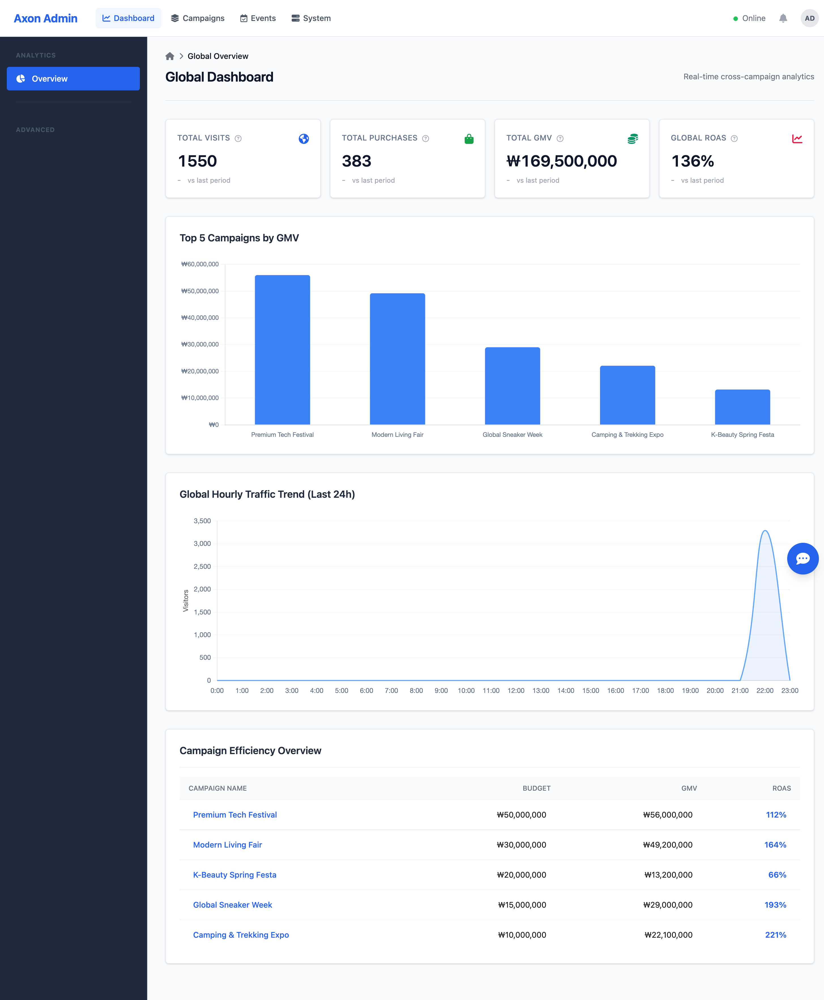
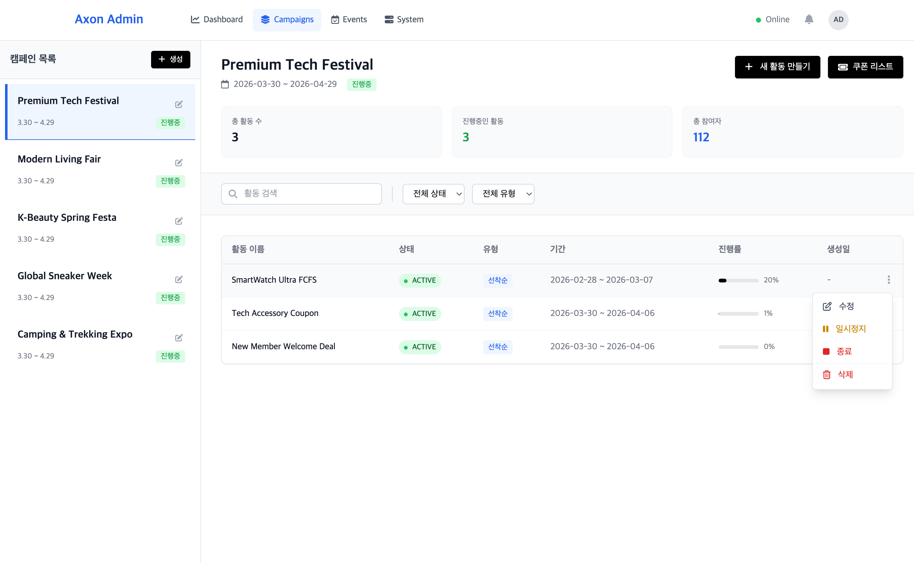
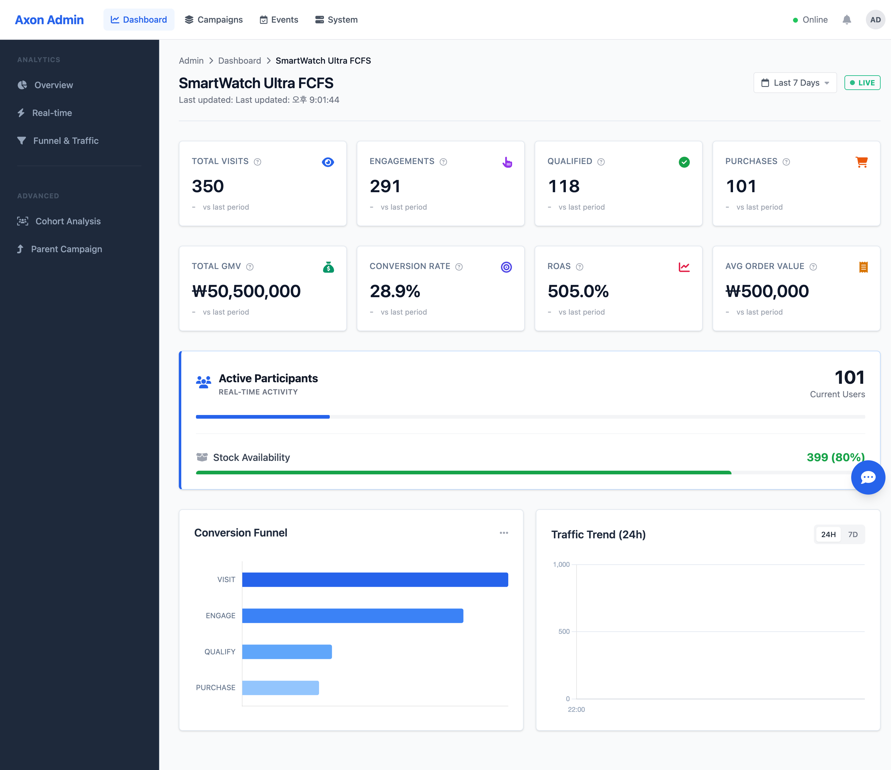
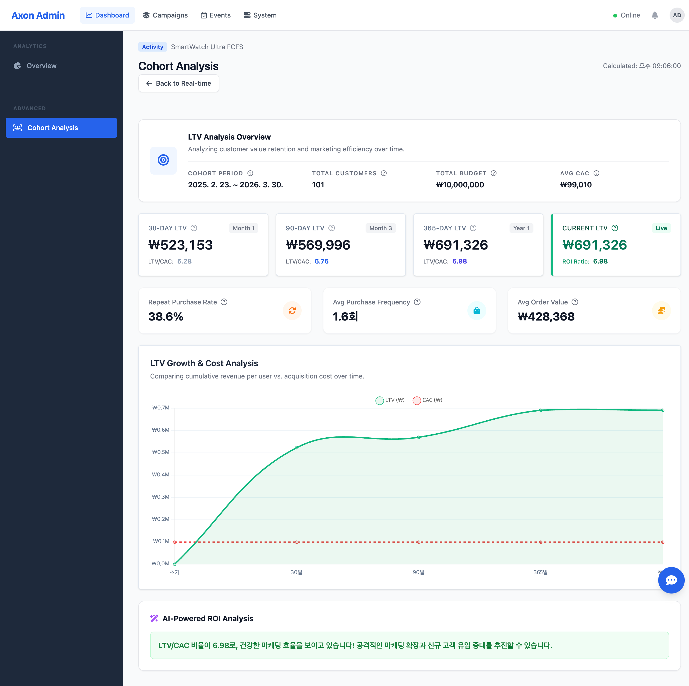
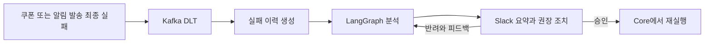

# 커머스 선착순 구매와 마케팅 파이프라인

선착순 이벤트 트래픽을 처리하고, 페이지 조회, 스크롤 깊이, 체류 시간, 구매 같은 행동 데이터를 수집해 마케팅 대시보드와 쿠폰, 알림 발송에 활용하는 프로젝트입니다.

주로 다룬 문제는 트래픽이 몰릴 때의 안정성, 선착순과 결제 기록의 정합성, 결제 이후 Kafka 비동기 후처리의 신뢰성입니다.

## 아키텍처

현재 Oracle VM 한 대에서 Docker Compose로 실행합니다. 요청을 빠르게 받는 서비스와 이후 데이터를 저장하고 활용하는 서비스를 나누고, 느린 외부 알림은 별도 Kafka topic으로 분리했습니다.


```mermaid
flowchart LR
    Browser[브라우저] --> SDK[행동 수집 SDK]
    Browser --> Entry[요청 수신 서비스]
    SDK --> Entry

    Entry <--> Redis[(Redis Lua 선착순 판정)]
    Entry -->|결제 완료, 행동 이벤트| Kafka[(Kafka)]

    Kafka -->|결제 처리 topic| Core[후속 처리 서비스]
    Kafka -->|Webhook topic| Webhook[외부 알림 처리]

    Core --> MySQL[(MySQL 참여, 구매, 쿠폰)]
    Core --> ES[(Elasticsearch 행동 로그)]
    Core --> Dashboard[마케팅 대시보드]

    Webhook --> External[외부 Webhook]
    Core -->|최종 실패| DLT[실패 메시지 topic]
    Webhook -->|최종 실패| DLT
    DLT --> AI[FastAPI, LangGraph 실패 원인 분석]
    AI --> Slack[Slack 관리자 승인]
    Slack -->|승인 후 재발행| Core
```

## 설계와 문제 해결

### 설계 이유

- **요청 수신 서비스와 후속 처리 서비스 분리**: 선착순 판정과 결제 준비는 바로 응답하고, 참여 기록, 구매 기록, 행동 로그, 쿠폰과 알림 처리는 Kafka를 통해 뒤에서 처리합니다.
- **Redis Lua 선착순 판정**: 중복 참여 확인, 수량 증가, 한도 초과 시 되돌리기를 한 번에 처리해 정원 초과 당첨을 막습니다.
- **Kafka 후속 처리**: 결제 완료 뒤 필요한 저장과 발송 작업을 요청 응답과 분리하고, 처리에 실패한 메시지는 다른 정상 메시지와 분리합니다.
- **Entry Virtual Thread**: 동시에 몰린 요청에서 토큰 발급과 내부 서비스 호출처럼 기다림이 있는 작업이 플랫폼 스레드를 오래 점유하지 않도록 처리합니다.

### 문제 해결

- 선착순 구매 이벤트에서 정원 초과 당첨과 응답 지연이 발생해 Redis 기반 선착순 처리와 Virtual Thread를 적용했습니다. 3,000 VU, 정원 800명 이벤트 오픈 시나리오에서 정원 초과 당첨 없이 선착순 API 성공 응답 p95 0.8s, peak 1,108 req/s를 처리했습니다.
- 이벤트 유입 고객의 구매를 추적하는 배치 분석에서 조회가 느려 복합 인덱스를 추가했습니다. `EXPLAIN ANALYZE`에서 range scan을 확인하고 쿼리 실행시간을 약 75% 단축했습니다.
- 선착순 결제 완료 뒤 Kafka consumer가 재고를 갱신하면서 DB 커넥션이 고갈돼, 재고 반영을 5분 주기 동기화로 바꿨습니다. 요청 응답시간을 80% 개선했습니다.
- 선착순 결제 성공 이벤트를 Kafka로 비동기 처리하고, 참여 기록과 구매 기록을 같은 트랜잭션으로 저장한 뒤 사용자 요약 정보는 별도로 갱신했습니다. 요청 응답을 저장 처리와 분리하고 메시지 중복 처리와 실패 복구를 구현했습니다.
- 선착순 결제 완료 메시지와 외부 Webhook 호출 메시지를 같은 topic에서 처리해, 느린 외부 호출이 결제 완료 처리까지 지연시켰습니다. Kafka topic과 consumer group을 분리해 외부 호출 지연이 선착순 구매 처리에 전파되지 않게 했습니다.
- 선착순 이벤트에서 수집한 고객 행동 로그를 MySQL과 Elasticsearch에 적재하고, 마케팅 성과 대시보드와 쿠폰, 알림 발송 조건에 사용했습니다.
- 쿠폰 발급과 알림 전송의 최종 실패를 DLT에 남기고, LangGraph 기반 AI 분석과 Slack 관리자 승인 흐름을 연결했습니다. 실패 원인과 이력을 요약한 뒤 관리자 승인으로만 재실행합니다.

## 주요 화면

### 마케팅 대시보드

<p align="center">
  
</p>

전체 캠페인의 매출과 전환 지표를 한 화면에서 확인합니다.

<p align="center">
  
</p>

캠페인과 세부 활동의 상태, 기간, 수량을 관리합니다.

<p align="center">
  
</p>

개별 활동의 참여 추이와 유입 데이터를 확인합니다.

<p align="center">
  
</p>

이벤트로 유입된 고객의 이후 구매와 재구매를 코호트 기준으로 조회합니다.

### 실패 분석과 관리자 승인


```mermaid
flowchart LR
    Failed[쿠폰 또는 알림 발송 최종 실패] --> DLT[Kafka DLT]
    DLT --> Case[실패 이력 생성]
    Case --> Agent[LangGraph 분석]
    Agent --> Message[Slack 요약과 권장 조치]
    Message -->|승인| Retry[Core에서 재실행]
    Message -->|반려와 피드백| Agent
```

외부 호출 실패는 원인과 이전 실패 이력을 정리해 Slack으로 보내고, 관리자가 승인한 경우에만 다시 발송합니다.

## 기술 스택

- Java 21, Virtual Thread, Spring Boot
- MySQL, Redis, Elasticsearch
- Kafka
- FastAPI, LangGraph
- Docker Compose, Oracle Cloud, GitHub Actions
- OpenTelemetry, Jaeger, Prometheus, Grafana

## 실행 방법

```bash
cp .env.compose.example .env
docker compose -f compose.app.yml up -d --build
```

```bash
curl http://127.0.0.1:8080/actuator/health
curl http://127.0.0.1:8081/actuator/health
```

분석 파이프라인은 아래 compose 파일을 함께 사용합니다.

```bash
docker compose -f compose.app.yml -f compose.analytics.yml up -d
```

메트릭과 추적 화면은 아래 compose 파일을 함께 사용합니다.

```bash
docker compose -f compose.app.yml -f compose.metrics.yml -f compose.otel.yml up -d
```
