# Technical Portfolio: 고성능 마케팅 및 실시간 데이터 처리 시스템 설계
> **3,000 VU 환경의 선착순 트래픽 제어와 비동기 분석 파이프라인 최적화 기록**

본 포트폴리오는 Axon 플랫폼의 핵심 엔지니어링 사례를 다루는 기술 리포트입니다. Axon은 이커머스 프로모션 시 발생하는 **대규모 선착순(FCFS) 트래픽을 안정적으로 제어**하고, 유입된 고객의 행동 로그를 실시간으로 분석하여 **마케팅 수익성(LTV) 인사이트를 도출**하는 시스템입니다.

단순한 기능 구현을 넘어, 3,000 VU(Peak 2,900 RPS)라는 극한의 상황에서 발생하는 병목을 어떻게 진단하고 기술적 트레이드오프를 거쳐 최적화했는지에 대한 해결 논리를 서술합니다.

**시스템 구조**: 트래픽 유입과 선착순 판정을 담당하는 **Entry-service**와 캠페인·구매 도메인 로직 및 영속성을 처리하는 **Core-service**, 두 서비스가 **Kafka**를 통해 비동기로 연결된 구조다. 이하 섹션들은 이 아키텍처 위에서 발생한 문제와 해결 과정을 다룹니다.

- 프로젝트 개요 깃허브링크: https://github.com/NileTheKing/marketing-intelligence-platform

---

## 1. 아키텍처 설계: 부하 완충을 위한 구조적 격리

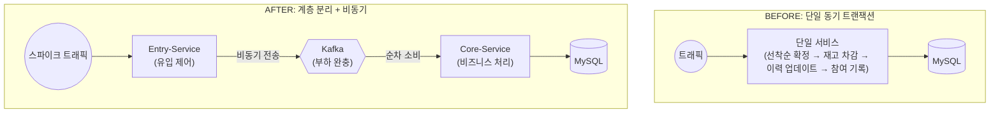

**문제**
- 선착순 구매 이벤트 오픈 시점에 집중되는 스파이크 트래픽이 비즈니스 로직과 DB에 직접적인 충격을 주어 시스템 전체가 마비될 위험 확인.
- 기존 단일 요청 흐름에서는 FCFS 선착순 확정, 재고 차감, 유저 구매 이력 업데이트, 이벤트 참여 기록이 하나의 동기 트랜잭션으로 연결되어 있어 DB 지연이 즉각적으로 사용자 응답 지연으로 전파되는 구조적 한계 노출.
- 대량 유입 시 DB 커넥션 풀 고갈을 방지하기 위해 트래픽을 일시적으로 수용할 메시지 대기열 계층 부재.

**해결**
- API Gateway 수준의 단순 Throttling 대신, 요청을 대기열에 수용하면서 시스템이 가용한 수준만큼 순차 처리하는 **Kafka 기반 Backpressure** 설계.
- 시스템 복잡도는 증가하지만, DB 커넥션 풀을 보호하고 스파이크 트래픽을 평탄화(Traffic Smoothing)하여 가용성을 확보하는 것이 비즈니스 연속성 측면에서 적합하다고 판단.

**결과**
- Entry-service만 독립적으로 수평 확장(Scale-out) 가능한 구조 확보 — 트래픽 유입부(Entry)와 비즈니스 처리부(Core)의 배포 단위 분리.
- Kafka 버퍼링을 통해 피크 타임에도 DB 커넥션 풀의 급격한 변동 없이 안정적인 메시지 소비 흐름 유지.

---

## 2. 비즈니스 확장성: 객체지향 설계를 통한 유연성 확보

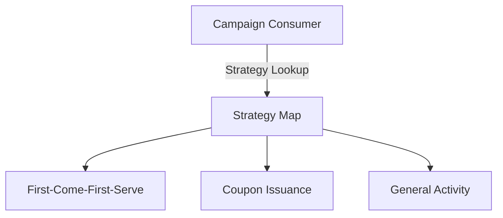

**문제**
- 선착순, 쿠폰 발행 등 캠페인 유형이 추가될 때마다 늘어나는 `if-else` 분기문으로 인해 코드 가독성과 유지보수성 저하.
- 특정 유형의 로직 수정이 전체 Consumer에 영향을 줄 수 있는 강한 결합도로 인해 신규 정책 도입 시 사이드 이펙트 리스크 존재.

**해결**
- 캠페인 유형별 특화 로직을 `CampaignStrategy` 인터페이스로 추상화하고 독립된 구현체로 캡슐화하는 **전략 패턴(Strategy Pattern)** 도입.
- 신규 정책 도입 시 기존 코드 수정 없이 구현체만 추가하는 **OCP(Open-Closed Principle)** 준수.
- 스프링의 `ApplicationContext`가 전략 빈(Bean)을 자동 수집 → Consumer 생성 시 `Map<CampaignActivityType, CampaignStrategy>`(유형 식별자: FCFS, 쿠폰 발행 등)로 빌드하여 런타임 시점의 전략 디스패치 구현.

**결과**
- 신규 캠페인 유형 추가 시 기존 전략 코드 무수정으로 배포 가능한 구조 확립.
- 정책별 로직이 물리적으로 분리되어 각 전략에 대한 독립적인 단위 테스트 가능.

---

## 3. 정합성 최적화: 비동기 환경의 한계 극복 (1)

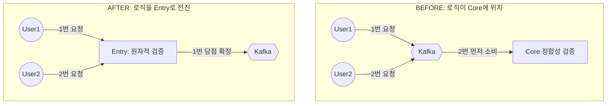

**문제**
- 선착순 판단 로직이 비동기 구간(Core) 뒤에 위치할 경우, Kafka의 파티션 할당이나 네트워크 지연에 따라 실제 유입 순서와 처리 순서가 뒤바뀌는 현상 발생.
- 먼저 응모한 유저가 낙첨되고 나중에 응모한 유저가 당첨되는 정합성 오류를 부하 테스트 중 실측하여 확인.
- 마감 이후의 요청까지 Kafka를 거쳐 Core DB에 도달하는 불필요한 리소스 낭비.

**해결**
- Kafka 파티션 키를 통한 순서 보장은 리밸런싱이나 장애 상황에서 완벽하지 않으므로, 판정 시점 자체를 유입 시점과 일치시키는 **전진 배치(Forward Placement)** 단행.
- Entry에서 즉각적인 원자적 판정을 내리고 성공한 건만 Kafka로 발행 — 이후 비동기 소비 순서와 무관하게 당첨 권한 보장.
- 선착순 마감 이후 요청은 Entry에서 즉각 Fail-fast 응답 반환하여 배후 서비스 보호.

**결과**
- 다중 Consumer 환경에서 유입 순서 역전 0건 (k6 검증).
- k6 기준 10,000건 요청 중 200건(2%)만 Core에 도달, **98%를 Entry에서 Fail-fast 처리** — DB와 Core 서비스 부하를 구조적으로 차단.
- DB 접근 없이 메모리 기반 검증으로 즉각 응답하여 피크 타임 응답 속도 개선.

---

## 4. 정합성 최적화: 비동기 환경의 한계 극복 (2)

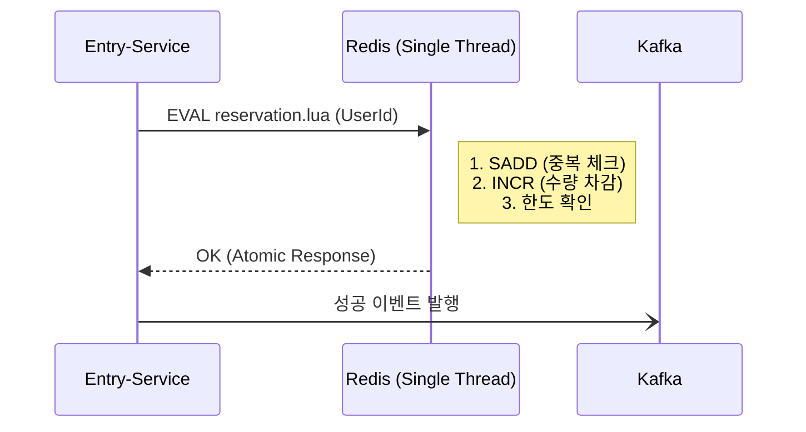

**문제**
- Section 3의 Forward Placement로 선착순 순서 역전 문제를 해결한 뒤, Entry에서 사용하는 FCFS 카운터 연산 방식에서 별도의 정합성 문제 발견.
- 기존 구현: `INCR(카운터 증가) → 오버부킹 여부 확인 → 오버부킹 시 DECR(복구)`의 3-step 연산.
- Redis는 싱글스레드 기반이므로 이 시퀀스에서 동시성으로 인한 오버부킹 자체는 발생하지 않음.
- 단, INCR 성공 후 네트워크 단절이나 프로세스 크래시 발생 시 DECR 복구가 실행되지 않아 **Ghost Reservation(유령 선점)** 발생 — 카운터는 점유됐지만 실제 참여자는 없는 상태. 이 오차가 누적되면 실제 참여 가능 재고가 카운터보다 높아지는 재고 정합성 오류 유발.

**해결**
- 복구 로직의 실패 가능성 자체를 없애기 위해 INCR(카운터 증가) → 오버부킹 여부 확인 → 오버부킹 시 DECR(복구)을 단일 Lua 스크립트로 원자화.
- Redis는 Lua 스크립트를 단일 명령으로 처리 — 스크립트 실행 도중 다른 커맨드가 끼어들 수 없으므로 중간 상태 자체가 발생하지 않아, DECR 복구 로직이 불필요해짐.
- 네트워크 재시도 시 발생하는 중복 참여를 막기 위한 **멱등성(Idempotency)** 검증(`SADD`)을 동일 스크립트 내에 결합.

**결과**
- Ghost Reservation 0건 — 원자 연산으로 중간 실패 상태 없으므로 카운터와 실제 참여자 수가 항상 일치.
- k6 10,000+ 동시 요청에서 오버부킹 0건.
- Redis 호출 3회 → Lua 스크립트 1회로 감소.

---

## 5. 비동기 적재 신뢰성: 정합성 한계 극복과 장애 격리(Fault Tolerance) 파이프라인

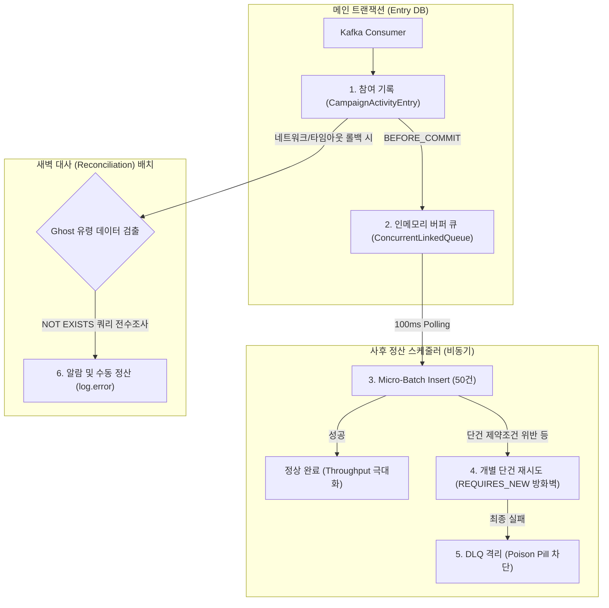

**문제**
- **스레드 병목 및 강결합 현상:** 메인 수신 스레드가 메모리 버퍼 적재뿐만 아니라 DB 일괄 저장(`flushBatch`)까지 직접 수행함에 따라, DB 락(Lock) 등 지연 발생 시 앞단 Kafka 수신부까지 대기가 걸리는 결합 문제 확인.
- **배치 오염 (Batch Contamination):** 트래픽 완화를 위해 50건 단위 배치(Micro-Batch) 구조를 도입했으나, 단 1건의 제약조건 오류 발생 시 전체 트랜잭션 배치가 롤백되어 타 유저의 정상 데이터까지 저장이 중단되는 리스크 존재.
- **Ghost Data (고아 데이터) 이슈:** 선착순 응답 속도를 위해 `BEFORE_COMMIT` 시점에 이벤트를 조기 전송하는데, 간헐적인 DB 커밋 타임아웃 발생 시 '참여 기록(Entry)은 롤백되었으나 결제 기록(Purchase)만 남는' 데이터 정합성 불일치 가능성 내포.

**과정 및 해결**
- **스레드 분리(Decoupling):** 수신 스레드는 큐(`ConcurrentLinkedQueue`)에 데이터를 담는 역할만 수행하고 즉시 반환되도록 분리. 실제 DB 일괄 적재는 100ms 주기의 독립 스케줄러 스레드가 전담하도록 설계하여 수신부와 영속성 처리부의 결합도를 낮춤.
- **`REQUIRES_NEW` 적용 및 DLQ 도입:** 배치 삽입 실패 시, 50건의 데이터를 개별 `REQUIRES_NEW` 트랜잭션으로 분할하여 재시도하는(Fallback) 로직 추가. 여기서도 실패하는 문제 데이터는 Dead Letter Queue (DLQ)로 전송하여 정상 데이터의 처리 흐름을 보장.
- **사후 대사(Reconciliation) 스케줄러 구현:** 성능을 위해 타협했던 'Ghost Data' 발생 가능성을 보완하기 위해, 유휴 시간대(새벽 3시)에 작동하는 비동기 대사 스케줄러 추가. `NOT EXISTS` 쿼리로 고아 데이터를 찾아내고 로깅하여 관리자가 인지 및 후속 처리할 수 있도록 조치.

**결과**
- **가용성 향상:** 카프카 수신 스레드가 DB 트랜잭션 지연에 직접적인 영향을 받지 않게 되어, 피크 타임에도 메시지 수신 파이프라인의 처리 속도 유지.
- **장애 격리:** 개별 트랜잭션 격리(`REQUIRES_NEW`)와 DLQ 구조를 통해 데이터 결함이 전체 배치 실패로 번지는 현상(Cascading Failure)을 방지.
- **정합성과 성능의 균형 확보:** 완전한 실시간 정합성 대신 빠른 응답 속도를 확보하되, 1차 장애 격리 및 2차 사후 대사(배치) 등 방어 로직을 추가하여 시스템 안정성을 보완.

---

## 6. 정합성 최종 수비: 분산 시스템의 데이터 무결성 설계

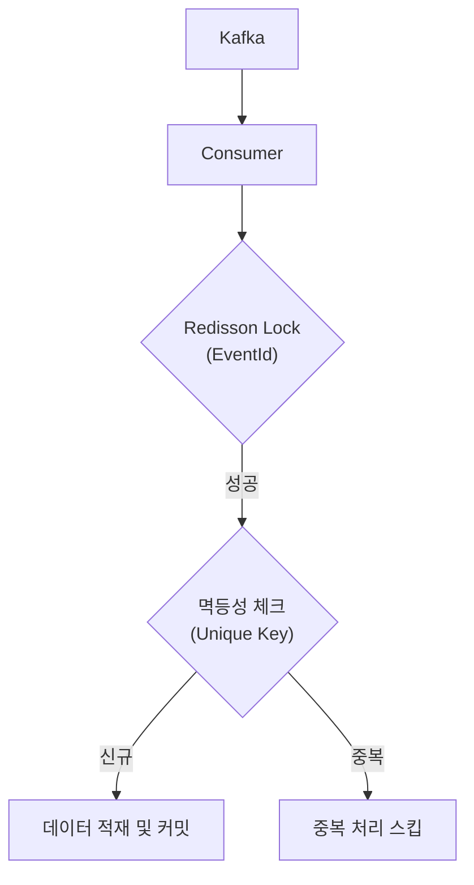

**문제**
- Kafka의 'At-least-once' 전달 특성으로 인해 네트워크 재시도 시 동일한 성공 메시지가 중복 소비될 가능성 상존.
- 다중 Consumer 환경에서 동일 이벤트 ID에 동시 접근 시 레이스 컨디션으로 이중 결제나 이중 적재가 발생할 정합성 리스크 확인.
- DB Unique 제약 조건만으로는 선행 작업(재고 차감 등)의 중복 실행을 막을 수 없어 상위 레벨의 동시성 제어 필요.

**해결**
- **Idempotent Consumer 패턴 구축**: Kafka EOS(`acks=all`, `idempotence=true`)를 활성화했으나, DB와 Kafka 간의 원자적 커밋이 불가능한 한계를 극복하기 위해 소비단에 **Redisson 분산 락**과 **DB Unique Key**를 조합한 이중 방어 로직 구축.
- **Cross-System Idempotency**: 설령 네트워크 재시도로 동일 메시지가 N번 수신되더라도 DB 레벨에서 안전하게 무시(Ignore)되도록 설계하여 시스템의 생존력(Survivability) 확보.

**결과**
- **정합성 100% 실증**: 3,000 VU 부하 테스트 중 고의적으로 Consumer를 죽이는 **Pod Restart 상황**에서도 중복 적재/이중 결제 **0건** 유지.
- **Zero Data Loss 달성**: 유실 방지를 위해 Producer 재시도를 **`MAX`**로 상향하면서도, 소비단의 철저한 멱등성 보장 덕분에 데이터 오염 없이 **'유실 없는 데이터 파이프라인'** 구축 성공.

---

## 7. 쓰기 병목 해소: 지연 동기화를 통한 Throughput 극대화

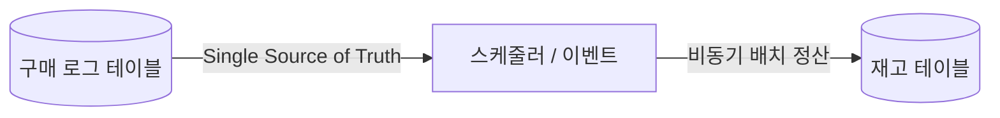

**문제**

- 구매 확정 시 상품 재고와 유저 요약을 실시간 업데이트할 때 발생하는 빈번한 DB Row-Lock 경합이 응답 지연의 주요 원인임을 확인.
- 인기 상품(Hot-Spot)의 경우 특정 행에 트랜잭션이 집중되어 커넥션 풀이 고갈되는 성능 임계점 노출.
- Strong Consistency를 유지하는 방식으로는 초당 수백 건의 쓰기 요청을 감당할 수 없음을 부하 테스트를 통해 진단.

**해결**

- **Eventual Consistency(결과적 일관성) 모델 채택**: 실시간 재고 차감 시 발생하는 DB Row-Lock 경합(Hot-spot)을 피하기 위해, 메인 트랜잭션에서는 `Purchase` 로그 적재(Insert)에만 집중하고 재고 테이블 업데이트는 유예(Defer)하는 방식 채택.
- **이원화된 Inventory 관리 전략**:
    - **Single Source of Truth (MySQL Purchase Log)**: 휘발성 리스크가 있는 Redis 대신, 물리적인 구매 로그를 '진실의 원천'으로 설계. 설령 DB 장애나 Redis 데이터 오염이 발생하더라도 `SELECT COUNT(*) FROM purchases`를 통해 100% 정확한 잔여 재고 복구가 가능한 구조 확립.
    - **Pre-allocated Stock (Quarantine)**: 이벤트 상품의 경우 일반 판매 재고와 격리된 **'이벤트 전용 재고'**로 운영하거나, 전체 재고 컨트롤러를 Redis로 일원화하여 성능과 정합성 사이의 균형 확보.
    - **Hybrid 정산**: 피크 타임엔 Redis `INCR`로 1차 게이팅을 수행하고, 5분 주기 배치 스케줄러가 구매 로그를 역산하여 `products` 테이블의 최종 재고를 일괄 업데이트(Bulk Update)하여 DB 부하 최소화.

**결과**

- **성능**: 재고 테이블의 Row-Lock 경합을 완전히 제거하여 초당 수천 건의 트래픽에서도 DB 커넥션 풀 가동률 안정화.
- **신뢰성**: 'RedisCounter - MySQL Log' 사이의 이중 검증(Audit) 파이프라인을 통해 인메모리 데이터의 휘발성 리스크 완벽 보완. (Audit 결과 불일치 시 Purchase 로그를 기준으로 자동 재정산하도록 설계)

---

## 8. 조회 성능 최적화: 수집 시점 역정규화 설계

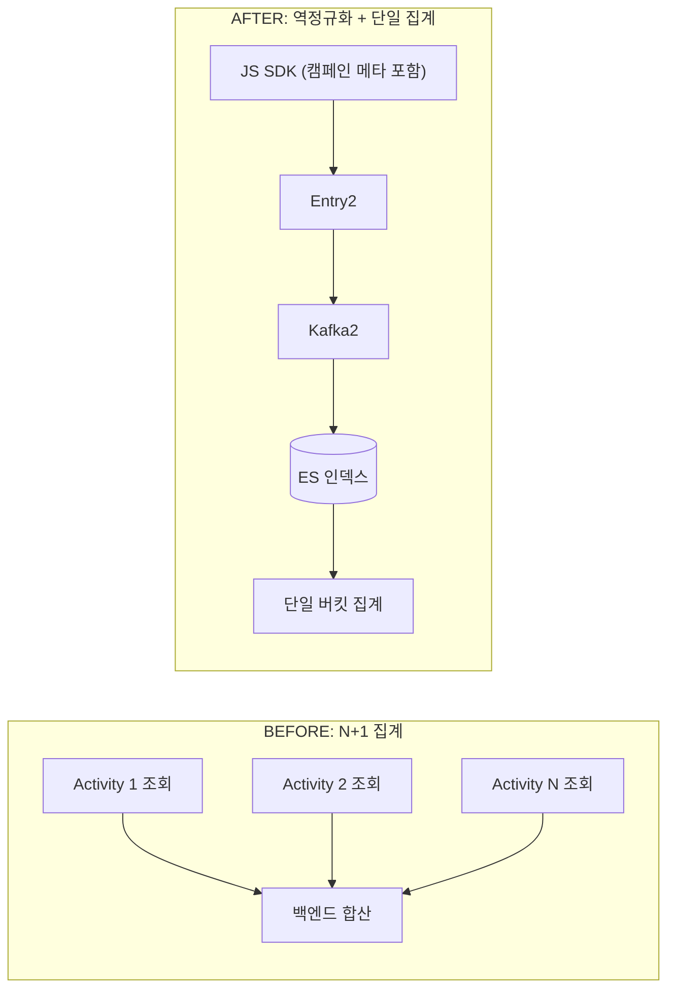

**문제**
- Campaign은 여러 CampaignActivity의 집합으로 구성. 캠페인 레벨 대시보드 조회 시 해당 Campaign에 속한 모든 Activity를 각각 쿼리한 뒤 백엔드에서 합산하는 방식이었음.
- Activity 수가 늘어날수록 쿼리 수가 선형으로 증가하는 N+1성 연산으로 조회 지연과 타임아웃 발생.
- 분석 워크로드와 OLTP 워크로드가 동일 DB 자원을 경합하며 서로의 성능을 저하시키는 리소스 간섭 현상 실측.

**해결**
- 개별 Activity 조회 후 합산하는 방식 대신, 데이터 수집 단계(JS SDK)에서 `campaign_id`, `activity_id` 등 메타데이터를 이벤트 페이로드에 미리 포함하여 전송하는 **의도적 역정규화(Denormalization)** 단행.
- Elasticsearch에서 단일 인덱스 쿼리와 버킷 집계만으로 캠페인 레벨 통계 산출 가능 — 백엔드 N+1 집계 연산 제거.
- 분석용 저장소(ES)와 처리용 저장소(MySQL)의 책임 분리로 OLAP/OLTP 리소스 간섭 제거.

**결과**
- 대시보드 주요 KPI 조회 성능 **440% 향상**.
- 피크 타임에도 데이터 발생부터 대시보드 반영까지의 지연 시간 최소화.

---

## 9. AI 에이전트 최적화: RAG와 Function Calling의 결합

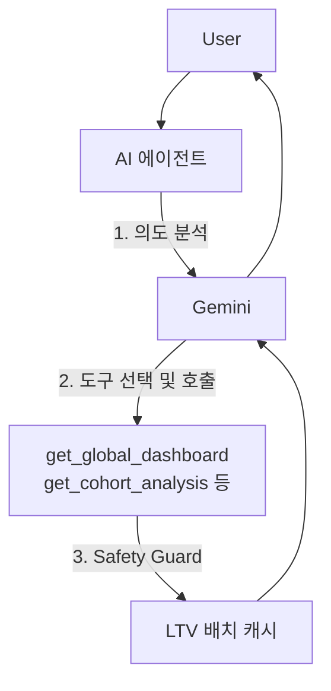

**문제**

- Campaign/Activity 단위 질문("이 캠페인의 전환율은?")은 현재 대시보드 데이터를 RAG 컨텍스트로 주입하여 LLM이 바로 답변 가능.
- 하지만 "이번 달 전체 캠페인 중 LTV/CAC 비율이 가장 높은 곳은?" 같은 Overview 수준의 질문은 컨텍스트에 없는 데이터를 요구. 모든 캠페인 데이터를 프롬프트에 Full Injection하면 캠페인당 Activity 수 × KPI 수 × 행동 로그 집계 데이터가 모두 포함되어 컨텍스트 크기가 선형으로 증가 — 컨텍스트 윈도우 제한 및 토큰 비용 급증.
- LLM이 원천 데이터 없이 수치를 추론할 경우 Hallucination 위험, 실시간 DB 직접 접근은 OLTP 부하 가중 우려.

**해결**

- 정적 지식 검색(RAG)과 **Function Calling**을 결합한 하이브리드 추론 엔진 설계.
- Overview 수준 질문 시 LLM이 스스로 필요한 도구(`get_global_dashboard`, `get_campaign_dashboard`, `get_cohort_analysis` 중 선택)를 호출 — 질문의 의도에 맞는 데이터만 가져오는 구조.
- **Safety Guard Layer**: LLM 이 장기간 코호트 분석 도구 호출 시 실시간 DB 조회를 차단하고 사전 계산된 LTV Batch 캐시 테이블만 참조하도록 강제 — 분석 쿼리의 OLTP 부하를 구조적으로 차단.

**결과**

- Full Context 주입 대비 토큰 소모 절감 약 80% 감소
- 필요한 정보를 선택적으로 조회하는 Function Calling을 이용하여 순수 RAG 방식 대비 메인 DB 부하 약 70%감소
- 구조화된 API 응답 기반 추론으로 수치 관련 Hallucination 방어.

---

## 10. 비즈니스 가치 창출: 코호트 기반 LTV 분석 파이프라인

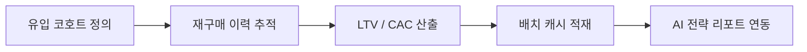

**문제**
- 선착순 이벤트로 유입된 고객의 단기 전환 성과를 넘어, 마케팅 투자가 장기 수익성(LTV)으로 이어지는지 판단할 수 있는 정량적 지표 부재.
- 유입 고객별 재구매 이력을 대시보드 조회 시마다 실시간으로 집계하는 방식은 쿼리 비용과 서비스 가용성 모두 문제.
- 30일/90일/365일 단위의 생애 가치 성장을 시계열로 가공하는 프로세스 부재.

**해결**
- 실시간 집계는 서비스 DB에 부하를 주므로 Read Replica 분리를 검토했으나, LTV 코호트 집계 자체가 전체 구매 이력을 스캔하는 무거운 쿼리라 분리된 읽기 전용 인스턴스에서도 서비스에 영향을 줄 수 있다고 판단 → 서비스 트래픽이 없는 새벽 시간대에 실행하는 **일 단위 배치** 방식으로 결정.
- 유입 시점(Cohort)을 기준으로 고객군을 그룹화하고, 기간별 누적 매출 및 획득 비용(CAC)을 자동 추적하는 **코호트 분석 엔진** 설계.
- 배치 결과를 대시보드 및 AI 에이전트(Section 9)와 연동하여 캠페인 ROI를 정량 수치 기반으로 즉각 판단할 수 있는 의사결정 보조 시스템 구성.

**결과**
- 캠페인 효율성(LTV/CAC Ratio)을 정량화하여 수익성 기반의 마케팅 예산 재분배 의사결정 지원.
- 배치 캐시 활용으로 코호트 분석 조회 시 DB 직접 집계 없이 안정적인 지표 제공 구조 확보.

---

## 11. 배치 연산 최적화: Java 집계 → SQL 오프로딩

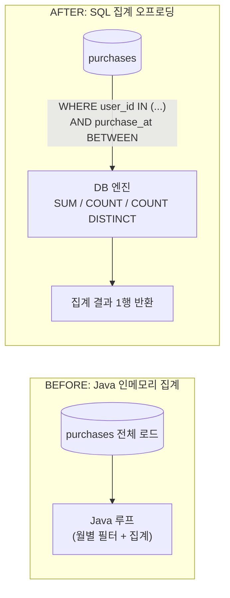

**문제**
- 코호트 LTV 배치 작업 시 기존 구현은 `findByUserIdIn()`으로 코호트 전체 구매 이력을 메모리에 적재한 뒤, Java 루프로 월별 매출·주문 수·활성 유저 수를 직접 집계하는 방식.
- 복합 인덱스 `(user_id, purchase_at)`가 구성되어 있었으나, 월별 범위 조건(`purchase_at BETWEEN`)이 Java 레이어에서만 적용되어 인덱스의 두 번째 컬럼이 활용되지 않는 구조적 낭비 존재.
- 코호트 크기가 클수록 전체 구매 이력이 JVM 힙에 상주하여 GC 압박과 메모리 사용량이 선형으로 증가.

**해결**
- Java 루프 집계를 `NamedParameterJdbcTemplate` SQL 집계 쿼리로 이관.
  - `SUM(price * quantity)`, `COUNT(*)`, `COUNT(DISTINCT user_id)`를 DB 엔진에서 직접 계산.
  - `WHERE purchase_at >= :start AND purchase_at < :end` 조건을 SQL 레이어로 이동하여 복합 인덱스 `(user_id, purchase_at)` 풀 활용.
- 증분 계산(offset > 0) 시 누적 LTV를 DB 재집계 없이 이전 달 배치 레코드 값에 이번 달 증분만 덧셈(`prevStat.getLtvCumulative().add(monthlyRevenue)`)하는 방식으로 월별 쿼리 수 최소화.

**결과**
- EXPLAIN ANALYZE 기준 스캔 rows 456 → 1 — 인덱스가 `user_id` 범위 필터에 이어 `purchase_at` 범위까지 풀 활용.
- 배치 처리 시간 약 68% 단축 (로컬 환경 실측).
- 메모리 상주 데이터 제거로 코호트 크기 확장 시에도 JVM 힙 사용량 안정적 유지.
