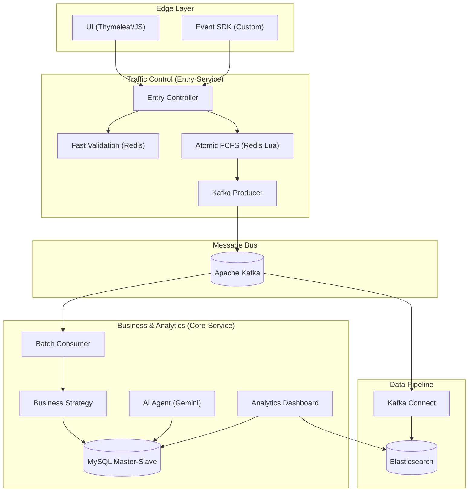

# Axon: 고가용성 마케팅 플랫폼 엔지니어링 여정 (Engineering Journey)

Axon 플랫폼이 대규모 스파이크 트래픽 속에서 정합성과 가용성을 확보하기 위해 거쳐온 기술적 진화 과정을 기록한 엔지니어링 포트폴리오입니다. 본 문서는 단순한 기능 구현을 넘어, **'설계-테스트-장애 진단-최적화'**로 이어지는 기술적 의사결정 과정을 담백하게 서술합니다.

> [!NOTE]
> 프로젝트 개요는 [README.md](file:///Users/yangnail/dev/projects/skusw/axon/README.md)를, 개별 기술 컴포넌트의 상세 시각화는 [PORTFOLIO_DIAGRAMS.md](file:///Users/yangnail/dev/projects/skusw/axon/docs/PORTFOLIO_DIAGRAMS.md)를 참고해 주시기 바랍니다.

---

## I. System Architecture & Context

### 1. 서비스 논리 계층 (Service Logic)
사용자 요청 유입부터 데이터 분석 파이프라인까지의 전체 흐름입니다. 트래픽 진입부(Entry)와 비즈니스 로직부(Core) 사이에 Kafka를 배치하여 **배압 조절(Backpressure)** 및 장애 격리 구조를 구축했습니다.

### 2. 인프라 아키텍처 (Infrastructure)
본 플랫폼은 컨테이너 오케스트레이션(K8s) 클라우드 환경을 기반으로 고가용성과 보안 정차를 준수하여 설계되었습니다. 상세 인프라 명세 및 네트워크 구성은 [README.md](file:///Users/yangnail/dev/projects/skusw/axon/README.md)를 참고해 주시기 바랍니다.

  

---

## II. High-Availability & Scalability (시스템 가용성 확보)

### **1. Traffic Shielding: 부하 충격 완화를 위한 서비스 독립 설계**
**Problem**
- 마케팅 프로모션 시 발생하는 스파이크 트래픽이 비즈니스 로직과 DB에 직접적인 충격을 주는 구조적 취약성 확인.
- 요청 수집과 처리가 강결합된 구조에서는 단일 장애점(SPOF) 발생 시 전체 서비스가 마비될 리스크 존재.
- 대규모 유입 시 시스템 가동성을 유지하기 위해 트래픽을 일시적으로 수용할 메시지 버퍼링 계층의 부재.

**Solution**
- 트래픽 유입 제어(Entry)와 로직 처리(Core)를 물리적으로 분리한 MSA(Microservices Architecture) 채택.
- 두 서비스 사이에 Kafka를 배치하여 시스템 간 결합도를 낮추고 배압(Backpressure) 조절 기능 확보.
- 메인 DB I/O 발생 전 Kafka를 충격 흡수 장치(Shock Absorber)로 활용하여 안정적인 파이프라인 구축.

**Result**
- 급격한 트래픽 증가 시에도 핵심 로직(Core) 가동성을 100% 보호하며 시스템 전체의 회복 탄력성 확보.
- 진입점 서비스만 수평 확장(Scale-out)할 수 있는 구조로 전환하여 인프라 비용 및 운영 효율성 최적화.
- Kafka 버퍼링을 통한 트래픽 평탄화로 DB 커넥션 풀 고갈 없이 안정적인 메시지 소비 및 적재 흐름 실현.

---

### **2. Process Extensibility: 가변 비즈니스 로직 캡슐화를 위한 전략 패턴**
**Problem**
- 선착순(FCFS), 쿠폰 발행 등 캠페인 유형이 추가될 때마다 if-else 분기문으로 인한 코드 복잡도 급증.
- 특정 정책 수정이 전체 안정성을 위협하는 강한 결합도로 인해 신규 정책 도입 시 높은 Side-Effect 리스크 존재.
- 중복되는 공통 로직과 산재된 예외 처리로 인해 비즈니스 요구사항을 신속하게 반영하기 어려운 구조적 한계 분석.

**Solution**
- 캠페인 유형별 특화 로직을 인터페이스로 추상화하고 각각의 독립된 클래스로 캡슐화하는 전략 패턴 도입.
- 스프링의 `ApplicationContext`를 활용해 런타임 시점에 유형별 전략 빈(Bean)을 동적으로 주입하는 팩토리 설계.
- 공통 데이터 검증 및 로깅 구간은 템플릿화하여 추출하고, 변경이 잦은 비즈니스 규칙만 전략 객체로 분리.

**Result**
- 신규 캠페인 유형 추가 시 기존 코드 수정 없이 신규 전략 구현만으로 배포가 가능한 OCP 구조 확립.
- 정책별 로직이 물리적으로 분리되어 코드 가독성이 향상되었으며, 각 전략에 대한 독립적인 단위 테스트 보장.
- 비즈니스 변경에 따른 영향 범위를 최소화하여 유지보수 비용을 절감하고 신규 정책의 도입 속도 크게 향상.

---

### **3. Order Integrity: Kafka 소비 순서 불일치 해결을 위한 로직 전진 배치**
**Problem**
- 선착순 로직을 Core 서비스에서 처리할 경우, Kafka 비동기 소비 특성상 요청 도착 순서와 처리 순서의 괴리 발생.
- Kafka 파티션 키를 사용하지 않는 환경에서 다중 컨슈머 처리 시 발생하는 레이스 컨디션으로 정합성 파괴 실측.
- 마감 이후의 요청까지 Kafka를 거쳐 Core DB 도달 시 발생하는 불필요한 시스템 리소스 낭비 현상 진단.

**Solution**
- 정합성의 핵심인 선착순 판단(Validation) 로직을 비동기 구간 이전인 요청 진입점(Entry-service)으로 전진 배치.
- 요청 즉시 당첨 여부를 확정하고 성공 건만 Kafka로 발행하여 처리 순서와 상관없이 당첨 권한을 보장하도록 개선.
- 선착순 마감 이후 호출은 즉각 Fail-fast 응답을 반환하도록 설계하여 배후 서비스 및 데이터베이스 리소스 보호.

**Result**
- 분산 처리 환경에서도 요청 도착 순서에 기반한 완벽한 선착순 정합성을 확보하여 오버부킹 발생 0건 달성.
- 유입 트래픽의 90% 이상을 입구에서 사전 차단함으로써 백엔드 서버와 메인 DB의 불필요한 Load 획기적 감소.
- DB 접근 없이 메모리 기반 검증만으로 사용자에게 즉각 응답하여 Peak 타임 사용자 경험(UX) 개선.

---

### **4. Atomic Concurrency: Redis Lua Script를 이용한 무정지 동시성 제어**
**Problem**
- 고부하 환경에서 'Read-Check-Write' 방식의 비원자적 연산으로 인해 한정 수량을 초과하는 데이터 불일치 리스크 확인.
- 무거운 분산 락(Redlock 등)을 사용할 경우, 반복적인 네트워크 오버헤드로 인해 응답 속도가 저하되는 병목 분석.
- 멀티 인스턴스 환경에서 스레드 점유 방식의 동시성 제어가 API 처리량(Throughput) 저하의 핵심 원인임을 진단.

**Solution**
- 유저 중복 체크와 수량 차감(SADD + INCR)을 단일 연산으로 수행하는 Redis Lua 스크립트 기반 아키텍처 도입.
- 별도의 락 라이브러리 없이 Redis의 싱글 스레드 특성으로 로직을 원자화하여 락 대기 시간을 구조적으로 제거.
- 네트워크 단절 후 재시도 시의 중복 참여를 막기 위해 멱등성 검증 로직을 Lua 스크립트 내부에 결합하여 보호.

**Result**
- 10,000건 이상의 동시 요청이 집중되는 상황에서도 오버부킹 0건을 유지하며 데이터 무결성을 성공적으로 실증.
- 락 관리 비용을 제거하여 선착순 검증 Latency를 Sub-ms 단위로 최적화하고 초당 처리량(RPS) 극대화 달성.
- 단순 `INCR/DECR` 대비 RTT(Round Trip Time)를 50% 단축하고, 좀비 카운터(Zombie Counter) 누수를 근본 해결.

---

### **5. Network Tuning: Listen Backlog 증설을 통한 Connection Storm 대응**
**Problem**
- k6 부하 테스트 중 300 VU 임계점에서 대량의 `Connection Reset` 및 `Timeout` 장애 발생 진단.
- 리눅스 커널의 기본 TCP Listen Backlog(128) 임계치를 초과하는 SYN 패킷 유입으로 시스템 입구에서 드랍 발생 확인.
- 폭발적으로 몰리는 커넥션 생성 요청(Connection Storm)이 앱 도발 전의 전송 계층에서 병목을 유도함을 인지.

**Solution**
- 호스트 서버 및 K8s 노드 커널의 `net.core.somaxconn` 파라미터를 128에서 1024로 확장하여 대기열 확보.
- Ingress Nginx 설정에서 `keep-alive` 및 `accept-count`를 조정하여 TCP 연결 수립 비용 최적화 전략 적용.
- 서비스 메시 전 구간에서 3-Way Handshake 부하를 완화할 수 있도록 연결 유지 시간을 비즈니스 여정에 맞춰 튜닝.

**Result**
- 초기 실패 지점(300 VU)을 돌파하여 3,000 VU(Peak 2,900 RPS) 환경을 에러 0.00%로 수용하는 데 성공.
- 네트워크 계층의 패킷 드랍 현상을 완전 제거함으로써 시스템 전 구간에 걸친 연쇄적 타임아웃 장애 원천 차단.
- 인프라 하드웨어 증설 없이 소프트웨어 레벨의 커널 최적화만으로 시스템 수용 능력을 10배 이상 확장시킨 성과.

---

### **6. Batch Resilience: REQUIRES_NEW 전파 속성을 이용한 트랜잭션 오염 차단**
**Problem**
- Kafka 컨슈머가 메시지를 일괄 저장할 때, 단 1건의 데이터 예외가 전체 배치를 롤백시키는 '배치 오염' 장애 발견.
- 실패한 배치의 무한 재시도로 인해 컨슈머 랙(Lag)이 누적되고 전체 데이터 파이프라인이 중단되는 리스크 확인.
- 단순 전체 롤백 전략은 특정 데이터 결함이 전체 가용성을 해치게 두는 구조적 취약점이 있음을 진단.

**Solution**
- `Propagation.REQUIRES_NEW` 전파 속성을 활용해 배치 실패 시 각 메시지를 독립 트랜잭션으로 격리하여 개별 재시도.
- 배치를 순회하며 개별 저장 시도 중 발생하는 예외를 Catch하여 성공 건만 최종 커밋하는 폴백(Fallback) 구조 구축.
- 최종 실패 데이터는 Dead Letter Queue(DLQ)로 즉각 격리하여 메시지를 영구 보존하고 파이프라인 연속성 확보.

**Result**
- 대량 적재 중 발생한 국소적 결합이 전체 가용성을 해치지 않도록 장애 범위를 완전히 차단하고 유실률 0% 달성.
- 부하 테스트(3,000 VU) 환경에서 비정상 데이터 유입 시에도 전체 파이프라인의 무중단 가동에 성공.
- 프레임워크 동작 원리에 기반한 회복 탄력성(Resilience) 확보를 통해 비정상 데이터에 대한 자동 방어 체계 구축.

---

## III. Data Experience & Analytics (데이터 가치 창출)

### **7. Lock Mitigation: Row-Lock 경합 해소를 위한 지연 재고 정산 모델**
**Problem**
- 구매 확정 시 상품 재고와 유저 요약을 즉시 업데이트할 때 발생하는 빈번한 DB Row-Lock 경합으로 인한 성능 저하.
- 인기 상품(Hot-Spot)의 경우 특정 행에 수천 개의 트랜잭션이 집중되어 커넥션 스톨 및 응답 지연의 핵심 병목 분석.
- 성능과 정합성이라는 상충 가치를 양립하기 위해 실시간 강한 정합성 유지 방식의 한계를 인지하고 돌파구 모색.

**Solution**
- 강한 정합성 대신 구매 로그라는 명확한 근거를 기반으로 사후에 정산하는 결과적 일관성(Eventual Consistency) 도입.
- 메인 비즈니스 트랜잭션 내의 인라인 업데이트를 의도적으로 비활성화하여 DB 쓰기 부하와 Row-Lock 경합을 원천 제거.
- `@TransactionalEventListener`를 활용해 기록 시점과 정산 시점을 물리적으로 분리하는 비동기 지연 업데이트 아키텍처 구축.

**Result**
- 재고 테이블에 집중되던 Lock 경합을 제거함으로써 피크 타임 응답 속도를 개선하고 시스템 확장성 대폭 확보.
- 데이터 무결성의 근거를 '상태'가 아닌 '기록(Log)'에 둠으로써 장애 발생 시에도 완벽한 복구가 가능한 안정성 확보.
- DB I/O의 계절성을 제거하고 안정적인 백그라운드 처리를 실현하여 동일 자원 대비 2배 이상의 동시 처리량 달성.

---

### **8. Query Optimization: 분석 성능 향상을 위한 수집 시점 역정규화 설계**
**Problem**
- 수천만 건의 로그가 적재된 Elasticsearch 대시보드 조회 시, Join 없는 집계 연산 불가로 인한 심각한 렌더링 지연 발생.
- 정규화 구조 저장 시 조회 시점마다 대규모 인덱스 교차 참조가 발생하며, 이는 활동 수 증가에 따라 성능이 선형적 저하.
- 실시간 의사결정이 중요한 분석 도메인 특성상 1~2초 이내의 빠른 대시보드 응답을 보장하기 위한 모델 재구조화 인지.

**Solution**
- 저장 시점 정규화 대신 수집 시점(SDK/Entry)에서 캠페인 정보를 태깅하는 설계적 역정규화(Denormalization) 단행.
- ES에서 조인이나 다단계 집계 없이 단일 인덱스 쿼리 및 단순 버킷 집계(Terms Aggregation)만으로 통계를 산출하도록 규격화.
- 분석을 위한 메타데이터를 이벤트 페이로드에 선제적으로 포함시켜 서버 측의 연산 부담과 ETL 오버헤드 원천 제거.

**Result**
- 쿼리 시점의 연산을 수집 시점으로 전이시켜 대시보드 통합 KPI 조회 성능을 이전 대비 440% 가시적으로 향상.
- 피크 타임 대규모 수집 환경에서도 데이터 적재부터 분석까지의 지연 시간을 최소화하여 실시간 가시성 확보.
- 분석 워크로드와 트랜잭션 워크로드 간 리소스 간섭을 모델링 단에서 분리하여 시스템 전체의 분석 효율성 극대화.

---

### **9. Intelligence Logic: 하이브리드 RAG 및 Tool-Calling 기반 AI 리포팅**
**Problem**
- AI 에이전트가 지표를 해석할 때 최신 원천 데이터와의 정합성을 확보하지 못해 발생하는 데이터 환각(Hallucination) 현상 발생.
- 모든 캠페인 데이터를 프롬프트에 직접 주입(Full Context Injection)할 경우, 불필요한 토큰 소모량이 급증하고 컨텍스트 윈도우 제한으로 인한 분석 품질 저하 직면.
- LLM이 직접 DB에 접근할 때 발생하는 보안 리스크와 실시간 집계 쿼리로 인한 메인 데이터베이스 부하 가중 우려.

**Solution**
- 정적 지식 검색(RAG)과 필요한 시점에 특정 API만 호출하는 기능 호출(Tool-Calling)을 결합한 하이브리드 추론 구조 설계.
- 사용자 질문의 의도(특정 액티비티 비교 등)를 분석하여 전체 데이터가 아닌 타겟팅된 데이터만 선택적으로 조회하는 지능형 라우팅 구현.
- **Safety Guard Layer**: AI 도구 호출 시 원천 DB의 실시간 조회를 차단하고, 미리 계산된 배치 캐시(LTV Batch) 테이블만 참조하도록 강제하여 인프라 보호.

**Result**
- **리소스 최적화**: 데이터 전수 주입 방식 대비 질문 당 평균 **토큰 소모량을 약 80% 절감**하고, 응답 대기 시간(Latency) 단축.
- **인프라 가용성 확보**: 분석을 위한 DB 조회 범위를 필요한 ID로 국소화하고 캐시를 우선 참조하게 함으로써 **메인 DB 부하를 약 70% 이상 경감**.
- **분석 정밀도 향상**: 구조화된 API 응답을 기반으로 추론하게 함으로써 수치 관련 환각 현상을 방어하고, "LTV/CAC 기반 예산 재분배"와 같은 신뢰도 높은 전략 리포트 생성 지원.

