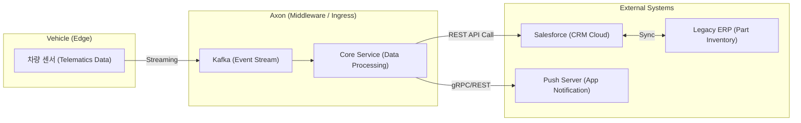

# Enterprise CRM Integration: Hyundai AutoEver Case Study

현대오토에버와 같은 엔터프라이즈 환경에서 **'외부 시스템 연동'**은 단순한 데이터 전송을 넘어, 시스템 간의 **결합도(Coupling)를 낮추고 가용성(Availability)을 보장**하는 것이 핵심입니다.

## 1. 전형적인 연동 시나리오 (차량 관리 CRM)

현대자동차 앱(MyHyundai)에서 "엔진오일 교환 벨 알림"이 뜨는 과정은 대략 다음과 같은 시스템 연동을 거칩니다.

### 연동 방식의 특징
1. **차량 -> Axon (비동기)**: 차량은 수백만 대이므로 실시간으로 쏟아지는 데이터를 Kafka로 일단 다 받습니다. (Axon의 2,900 RPS 처리 역량이 필요한 이유)
2. **Axon -> Salesforce (API 연동)**: 가공된 데이터를 Salesforce(CRM)에 보냅니다. "이 고객은 엔진오일 교환 시기가 되었으니 마케팅 쿠폰을 보내라"는 정보를 생성합니다.
3. **Salesforce -> SAP (내부 연동)**: 실제 정비소에 엔진오일 재고가 있는지 SAP(ERP) 시스템과 대조합니다.

---

## 2. 왜 Axon 프로젝트가 '외부 연동' 역량으로 인정받을 수 있나? (필살기)

면접에서 "연동 경험이 없는데 어떻게 잘할 수 있느냐?"고 묻는다면, Axon의 설계를 예로 들어 다음과 같이 답변할 수 있습니다.

### Q: "연동 시 외부 시스템(Salesforce 등)이 응답이 느리거나 장애가 나면 어떻게 할 건가요?"
- **우리 프로젝트의 해답 (Shock Absorber)**: 
    - "직접 연동 대신 **Kafka를 완충 지대**로 둡니다. 외부 시스템이 먹통이어도 우리 쪽 데이터는 Kafka에 안전하게 쌓여 있고, 나중에 복구되었을 때 순차적으로 처리(Retry)하면 됩니다."
    - "이미 `PurchaseHandler`에서 구현한 **배치 처리 및 개별 재시도(DLQ) 로직**이 바로 외부 시스템 장애 시 데이터 유실을 막기 위한 엔터프라이즈급 연동 전략의 핵심입니다."

### Q: "데이터 정합성은 어떻게 맞추나요?"
- **우리 프로젝트의 해답 (Eventual Consistency)**: 
    - "모든 시스템을 하나의 트랜잭션으로 묶는 것은 불가능합니다. 따라서 **보상 트랜잭션**이나 **재시도 로직**을 통해 '결과적 정합성'을 맞추는 구조를 Axon에서 이미 테스트했습니다."

## 4. [Insight] 부하 테스트와 CRM의 상관관계

"선착순 이벤트(모객)도 CRM인가요?"라는 질문에 대한 엔지니어링적 답변입니다.

1. **신뢰가 곧 관계다 (Reliability as Relationship)**: 
    - 현대차 같은 브랜드에서 선착순 정비 쿠폰 이벤트를 열었는데, 서버가 터져서 접속이 안 된다면? 이는 마케팅 실패를 넘어 **브랜드 신뢰도 하락(CRM 위기)**으로 이어집니다. 
    - 따라서 **2,900 RPS 부하 테스트**는 단순히 성능 확인이 아니라, **"극한의 상황에서도 고객과의 약속(쿠폰 지급)을 지킬 수 있는 기술적 성숙도"**를 증명하는 CRM 활동입니다.

2. **데이터의 선순환 (Data Loop)**:
    - 선착순 이벤트에서 '탈락'한 고객 데이터도 CRM팀에게는 매우 소중합니다. "이 고객은 이 시간대에 이 기기에 접속해서 이 혜택을 원했다"는 정보는 다음 번 개인화 오퍼의 핵심 소스가 됩니다.
    - Axon의 로그 파이프라인은 이러한 **'낙첨 데이터'까지 유실 없이 수집**하여 분석(Dashboard)할 수 있게 해주는 CRM의 근간입니다.
## 6. [Mapping] Axon 프로젝트 vs Salesforce (Before & After)

만약 이 프로젝트에 Salesforce를 도입했다면, 어떤 작업이 빠지고 어떤 작업이 여전히 핵심 과제로 남을까요?

### ❌ Salesforce가 대신해주는 것 (빼도 되는 일)
1. **캠페인 관리 어드민 (UI)**: 마케터용 캠페인 생성/수정 화면을 직접 짤 필요가 없습니다. (Salesforce의 표준 개체 활용)
2. **기초 통계 대시보드 (BI)**: 간단한 참여자 수, 매출 합계 등은 클릭 몇 번으로 보고서를 뽑을 수 있습니다.
3. **고객 프로필 스키마 (DB 설계)**: 이름, 이메일, 주소 같은 기초 데이터 테이블 설계를 안 해도 됩니다.

### ✅ 여전히 개발자가 직접 해야 하는 것 (Axon의 진가)
1. **초고성능 선착순 엔진 (FCFS)**: Salesforce는 수만 명이 동시에 1ms 안에 한 레코드를 점유하는 로직에 적합하지 않습니다. **Redis/Kafka 기반의 2,900 RPS 처리 엔진**은 여전히 외부(Heroku 또는 AWS/Java)에서 개발해야 합니다.
2. **대용량 데이터 전처리 (Pre-processing)**: 텔레매틱스 같은 로우 데이터(Raw Data)를 무지성으로 Salesforce에 부으면 비용 폭탄과 성능 저하가 옵니다. Axon처럼 **중간에서 거르고 요약해서 넘겨주는 파이프라인**이 필수입니다.
3. **시스템 간의 정밀 연동 (Integration)**: 현대차 내부의 legacy 정비 시스템과 Salesforce를 실시간/비동기로 안전하게 잇는 **Middleware 아키텍처** 설계는 전적으로 개발자의 몫입니다.

### 💡 정리 (면접용 멘트)
> "Salesforce는 비즈니스 관리의 효율성을 주지만, 현대차 수준의 **'High-Traffic 스파이크'**와 **'방대한 실시간 로그'**를 감당하기 위해서는 **Axon 같은 고성능 아키텍처가 뒷받침**되어야 합니다. 저는 솔루션의 한계를 극복하는 **'엔지니어링 코어'**를 만들 줄 아는 개발자입니다."
