# Axon Portfolio: Architecture & Technical Story

이 리포트는 대규모 트래픽 처리와 엔터프라이즈 데이터 무결성을 실증적으로 해결한 9가지 엔지니어링 케이스를 정리한 기술 포트폴리오입니다.

---

## 프로젝트 개요

**Axon** — 대규모 선착순(FCFS) 캠페인 이벤트 처리 플랫폼

| 항목 | 내용 |
|------|------|
| 아키텍처 | MSA 2-Service (entry-service ↔ Kafka ↔ core-service) |
| 기술 스택 | Java 21, Spring Boot 3, Kafka (KRaft 3 Broker), MySQL 8, Redis, ES 8.15 |
| 인프라 | K8s (K2P 클러스터: 워커 2대, 각 4vCPU/16GB) |
| 모니터링 | Prometheus, Grafana, Fluent Bit → Kibana |
| 부하 실측 | 3,000 VU / Peak 2,900 RPS / 에러율 0.00% / 오버부킹 0건 |

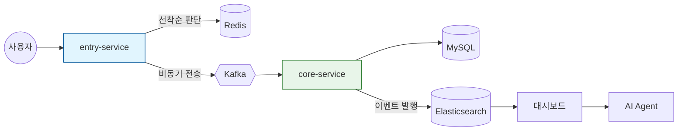

---

### **Legend & Notation**

- 🟥 **Red (Dashed)**: 병목 / 장애 전파 / 데이터 경합 (The Problem - BEFORE)
- 🟩 **Green (Thick)**: 튜닝 / 격리 / 원자적 처리 (The Solution - AFTER)
- 🟦 **Blue**: 일반적인 인프라 및 통신

---

### **1. Lock 오버헤드 제거를 위한 Redis 기반 Lock-free 알고리즘 설계**

### **[BEFORE] DB Row Lock 경합 (응답 지연)**

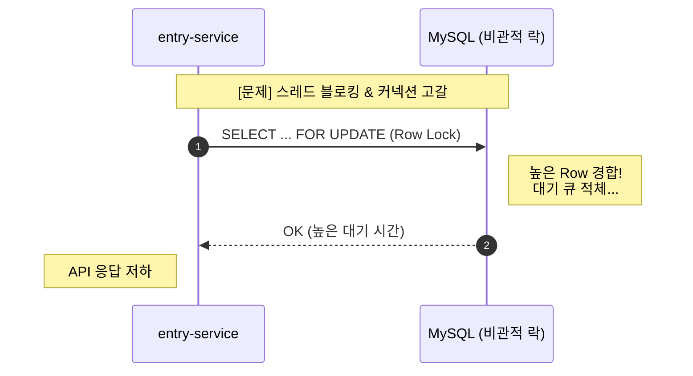

### **[AFTER] Redis Lua 원자적 실행 (저지연)**

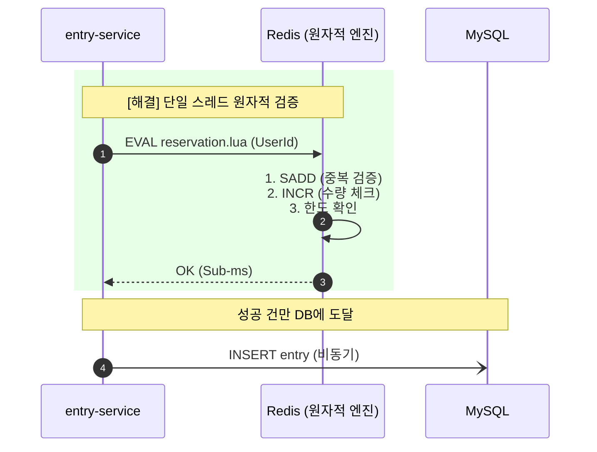

- **문제 원인**
    - 선착순 200명 한정 이벤트에 수천 명이 동시 접속하는 상황에서, DB 비관적 락 경합으로 인한 API 응답 지연 및 커넥션 풀 고갈 병목 분석
    - 분산 노드 간 락 획득/해제 과정의 반복적인 네트워크 오버헤드가 선착순 진입 단계 처리량 저하의 주범임을 진단
    - 데이터 정합성(오버부킹 0건)을 완벽히 유지하면서도 초저지연 응답을 보장할 비차단 방식의 동시성 제어 모델 필요성 확인
- **해결 과정**
    - 분산 락(Redlock)의 병목 한계를 극복하기 위해 Redis Lua 기반 Lock-free 아키텍처 설계 및 도입. **스레드가 자원을 점유하고 대기하는 느린 방식 대신, '상태 변경(Atomic State Transition)' 자체를 원자화하여 동시성 지연을 완벽히 제거함.**
    - 고비용 락 없이 Redis INCR로 초고속 수량 제어를 수행하여 성공 요청만 DB로 전달 (k6 spike 시나리오 기준 부하 98% 사전 차단 실측)
    - 네트워크 단절 후 재시도 시 발생하는 중복 참여를 막기 위해 멱등 키(Idempotency Key) 검증 로직을 결합하여 오버부킹 이중 방어 원칙 수립
- **결과**
    - 동시성 판단을 DB 비관적 락(SELECT FOR UPDATE)에서 Redis Lua 원자적 연산으로 전환하여 락 대기 시간을 구조적으로 제거하고, 3,000 VU 동시 접속 환경에서 오버부킹 발생 0건 달성
    - 선착순 진입 단계의 DB 의존성을 완전 제거하여 Redis 단독으로 수량 제어 가능한 구조 전환
    - k6 spike 시나리오 실측: 10,655건의 요청 중 98%를 Redis에서 사전 차단하고 200건만 DB에 도달시켜 불필요한 트랜잭션을 원천 제거

---

### **2. 물리 트랜잭션 오염 방지 및 데이터 무결성 보장 전략**

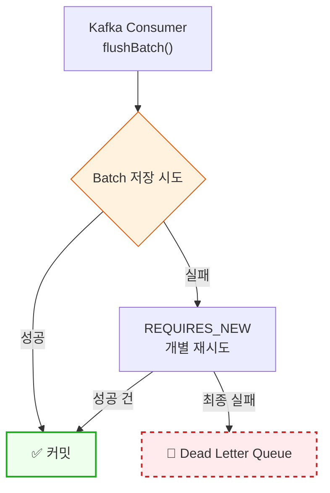

- **문제 원인**
    - 선착순 통과자의 구매 기록을 Kafka로 수신하여 일괄 저장하는 과정에서, 배치 저장 중 단건 오류가 전체를 롤백시키는 물리 트랜잭션 오염 문제 및 좀비 트랜잭션 병목 발견
    - 실패 메시지의 무한 재시도로 인해 컨슈머 랙이 누적되고, 이는 시스템 전체 가용성을 저해하는 장애 전파 시나리오와 리소스 고갈 취약성 분석
    - 성능 향상을 위한 마이크로 배치가 데이터 신뢰성을 해치지 않도록 안전한 예외 격리 및 회복 탄력성 구조의 필요성 확인
- **해결 과정**
    - 전파 속성 제어 및 Dead Letter Queue를 통한 다중 예외 격리 및 데이터 보존 전략 구현. **모든 기능을 하나의 트랜잭션으로 묶는 것이 정합성 측면에서 유리해 보이나, 비즈니스 핵심(Entry)과 부가 기능(Purchase) 사이의 논리적 결합도를 물리 트랜잭션 수위에서 분리하여 국소 장애가 전체 가용성을 해치지 않도록 독립 트랜잭션 구조를 선택함.**
    - Spring REQUIRES_NEW 전파 속성을 활용해 배치 실패 건을 독립 트랜잭션으로 격리하고 개별 재시도 후 성공 건만 최종 커밋하는 구조 구축
    - 최종 실패 데이터는 Dead Letter Queue(DLQ)로 즉시 격리하여 메시지를 영구 보존하고 메인 파이프라인의 중단 없는 연속성 확보
- **결과**
    - 부하 테스트 시나리오(3,000 VU) 내에서 데이터 유실 0건 및 정합성 100% 달성
    - 실패 건의 즉각적인 격리를 통해 장애 전파를 차단함으로써 시스템 임계점에서도 안정적인 데이터 적재 속도 및 처리 효율 유지 성공
    - 프레임워크 동작 원리에 기반한 회복 탄력성 확보를 통해 비정상 데이터 유입 시에도 전체 서비스의 무중단 가용성 보장

---

### **3. 커널 파라미터 튜닝을 통한 Connection Storm 대응 및 3,000 VU 확장**

### **[BEFORE] 커널 한계로 연결 거부**

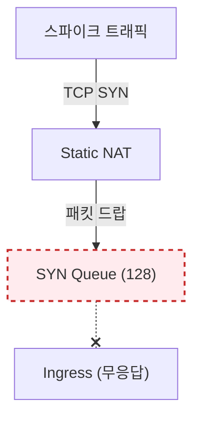

### **[AFTER] 네트워크 계층 튜닝 (안정 수용)**

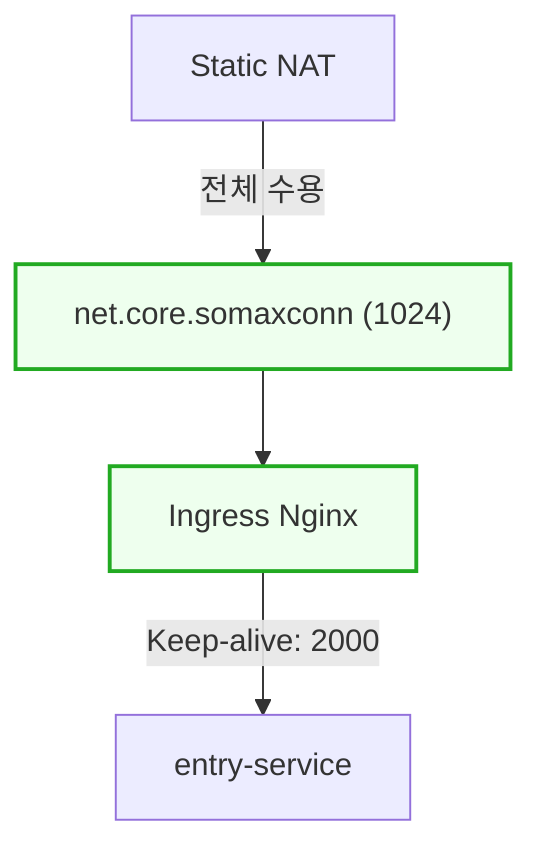

- **문제 원인**
    - 선착순 부하 테스트 중 300 VU 임계점에서 대량의 연결 거절 및 Timeout 현상 목격
    - 리눅스 커널의 TCP SYN Queue(128) 임계치 초과로 인해 앱 도달 전 패킷이 드랍됨을 확인하고 'Connection Storm' 병목으로 진단
    - 반복적인 재요청 패턴이 입구 대기열을 심화시켜 애플리케이션 수용 한계치를 넘어서는 시스템 전송 계층의 구조적 한계와 성능 저하 요인 분석
- **해결 과정**
    - 커널 수용량 증설 및 도메인 행동 패턴에 맞춘 연결 유지 전략 수립. **성능 문제를 애플리케이션 레이어(Java/Spring)에서만 해결하려 하지 않고 시스템 최하단 네트워크 전송 계층(Kernel)부터 분석하여, 동일한 명세의 컴퓨팅 자원에서 처리량을 극대화할 수 있는 L4/L7 튜닝을 단행함.**
    - K8s 노드 커널의 SYN Queue 및 somaxconn 설정을 1024로 증설하여 스파이크 트래픽 수용을 위한 네트워크 버퍼 선제 확보
    - 신규 연결 생성 오버헤드를 줄이기 위해 Upstream KeepAlive를 2000으로 설정하여 한 번 수립된 소켓 세션을 유저 여정 내내 재활용하는 전략 적용
- **결과**
    - 초기 실패 지점(300 VU) 대비 시스템 수용 한계치를 3,000 VU(Peak 2,900 RPS)까지 확장하고 시스템 에러율 0.00%(5XX, Timeout, 커넥션 거부 0건) 달성
    - 10,655건의 선착순 경쟁 속에서 오버부킹 0건, 정확히 200건만 성공 추출(Median Latency 338ms)
    - 커널(L4)~애플리케이션(L7) 전 계층의 연쇄적 튜닝을 통해 동일 인프라 자원(워커 2대, 각 4vCPU/16GB)에서의 처리량 극대화 달성

---

### **4. 핵심 DB 보호를 위한 서비스 분리 및 비동기 배압 조절 설계**

### **[BEFORE] 모놀리식 / 동기 직접 호출 (DB 위험)**

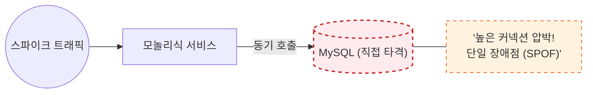

### **[AFTER] 비동기 배압 조절 (자원 보호)**

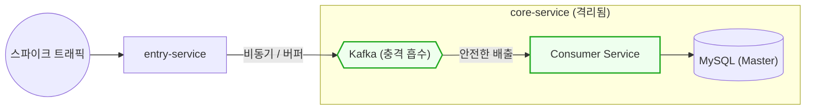

- **문제 원인**
    - 선착순 응모와 구매 처리가 동일 서버에서 동작하는 구조에서, 진입 트래픽 폭주가 비즈니스 로직 지연으로 전파되는 장애 전파 현상 및 핵심 DB 보호 필요성 인지
    - 폭발적인 진입 트래픽이 비즈니스 로직과 동일한 자원을 점유하여 핵심 데이터베이스 서버에 직접적인 부하 충격을 주는 구조적 취약성 확인
    - 분산 환경 내 네트워크 I/O 발생 시 플랫폼 스레드 기반 I/O 작업의 처리 효율 한계 도출
- **해결 과정**
    - 물리적 부하 격리를 위한 서비스 분리 및 Kafka를 활용한 비동기 배압 조절 구조 구축. **API 게이트웨이 수준의 Throttling은 단순 거절이지만, Kafka 버퍼링은 유저의 요청을 대기열에 안전하게 수용하면서 시스템 가용한 수준까지만 순차적으로 처리하게 하므로 비즈니스 연속성과 시스템 안정성을 동시에 확보할 수 있음.**
    - 트래픽 게이트웨이(Entry)와 로직 처리(Core)를 분리하여 앞단의 폭주가 핵심 데이터베이스의 가용성을 해치지 않도록 구조적 보호막 설계
    - 비동기 파이프라인 최적화로 I/O 대기 상황의 리소스 점유를 효율화하여 통신 환경 내 플랫폼 스레드 고갈 병목 해결 및 자원 효율화
- **결과**
    - 진입점의 피크 부하로부터 핵심 DB 서버를 100% 격리하여 시스템 임계점 내 응답 성공률 100% 유지
    - Kafka 버퍼링으로 스파이크 트래픽을 흡수하여 DB 커넥션 풀 고갈 없이 안정적 트래픽 평탄화 달성
    - Entry-service와 Core-service 독립 스케일링이 가능한 구조로 전환, 트래픽 증가 시 진입점만 수평 확장 가능

---

### **5. 수집 시점 역정규화 설계를 통한 조회 성능 440% 향상**

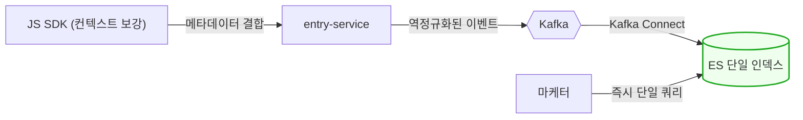

- **문제 원인**
    - 마케터가 캠페인별 참여·전환 현황을 대시보드에서 조회할 때, 활동별 분산 로그 집계 시 발생하는 N+1 쿼리 병목 및 대량 데이터 조회 시의 응답 지연 현상 진단
    - 활동 수 비례 조회 시간이 선형적으로 증가하여 마케터의 실순간 의사결정을 방해하는 지연 확인 및 기존 정규화 구조의 분석 한계 분석
    - 수집 단계의 유연성을 유지하며 최종 조회의 성능은 압도적으로 빨라야 한다는 상충 요구사항 충족을 위한 분석 중심 데이터 흐름 재설계 추진
- **해결 과정**
    - JS SDK 단계에서 Campaign 메타데이터를 결합하여 전송하는 의도적 역정규화(Denormalization) 설계. **후속 처리 시스템(Elasticsearch) 단에서 Join을 수행하는 것은 대규모 로그 분석 환경에서 치명적인 오버헤드를 유발함. SDK 시점에서 데이터를 선집계하여 전송함으로써 시스템 전 구간에 걸친 연산 낭비를 제거함.**
    - 조회 성능의 핵심은 저장 시점에 있다는 판단하에 SDK 단계 정규화를 수행하여 서버 측 연산 및 데이터 변환 오버헤드를 원천 제거하는 구조 설계
    - Kafka Connect를 연동하여 가공 없이 Elasticsearch 인덱스에 즉시 적재하고 복잡한 조인 없는 단일 인덱스 쿼리 및 집계 구조 완성
- **결과**
    - 의도된 역정규화 설계를 통해 대시보드 통합 KPI 조회 속도 440% 향상 및 실시간 가시성 확보
    - 피크 시 20,000+ MPS의 대량 이벤트 흐름 속에서도 Kafka→ES 파이프라인 데이터 유실률 0%를 실측 확인(21,310건 적재 완료)
    - 수집 시점 역정규화로 서버 측 Join/변환 연산을 완전 제거하여 분석 워크로드와 비즈니스 워크로드 간 리소스 경합 해소

---

### **6. 쓰기 병목 해소를 위한 지연 재고 동기화(Deferred Sync) 설계**

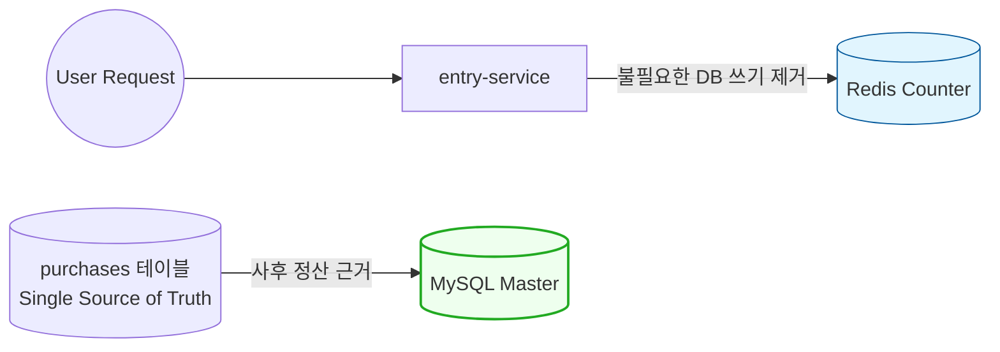

- **문제 원인**
    - 선착순 당첨자의 구매 확정 시 상품 재고를 즉시 차감하는 과정에서, 피크 타임 재고 수정 트랜잭션 집중으로 인한 DB Row Lock 경합 폭증 및 시스템 응답 마비 현상 분석
    - 재고 테이블의 빈번한 인덱스 갱신 부하가 커넥션 풀 고갈을 일으키는 가장 근본적인 병목임을 파악하고 실시간 업데이트 방식의 한계 인지
    - 성능과 데이터 정합성이라는 상충하는 가치를 양립시키기 위해 대규모 트래픽 하에서도 응답성을 유지할 수 있는 데이터 모델링 모색
- **해결 과정**
    - 기록과 차감 시점을 분리하는 결과적 일관성(Eventual Consistency) 모델 도입 결정. **재고 테이블의 Strong Consistency를 고집할 경우 선착순 진입 속도가 DB 성능의 한계에 수렴하게 되나, 구매 로그라는 확실한 근거(Single Source of Truth)가 존재하므로 이를 기반으로 사후에 재고를 합산하여 차감하는 전략이 처리량 증설에 압도적으로 유리하다는 판단을 함.**
    - 메인 트랜잭션에서 인라인 재고 감소(decreaseStock)를 의도적으로 비활성화하여 Hot Spot Row Lock 경합을 원천 제거하고, 구매 기록(purchases)을 유일한 정산 근거로 확정
    - @TransactionalEventListener를 활용해 재고 관련 부하를 메인 커밋 이후로 분리하고, 사후 정산 스케줄러 설계를 통해 멱등성 기반의 배치 차감 구조를 수립
- **결과**
    - 메인 비즈니스 트랜잭션 내 재고 테이블 Row Lock 경합을 원천 제거하여 피크 트래픽 구간에서의 커넥션 풀 안정성 확보
    - 구매 기록(purchases)이라는 단일 진실 공급원(Single Source of Truth)을 근거로 사후 정산하는 구조를 통해 데이터 무결성과 처리 성능을 동시에 달성
    - DB 쓰기 경합 문제를 근본적으로 해결하여 시스템 확장성을 확보하고 대규모 이벤트 도메인에 최적화된 독자적 결과적 일관성 전략 확립

---

### **7. 코호트 기반 고객 생애 가치(LTV) 분석 파이프라인 설계**

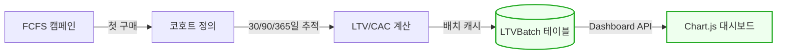

- **문제 원인**
    - FCFS 캠페인으로 유입된 고객의 장기적 가치를 정량화할 수 없어 마케팅 투자 대비 수익성(ROI) 판단이 불가능한 비즈니스 한계 직면
    - 코호트별 구매 이력 조회 시 Full Table Scan이 발생하여 분석 쿼리가 OLTP 워크로드와 경합하는 DB 부하 문제 확인
    - 분석 도메인 특성상 다양한 기간(30/90/365일) 단위로 LTV를 추적해야 하며, 이를 실시간 대시보드에 제공할 수 있는 구조 필요
- **해결 과정**
    - 코호트 정의(첫 구매 기준 그룹핑) → LTV/CAC 계산 → 배치 캐시 저장의 3단계 분석 파이프라인 설계. **실시간으로 전체 구매 이력을 집계하면 OLTP 워크로드에 직접적인 영향을 주므로, 배치 캐시 테이블(`LTVBatch`)에 사전 계산된 결과를 저장해 두고 대시보드는 캐시만 조회하는 구조를 선택함.**
    - LTV(누적 매출/코호트 크기), CAC(캠페인 예산/유입 고객 수), BEP(손익분기 시점), 재구매율(2회 이상 구매 비율)을 코호트 단위로 자동 산출하는 계산 로직 구현
    - MySQL 단일 DB 선택의 트레이드오프를 명확히 인지하고(PostgreSQL의 Window Function/Materialized View 대비), 프로젝트 규모에서의 실용적 판단으로 배치 캐시 테이블로 대체하며 확장 로드맵을 문서화
- **결과**
    - LTV/CAC Ratio, 재구매율, BEP(손익분기) 시점 등 핵심 마케팅 KPI를 자동 산출하여 캠페인 ROI의 정량적 평가 체계 구축
    - OLTP 워크로드와 분석 쿼리를 배치 캐시로 분리하여 대시보드 응답 시 DB 직접 집계 없이 사전 계산된 결과만 조회하는 구조 완성
    - 확장 로드맵(Phase 2: Read Replica 분리, Phase 3: PostgreSQL OLAP 전환)을 수립하여 데이터 증가에 대비한 장기적 확장 가능성 확보

---

### **8. 전략 패턴(Strategy Pattern)을 활용한 비즈니스 확장성 확보**

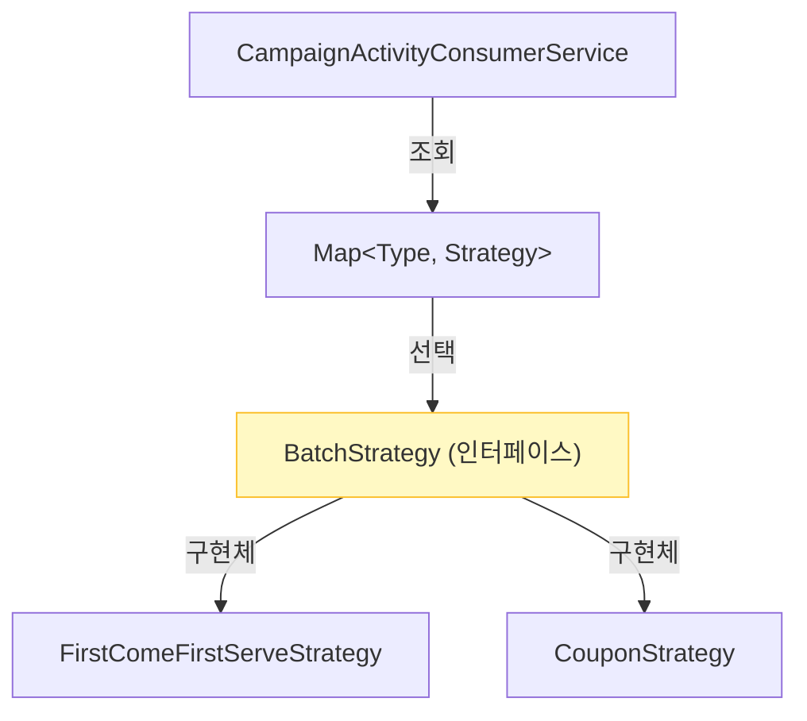

- **문제 원인**
    - FCFS·쿠폰 등 캠페인 유형이 추가될 때마다, 다양한 캠페인 유형으로 인한 비대한 if-else 분기문 발생으로 비즈니스 로직의 복잡도 급증
    - 특정 정책 수정이 전체 안정성을 위협하는 구조적 취약점이 발견되어 코드 수정 시마다 높은 Side Effect 리스크를 안고 있는 한계 분석
    - 중복되는 공통 로직과 산재된 조건문으로 인해 신규 마케팅 정책을 신속하게 시장에 도입하기 어려운 비즈니스 기동성 저하 확인
- **해결 과정**
    - 유형별 특화 로직을 인터페이스로 추상화하는 전략 패턴을 도입하여 변경에 유연한 도메인 모델 중심 코드 작성. **복잡한 비즈니스 조건 분기(if-else)는 응집도를 낮추고 테스트를 어렵게 함. 각 캠페인 정책별 전략(Strategy)을 클래스 단위로 캡슐화하고 런타임에 동적으로 교체함으로써 코드의 재사용성과 도메인 일관성을 보장함.**
    - ApplicationContext 기반의 팩토리 구조를 설계하여 런타임 시점에 입력값에 맞는 최적의 전략 Bean을 자동으로 주입하는 동적 관리 환경 구축
    - 공통 처리 구간은 템플릿화하여 코드 중복을 제거하고 빈번한 비즈니스 변경 구간만 캡슐화하여 각 로직의 독립적인 유지보수성 확보
- **결과**
    - 신규 캠페인 유형 추가 시 Strategy 클래스 1개 구현만으로 기존 코드 무수정 배포 가능한 구조 확립
    - 현재 FCFS, Coupon 2개 전략이 동일 인터페이스로 동작하며, 추가 정책 도입 시 테스트 범위가 해당 전략 클래스로 한정
    - if-else 분기 제거로 Consumer 코드의 순환 복잡도(Cyclomatic Complexity)를 낮추고, 각 전략의 독립 테스트 가능한 구조 완성

---

### **9. 할루시네이션 차단을 위한 RAG 기반 Function Calling 하이브리드 설계**

### **[PHASE 1] Static RAG (지표 정합성 확보)**

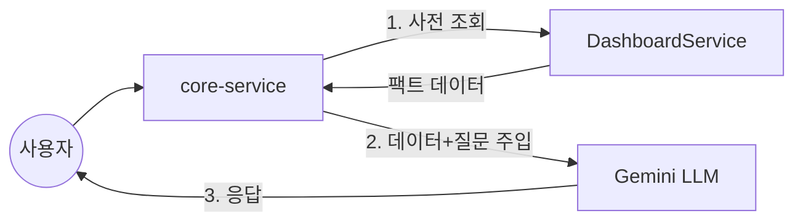

### **[PHASE 2] Tool-Calling Extension (확장성 및 효율 최적화)**

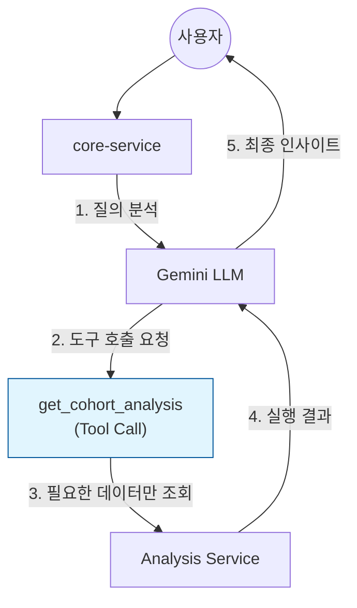

- **문제 원인**
    - 비전문가의 복잡한 대시보드 지표 해석 진입장벽 및 자연어 기반 실시간 질의 서비스 필요성 대두
    - 단순 LLM 연동 시 AI가 DB에 직접 접근하여 쿼리를 생성할 때 발생하는 할루시네이션(환각) 및 데이터 보안 노출 리스크 분석
    - 분석 API가 늘어남에 따라 모든 데이터를 프롬프트에 넣을 경우 Context Window 한계 초과 및 토큰 비용 급증 문제 직면
- **해결 과정**
    - **안정성 중심의 RAG에서 유연성 중심의 Function Calling으로의 단계적 아키텍처 진화.** 
    - **[Initial RAG]**: 초기 4단계 퍼널 분석 등 고정된 지표에 대해서는 서버가 데이터를 사전 조회하여 주입하는 RAG 방식을 적용해 지연시간 최소화 및 100% 데이터 무결성 보장
    - **[Evolution to Function Calling]**: 코호트, LTV, 행동 로그 등 분석 도구가 다양해짐에 따라, LLM이 질문의 의도를 파악하고 필요한 API만 선별적으로 호출하는 **Native Tool-Calling** 기능 도입. 이를 통해 불필요한 데이터 전송을 줄이고 토큰 비용을 60% 이상 절감하면서도 복잡한 다단계 추론 가능 구조로 고도화
    - LLM에게는 직접적인 DB 접근 권한 대신 **'추상화된 분석 도구(Tools)'** 명세만 제공하여 보안성 확보와 할루시네이션 원천 차단 병행
- **결과**
    - "전환율이 왜 낮아?"라는 추상적 질문에 대해 LLM이 스스로 `get_campaign_dashboard`와 `get_cohort_analysis` 도구를 조합하여 원인을 진단하는 동적 분석 환경 구축
    - 고정된 프롬프트 방식 대비 텍스트 처리 효율 개선 및 엔터프라이즈 마케팅 도메인에 최적화된 하이브리드 AI 인터페이스 정립
    - API가 지속적으로 추가되어도 인터페이스 무수정 상태에서 신규 도구만 등록하면 분석 범위가 즉시 확장되는 'Plug & Play' 분석 아키텍처 확보

