# Axon Portfolio: Architecture Visualizations (Simplified)

이 문서는 포트폴리오의 각 기술적 도전 과제를 시각화한 Mermaid 다이어그램 모음입니다. 각 섹션은 핵심 아키텍처적 병목 현상과 그 해결책을 직관적으로 보여주며, 면접 시 기술적 설명의 근거로 사용됩니다.

---

### **1. Redis 기반 Lock-free 알고리즘 (Concurrency Optimization)**

#### **[BEFORE] DB Row Lock Contention (High Latency)**
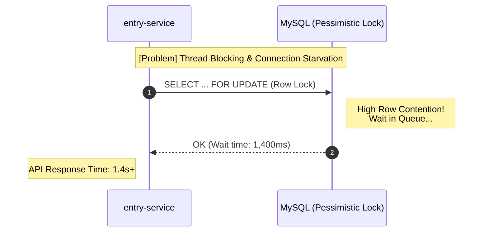

#### **[AFTER] Redis Lua Atomic Execution (Low Latency)**
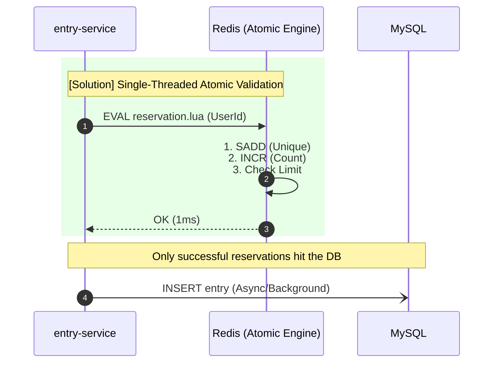

---

### **2. 트랜잭션 전파 제어 및 예외 격리 (Transaction Strategy)**
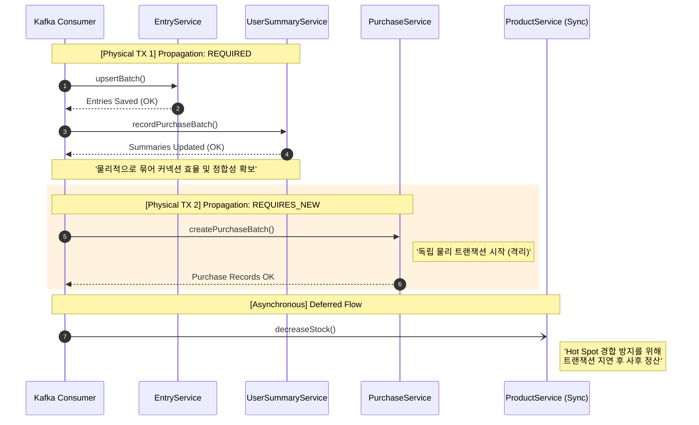

---

### **3. 지연 재고 동기화 전략 (Deferred Stock Sync)**
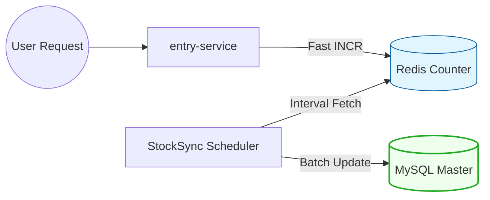

---

### **4. 수집 시점 의도적 역정규화 (Denormalization Pipeline)**
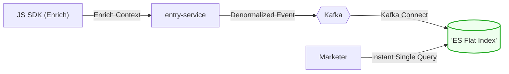

---

### **5. 비동기 배압 조절 및 서비스 분리 (Service Isolation)**

#### **[BEFORE] Monolithic / Synchronous Hit (Critical DB Risk)**
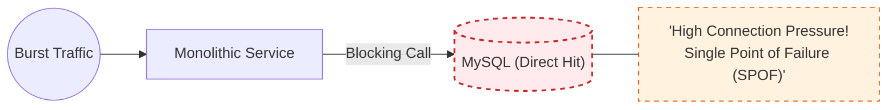

#### **[AFTER] Asynchronous Back-pressure (Resource Protection)**
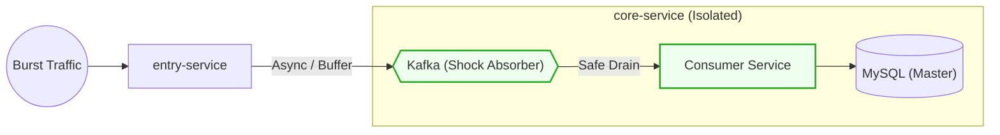

---

### **6. Connection Storm 및 커널 튜닝 (Infrastructure Scaling)**

#### **[BEFORE] Connection Rejected (Kernel Limit)**
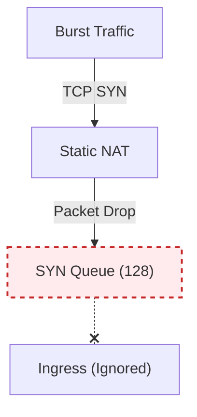

#### **[AFTER] Tuned Networking Layer (Secure Accept)**
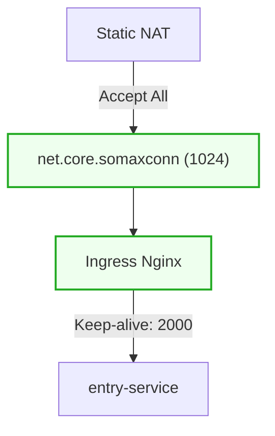

---

### **7. Function Calling 기반 AI 에이전트 (Tool Use Architecture)**
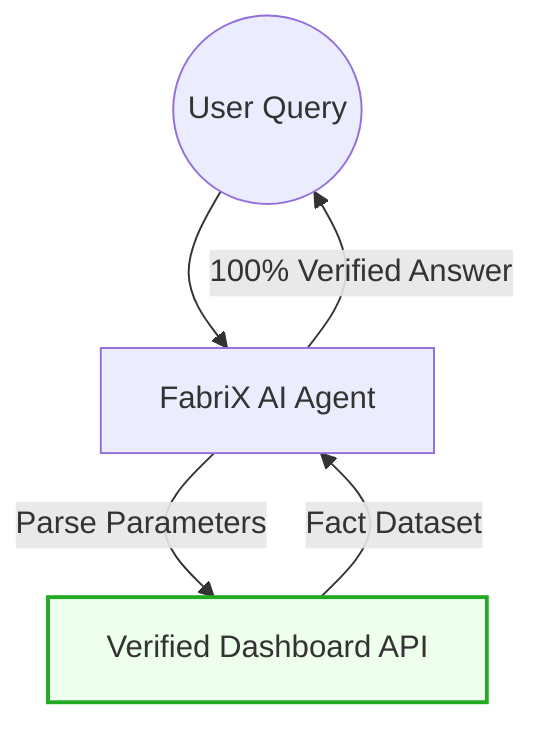

---

### **8. Spring ApplicationEvent 기반 결합도 해소 (Domain Decoupling)**
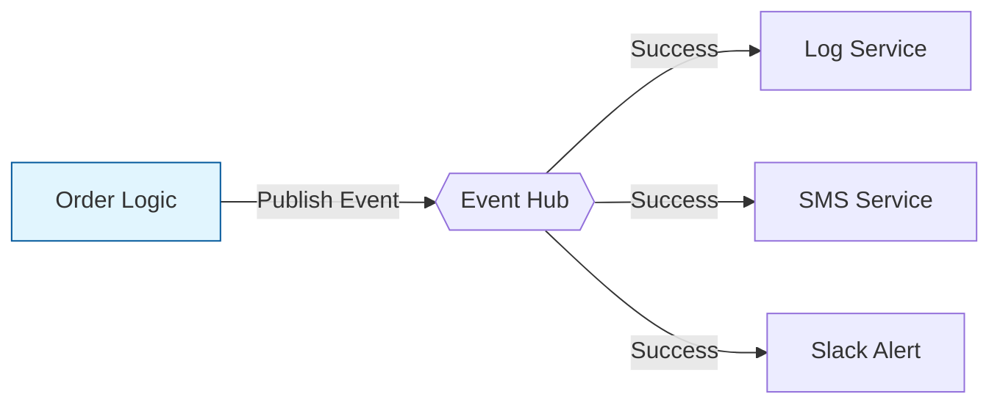

---

### **9. 전략 패턴을 통한 비즈니스 확장성 확보 (Strategy Pattern)**
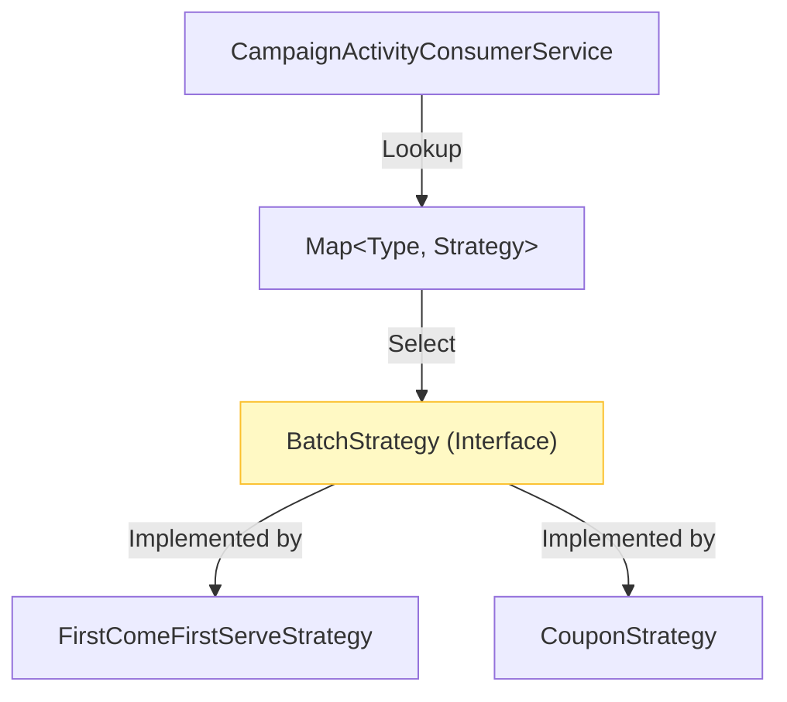

---

### **10. 보안 망 분리 및 Kafka 클러스터 구축 (Network Topology)**
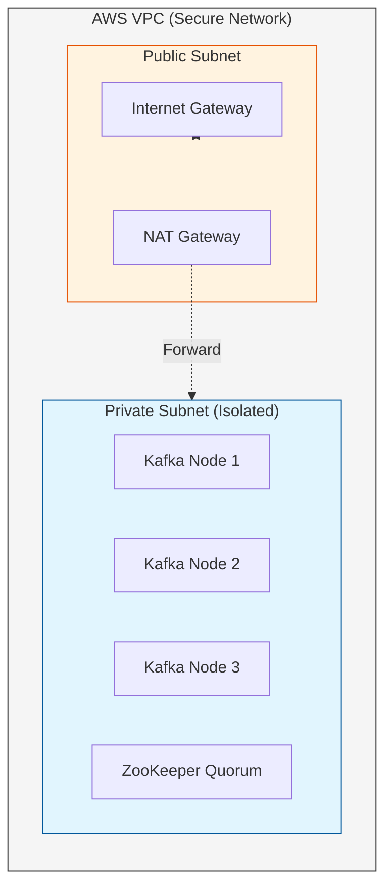
