# PORTFOLIO MASTER

> 재조립용 포트폴리오 블록 저장소. 원자화 T파일과 회사별 최신 포트폴리오에서 검증된 섹션을 보존한다.
> 같은 무기라도 각도가 다르면 남기고, 같은 목적의 낡은 섹션만 최신 버전으로 교체한다.

---

# Axon — 이벤트 기반 커머스 플랫폼

> **GitHub**: https://github.com/NileTheKing/marketing-intelligence-platform

선착순(FCFS) 피크 트래픽을 Kafka 메시지 기반 비동기 파이프라인으로 처리하고, 행동 데이터를 실시간 수집·분석하는 커머스 플랫폼.

- **구조**: Spring Boot 멀티모듈 (Entry-service / Core-service) — Kafka 메시지 기반 비동기 아키텍처
- **규모**: 3,000 VU 동시 접속 / Peak 2,900 RPS / 선착순 200명 / KT Cloud K8s 배포
- **협업**: CRM 전문기업 오브젠 현업 CRM 개발자와 요구사항 기반 설계·구현

---

## 1. 아키텍처 설계: Kafka 계층 분리

> **3,000 VU / Peak 2,900 RPS / 에러율 0%**

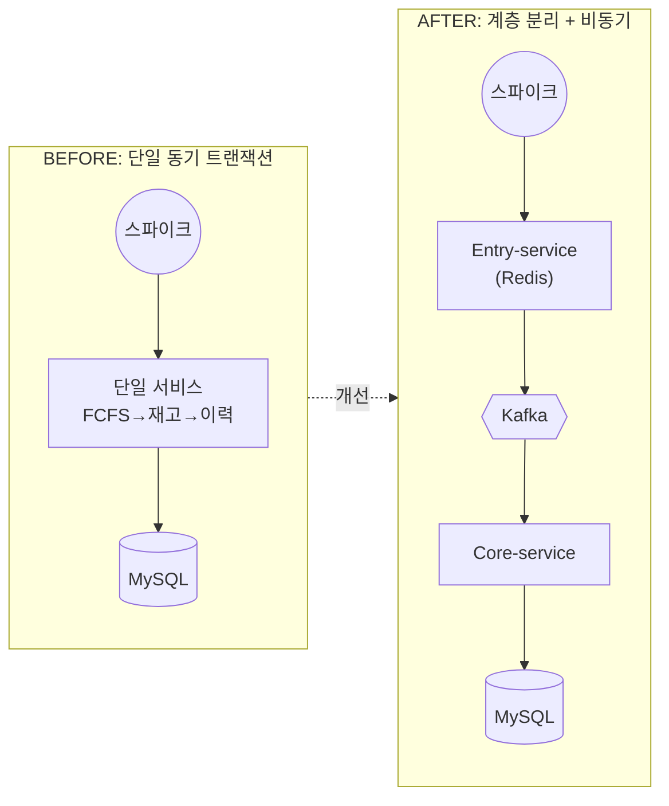

**문제**
- 이벤트 오픈 순간 수천 건의 요청이 동시에 들어오는데, FCFS(선착순) 판정·재고 차감·이력 기록이 하나의 동기 트랜잭션으로 묶여 있어 DB 응답 지연이 즉각 사용자 응답 지연으로 전파되는 구조
- 피크 트래픽 시 MySQL 커넥션 풀 고갈 → 신규 요청 대기 → 전체 서비스 응답 불가
- 결제 처리가 느려지면 선착순 유입부까지 같이 느려지는 강결합 — 부하 집중 지점만 선택적 스케일아웃 불가

**해결**
- 단순 인스턴스 스케일아웃 제외 — 인스턴스 수가 늘어도 DB 커넥션 풀 소모량이 비례 증가해 근본 해결 불가
- API Gateway Throttling 제외 — 초과 요청 즉시 거부 시 클라이언트 재시도가 폭증(Retry Storm)하여 수용 트래픽 오히려 감소
- **메시지 큐 선택 근거** — RabbitMQ: 메시지 소비 후 Replay 구조적 불가 → 결제 데이터 Reconciliation 파이프라인 구현 불가; Kafka: 파티션 로그 영속성(Retention) + Consumer Group 리밸런싱으로 장애 후 재처리·정합성 검증 구조 확보
- **Kafka Backpressure 채택** — 유입 트래픽을 메시지 큐로 일단 수용한 뒤, Consumer가 처리 가능한 속도만큼 순차 소화하여 DB 부하 평탄화
- 트래픽 유입부(Entry-service)와 비즈니스 처리부(Core-service)를 독립 배포 단위로 분리, Entry는 Redis만 타는 경량 경로로 설계 — 부하 집중 지점만 선택적 스케일아웃 가능

**결과**
- Entry-service만 독립 스케일아웃 가능한 구조 확보 — HPA로 Pod 자동 확장 적용
- DB 커넥션 풀 급변 없이 피크 타임에도 안정적 메시지 소비 흐름 유지, 에러율 0% 달성

---

## 2. 인프라 최적화: Connection Storm 대응을 위한 커널 튜닝

**문제**
- k6를 통한 초기 3,000 VU 부하 테스트 시, 애플리케이션 사양은 충분함에도 불구하고 **Connection Refused** 및 **Connection Timeout**이 대량 발생하여 트래픽 유입 자체가 차단되는 현상 실측.
- 진단 결과, 초단기 스파이크 트래픽 유입 시 TCP 3-way Handshake 과정에서 커널의 대기 큐가 가득 차 서버가 새로운 연결을 거부하는 **Connection Storm** 병목 확인.

**해결**
- **OS 커널 튜닝 (Accept Queue 증설)**: Peak 트래픽 시 네트워크 대기실 역할을 하는 `net.core.somaxconn`과 `net.ipv4.tcp_max_syn_backlog`를 128(기본값)에서 1,024로 증설하여 수용 능력 확보.
- **ulimit 및 파일 디스크립터 최적화**: 대량의 동시 소켓 연결 처리를 위해 프로세스당 오픈 가능한 파일 디스크립터(File Descriptors) 수를 65,535로 상향하여 리소스 부족(Too many open files) 현상 예방.

**결과**
- **가용성 0.00% Error Rate 달성**: 3,000 VU 환경에서 시스템 리소스를 100% 활용하며 단 1건의 연결 거부 없이 트래픽 전량 수용 성공.
- 인프라 레벨의 병목을 해결함으로써 애플리케이션의 본래 처리 성능(Throughput)을 온전히 발휘할 수 있는 환경 구축.

---

## 3. 비즈니스 확장성: 객체지향 설계를 통한 유연성 확보

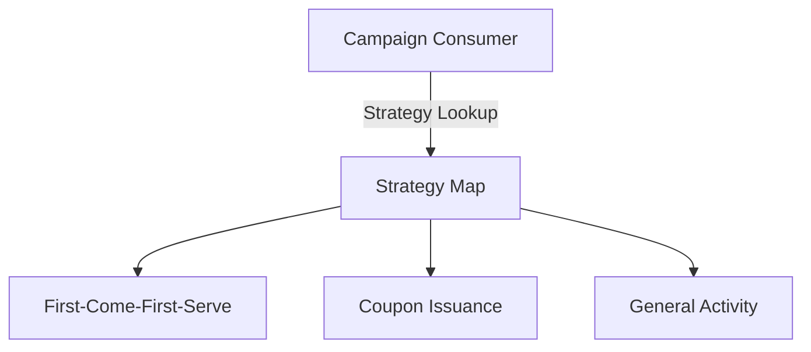

**문제**
- 선착순, 쿠폰 발행 등 캠페인 유형이 추가될 때마다 늘어나는 `if-else` 분기문으로 인해 코드 가독성과 유지보수성 저하.
- 특정 유형의 로직 수정이 전체 Consumer에 영향을 줄 수 있는 강한 결합도로 인해 신규 정책 도입 시 사이드 이펙트 리스크 존재.

**해결**
- 캠페인 유형별 특화 로직을 `CampaignStrategy` 인터페이스로 추상화하고 독립된 구현체로 캡슐화하는 **전략 패턴(Strategy Pattern)** 도입.
- 신규 정책 도입 시 기존 코드 수정 없이 구현체만 추가하는 **OCP(Open-Closed Principle)** 준수.
- 스프링의 `ApplicationContext`가 전략 빈(Bean)을 자동 수집 → Consumer 생성 시 `Map<CampaignActivityType, CampaignStrategy>`(유형 식별자: FCFS, 쿠폰 발행 등)로 빌드하여 런타임 시점의 전략 디스패치 구현.

**결과**
- 신규 캠페인 유형 추가 시 기존 전략 코드 무수정으로 배포 가능한 구조 확립.
- 정책별 로직이 물리적으로 분리되어 각 전략에 대한 독립적인 단위 테스트 가능.

---

> 아래 `4`, `5` 섹션은 FCFS 정합성을 분리 각도로 설명한 구버전 보존 블록이다.
> 최신 회사 포트폴리오 기준의 현재 표준 버전은 `4+5` 통합 섹션이다.

## 4. 정합성 최적화: 비동기 환경의 한계 극복 (1)

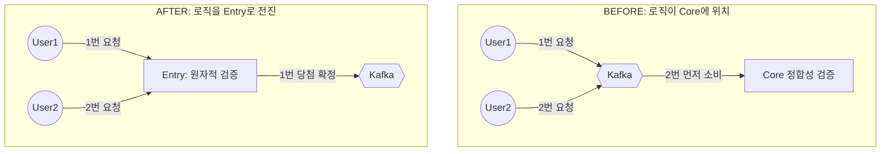

**문제**
- 선착순 판단 로직이 비동기 구간(Core) 뒤에 위치할 경우, Kafka의 파티션 할당이나 네트워크 지연에 따라 실제 유입 순서와 처리 순서가 뒤바뀌는 현상 발생.
- 먼저 응모한 유저가 낙첨되고 나중에 응모한 유저가 당첨되는 정합성 오류를 부하 테스트 중 실측하여 확인.
- 마감 이후의 요청까지 Kafka를 거쳐 Core DB에 도달하는 불필요한 리소스 낭비.

**해결**
- Kafka 파티션 키를 통한 순서 보장은 리밸런싱이나 장애 상황에서 완벽하지 않으므로, 판정 시점 자체를 유입 시점과 일치시키는 **전진 배치(Forward Placement)** 단행.
- Entry에서 즉각적인 원자적 판정을 내리고 성공한 건만 Kafka로 발행 — 이후 비동기 소비 순서와 무관하게 당첨 권한 보장.
- 선착순 마감 이후 요청은 Entry에서 즉각 Fail-fast 응답 반환하여 배후 서비스 보호.

**결과**
- 다중 Consumer 환경에서 유입 순서 역전 0건 (k6 검증).
- k6 기준 10,000건 요청 중 200건(2%)만 Core에 도달, **98%를 Entry에서 Fail-fast 처리** — DB와 Core 서비스 부하를 구조적으로 차단.
- DB 접근 없이 메모리 기반 검증으로 즉각 응답하여 피크 타임 응답 속도 개선.

---

## 5. 정합성 최적화: 비동기 환경의 한계 극복 (2)

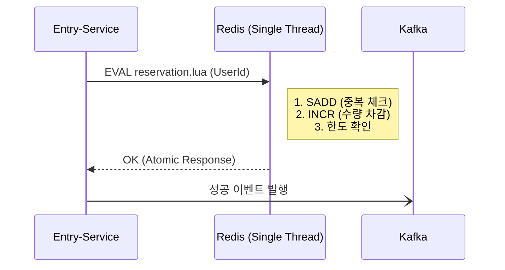

**문제**
- Section 3의 Forward Placement로 선착순 순서 역전 문제를 해결한 뒤, Entry에서 사용하는 FCFS 카운터 연산 방식에서 별도의 정합성 문제 발견.
- 기존 구현: `INCR(카운터 증가) → 오버부킹 여부 확인 → 오버부킹 시 DECR(복구)`의 3-step 연산.
- Redis는 싱글스레드 기반이므로 이 시퀀스에서 동시성으로 인한 오버부킹 자체는 발생하지 않음.
- 단, INCR 성공 후 네트워크 단절이나 프로세스 크래시 발생 시 DECR 복구가 실행되지 않아 **Ghost Reservation(유령 선점)** 발생 — 카운터는 점유됐지만 실제 참여자는 없는 상태. 이 오차가 누적되면 실제 참여 가능 재고가 카운터보다 높아지는 재고 정합성 오류 유발.

**해결**
- 복구 로직의 실패 가능성 자체를 없애기 위해 INCR(카운터 증가) → 오버부킹 여부 확인 → 오버부킹 시 DECR(복구)을 단일 Lua 스크립트로 원자화.
- Redis는 Lua 스크립트를 단일 명령으로 처리 — 스크립트 실행 도중 다른 커맨드가 끼어들 수 없으므로 중간 상태 자체가 발생하지 않아, DECR 복구 로직이 불필요해짐.
- 네트워크 재시도 시 발생하는 중복 참여를 막기 위한 **멱등성(Idempotency)** 검증(`SADD`)을 동일 스크립트 내에 결합.

**결과**
- Ghost Reservation 0건 — 원자 연산으로 중간 실패 상태 없으므로 카운터와 실제 참여자 수가 항상 일치.
- k6 10,000+ 동시 요청에서 오버부킹 0건.
- Redis 호출 3회 → Lua 스크립트 1회로 감소.

---

## 4+5. [현재 표준] FCFS 정합성: Forward Placement + Redis Lua 원자화

> **오버부킹 0건 · Ghost Reservation 0건 · 순서 역전 0건**

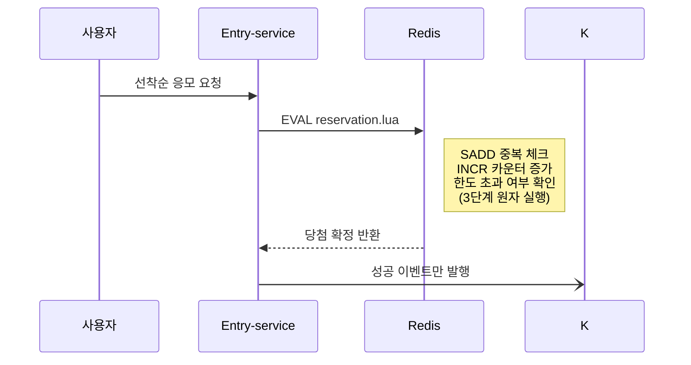

**문제**
- 선착순 당첨 판정이 Kafka 소비 이후 Core-service에서 이루어지는 구조였는데, Kafka 파티션 할당 특성상 먼저 요청한 유저가 나중에 처리되는 순서 역전 현상이 k6 부하 테스트 중 실제로 발생 — 먼저 응모한 유저가 낙첨되고 나중 유저가 당첨되는 정합성 오류
- Redis 카운터 연산을 `INCR(증가) → 오버부킹 확인 → 초과 시 DECR(복구)`의 3단계로 처리하던 중, INCR 성공 후 프로세스 크래시나 네트워크 단절 발생 시 DECR 복구가 실행되지 않아 카운터만 점유된 채 실제 참여자는 없는 **Ghost Reservation**이 누적
- Ghost Reservation 누적 시 카운터 과소 집계 → 정상 참여 가능 유저 마감 오인 — 재고 정합성 오류

**해결**
- Kafka 파티션 키 기반 순서 보장 검토 → 제외 — 동일 파티션 내에서는 순서가 보장되지만, Consumer 리밸런싱이나 브로커 장애 발생 시 파티션 재할당으로 순서 보장이 깨지며, 근본적으로는 "판정이 비동기 소비 이후에 일어난다"는 구조적 문제 자체가 해소되지 않음
- **Forward Placement 채택** — 판정 시점을 Kafka 큐 진입 이전(Entry-service 요청 수신 시점)으로 전진 배치, Redis 원자 연산으로 유입 순간에 당첨을 확정하고 성공 이벤트만 Kafka에 발행 — 이후 비동기 처리 순서와 완전히 독립
- **Lua 원자화** — SADD(중복 체크) + INCR(순번) + 한도 초과 시 SREM + DECR(원자적 롤백)까지 단일 스크립트로 묶어 중간 실패 상태 자체 원천 차단 → Ghost Reservation 0건
- 선착순 마감 이후 요청은 Entry-service에서 즉시 거부(Fail-fast) — 참여 요청 10,000건 중 98%가 Entry에서 차단되어 Core·DB 불필요한 부하 전달 방지

**결과**
- 순서 역전 0건 · Ghost Reservation 0건 · 오버부킹 0건 (k6 Spike 시나리오, 3,000 VU, 총 34,365건, 에러율 0%)
- Kafka·Redis·ES·MySQL 공존 클러스터 (KT Cloud K2P 8 vCPU, 앱 CPU limit 800m) 제약 환경에서 p95 3.99s · 정합성 완벽 유지
- Redis 호출 3회 → Lua 스크립트 1회로 감소, 원자성과 네트워크 효율 동시 확보
- Redis 자료구조 역할 분리 — Set(참여자 중복 체크) · INCR(순번 카운터) · Cache Aside String(캠페인 메타·유저 정보 선적재) → Core-service HTTP 없이 sub-ms 검증

---

## 6. [현재 표준] Kafka 파이프라인 신뢰성: 스레드 분리 · REQUIRES_NEW · 멱등키

> **데이터 유실 0건 · 중복 적재 0건 / Entry 200건 = Purchase 200건**

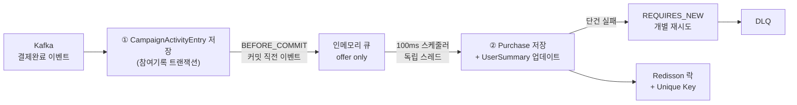

### 처리량: Consumer 수신 스레드 분리

**문제**
- Kafka 수신 스레드가 A(참여기록 Entry 저장 트랜잭션)와 B(Purchase 배치 INSERT) 모두 직접 수행 — B의 DB 쓰기 지연이 Kafka 수신 속도 자체를 저하시키는 강결합 구조

**해결**
- **BEFORE_COMMIT + 독립 스케줄러** — Entry 저장 트랜잭션 커밋 직전 시점에 Purchase 데이터를 `ConcurrentLinkedQueue`에 offer만 하고 즉시 반환, 실제 DB 쓰기는 100ms 주기 독립 스케줄러 스레드가 전담
- `LinkedBlockingQueue` 제외 — 큐가 꽉 찰 때 Kafka Listener 스레드가 대기 → `max.poll.interval.ms` 초과로 Consumer Group 리밸런싱 트리거. Non-blocking CAS 큐(`ConcurrentLinkedQueue`)여야 수신 스레드가 즉시 반환 가능
- Transactional Outbox Pattern 제외 — Outbox 테이블 + CDC 폴러 필요로 인프라 복잡도 증가 대비 Reconciliation으로 충분
- BEFORE_COMMIT 트레이드오프: Entry 커밋 후 서버 재시작 시 버퍼 내 Purchase 유실 가능 → 새벽 Reconciliation 배치(NOT EXISTS JPQL)로 Entry·Purchase 불일치 전수 탐지·보완

**결과**
- 수신부·영속성 처리부 결합도 제거, Entry·Purchase 정합성 자동 감시

### 정합성: 배치 오염 차단 + 3중 멱등성

**문제**
- 20건 배치 처리 중 단 1건의 제약조건 위반 발생 시 나머지 19건의 정상 데이터까지 전체 트랜잭션 롤백으로 유실되는 배치 오염 문제
- Kafka at-least-once 특성상 네트워크 오류·Consumer 재기동 시 동일 결제 이벤트를 두 번 이상 수신할 수 있어 중복 구매 기록 적재 위험

**해결**
- **Kafka 설정 레벨** — `acks=all` + `enable.idempotence=true` + `isolation-level=read_committed` + `min.insync.replicas=2`로 exactly-once 파이프라인 구성
- **Dual KafkaTemplate 분리** — 비즈니스 커맨드(구매·재고)는 트랜잭션 프로듀서(`transactionalKafkaTemplate`, `acks=all`) / 행동 로그는 일반 `kafkaTemplate` — 중요도·성능 비용 기준 전략 분리
- **REQUIRES_NEW + DLQ** — 배치 삽입 실패 시 20건을 단건으로 분해, `@Transactional(REQUIRES_NEW)`로 각각 독립 재시도 — 최종 실패 건은 DLQ로 격리
- **멱등성 이중 방어** — Redisson 분산락으로 결제 ID별 처리 순서 보장 + MySQL Unique Key로 중복 저장 물리적 차단

**결과**
- Consumer 강제 재기동 극단 시나리오에서도 데이터 유실 0건 · 중복 적재 0건
- Entry 200건 발행 시 Purchase 200건 DB 적재 정합성 달성

---

> 아래 `6-A`, `7-A` 섹션은 Kafka 신뢰성을 장애 격리와 멱등성으로 나눠 설명한 보존 블록이다.
> 현재 표준 재조립 단위는 위 `6` 섹션이다.

## 6-A. 비동기 적재 신뢰성: 정합성 한계 극복과 장애 격리(Fault Tolerance) 파이프라인

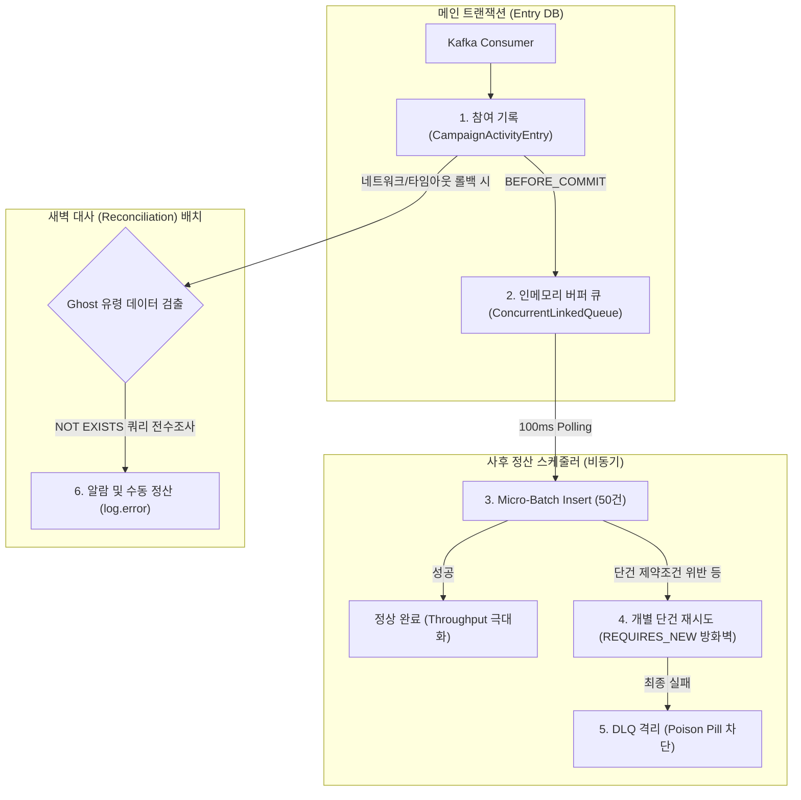

**문제**
- **스레드 병목 및 강결합 현상:** 메인 수신 스레드가 메모리 버퍼 적재뿐만 아니라 DB 일괄 저장(`flushBatch`)까지 직접 수행함에 따라, DB 락(Lock) 등 지연 발생 시 앞단 Kafka 수신부까지 대기가 걸리는 결합 문제 확인.
- **배치 오염 (Batch Contamination):** 트래픽 완화를 위해 50건 단위 배치(Micro-Batch) 구조를 도입했으나, 단 1건의 제약조건 오류 발생 시 전체 트랜잭션 배치가 롤백되어 타 유저의 정상 데이터까지 저장이 중단되는 리스크 존재.
- **Ghost Data (고아 데이터) 이슈:** 선착순 응답 속도를 위해 `BEFORE_COMMIT` 시점에 이벤트를 조기 전송하는데, 간헐적인 DB 커밋 타임아웃 발생 시 '참여 기록(Entry)은 롤백되었으나 결제 기록(Purchase)만 남는' 데이터 정합성 불일치 가능성 내포.

**과정 및 해결**
- **스레드 분리(Decoupling):** 수신 스레드는 큐(`ConcurrentLinkedQueue`)에 데이터를 담는 역할만 수행하고 즉시 반환되도록 분리. 실제 DB 일괄 적재는 100ms 주기의 독립 스케줄러 스레드가 전담하도록 설계하여 수신부와 영속성 처리부의 결합도를 낮춤.
- **`REQUIRES_NEW` 적용 및 DLQ 도입:** 배치 삽입 실패 시, 50건의 데이터를 개별 `REQUIRES_NEW` 트랜잭션으로 분할하여 재시도하는(Fallback) 로직 추가. 여기서도 실패하는 문제 데이터는 Dead Letter Queue (DLQ)로 전송하여 정상 데이터의 처리 흐름을 보장.
- **사후 대사(Reconciliation) 스케줄러 구현:** 성능을 위해 타협했던 'Ghost Data' 발생 가능성을 보완하기 위해, 유휴 시간대(새벽 3시)에 작동하는 비동기 대사 스케줄러 추가. `NOT EXISTS` 쿼리로 고아 데이터를 찾아내고 로깅하여 관리자가 인지 및 후속 처리할 수 있도록 조치.

**결과**
- **가용성 향상:** 카프카 수신 스레드가 DB 트랜잭션 지연에 직접적인 영향을 받지 않게 되어, 피크 타임에도 메시지 수신 파이프라인의 처리 속도 유지.
- **장애 격리:** 개별 트랜잭션 격리(`REQUIRES_NEW`)와 DLQ 구조를 통해 데이터 결함이 전체 배치 실패로 번지는 현상(Cascading Failure)을 방지.
- **정합성과 성능의 균형 확보:** 완전한 실시간 정합성 대신 빠른 응답 속도를 확보하되, 1차 장애 격리 및 2차 사후 대사(배치) 등 방어 로직을 추가하여 시스템 안정성을 보완.

---

## 7-A. 정합성 최종 수비: 분산 시스템의 데이터 무결성 설계

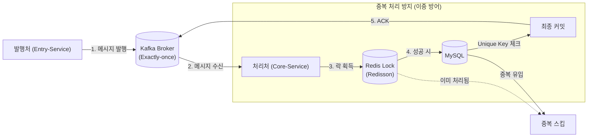

**문제**
- 카프카의 **Exactly-once(EOS)** 설정을 사용하더라도, DB 처리는 끝났으나 오프셋이 기록되기 전 서버가 종료될 경우 동일 메시지를 재수신하여 중복 처리될 위험 인지.
- 특히 다중 서버 환경에서 동일 결제 건에 대해 여러 컨슈머가 동시에 접근할 때 발생하는 데이터 경합 및 중복 적재 가능성 확인.

**해결**
- **애플리케이션 레벨의 멱등성 보강**: 인프라(Kafka)의 설정에만 의존하지 않고, 로직단에서 중복 유입을 안전하게 무시하거나 처리하도록 설계.
- **분산 락(Redisson) 도입**: 결제 ID별로 락을 잡아, 여러 서버가 동시에 같은 주문을 처리하지 못하도록 전역적인 실행 순서 보장.
- **DB Unique Key 활용**: 설령 락을 통과하더라도 물리적인 제약 조건을 통해 중복 저장을 원천 차단하고 안전하게 무시(Ignore)하도록 처리.

**결과**
- 3,000 VU 부하 테스트 중 컨슈머를 강제로 재기동하는 극단적 시나리오에서도 중복 적재 및 이중 결제 0건 유지 확인.
- 성능이 중요한 행동 로그와 정합성이 중요한 결제 명령의 파이프라인을 이원화하여, 신뢰성과 시스템 전체의 가용성 사이의 균형 확보.

---

## 8. 쓰기 병목 해소: 지연 동기화를 통한 Throughput 극대화

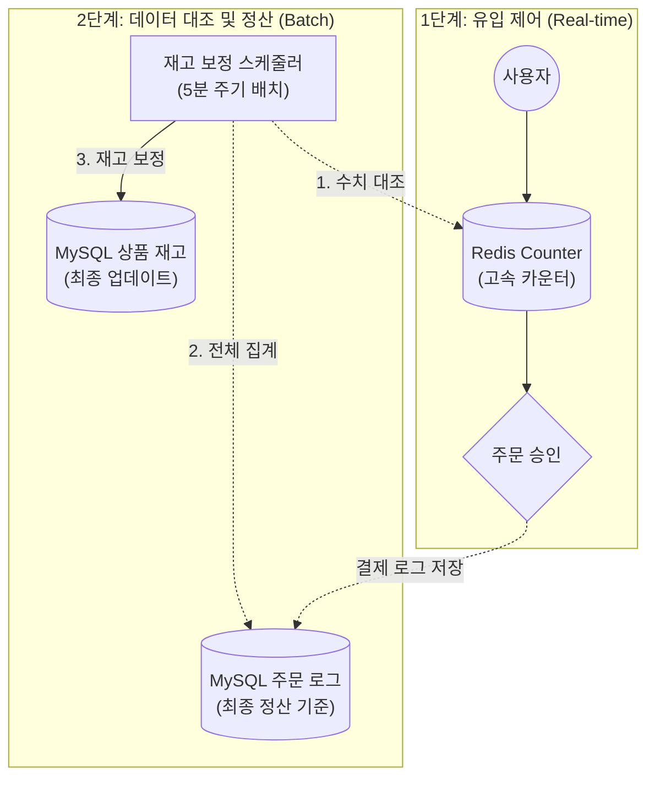

**문제**
- 이벤트 시작 직후 특정 상품에 트래픽이 몰리면서, DB의 해당 상품 재고 행(Row)에 비관적 락(Pessimistic Lock)이 집중되는 현상 발생.
- 락 점유 시간이 길어지며 다른 요청들이 대기하게 되고, 결국 DB 커넥션 풀이 고갈되면서 시스템 전체가 응답하지 않는 '성능 병목' 확인.

**해결**
- **재고 체크의 분리 (Redis Gate)**: 특정 상품 행에 집중되는 DB 비관적 락을 회피하기 위해, 유입 시점의 재고 검증은 Redis의 원자적 연산을 활용한 **고속 카운터**에서 먼저 처리하도록 개선.
- **재고 차감 비동기화 (지연 정산)**: 메인 트랜잭션에서 무거운 재고 업데이트 로직을 분리. 결제 완료 시점에는 주문 로그만 빠르게 저장하고, 실제 재고 수량 차감은 **별도의 배치(Batch) 작업**을 통해 처리하여 DB 쓰기 부하 해소.
- **데이터 보정(Reconciliation) 파이프라인**: 성능 위주의 Redis와 최종 장부인 MySQL 사이의 데이터 오차를 해결하기 위해, 실제 주문 로그를 기준으로 Redis와 DB 재고 수치를 주기적으로 대조하고 자동 보정하는 프로세스 구축.
- **트래픽 격리**: 특정 인기 상품에 쏠리는 부하가 일반 상품 서비스까지 간섭하지 않도록 DB 자원 사용량을 논리적으로 격리하여 전체 시스템의 가용성 확보.

**결과**
- 기존 비관적 락 방식 대비 약 5.6배의 응답 속도 향상 확인 (704ms → 124ms).
- 특정 상품에 트래픽이 몰려도 DB 커넥션 풀이 마르지 않고 안정적으로 유지됨을 확인.
- Redis 카운터에 오차가 발생하더라도, 배치 작업이 실제 주문 내역을 기반으로 재고를 자동 복구함으로써 데이터 정합성 유지.

---

## 9. 조회 성능 최적화: 수집 시점 역정규화 설계

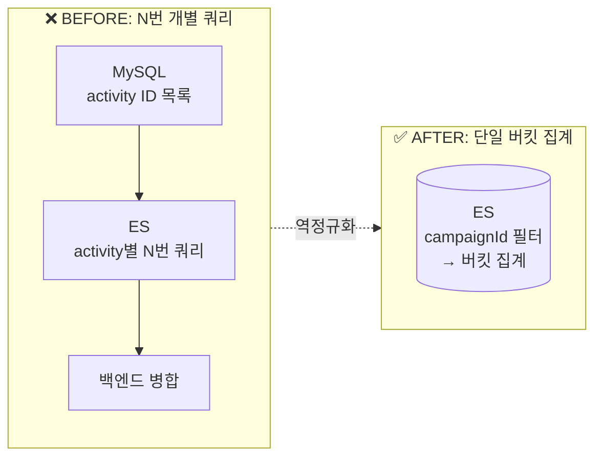

**문제**
- Campaign은 여러 CampaignActivity의 집합으로 구성. 캠페인 레벨 대시보드 조회 시 해당 Campaign에 속한 모든 Activity를 각각 쿼리한 뒤 백엔드에서 합산하는 방식이었음.
- Activity 수가 늘어날수록 쿼리 수가 선형으로 증가하는 N+1성 연산으로 조회 지연과 타임아웃 발생.
- 분석 워크로드와 OLTP 워크로드가 동일 DB 자원을 경합하며 서로의 성능을 저하시키는 리소스 간섭 현상 실측.

**해결**
- 개별 Activity 조회 후 합산하는 방식 대신, 데이터 수집 단계(JS SDK)에서 `campaign_id`, `activity_id` 등 메타데이터를 이벤트 페이로드에 미리 포함하여 전송하는 **의도적 역정규화(Denormalization)** 단행.
- 이벤트 수집 시점에 Entry-service가 `activityId → campaignId`를 Redis 캐시로 lookup 후 ES 문서에 역정규화 저장 — campaign 단위 직접 필터·집계 가능한 구조로 전환.
- **ES Query DSL** (`BoolQuery + TermFilter + 중첩 Terms Aggregation`) — `campaignId` 단일 필터 후 `by_activity → by_trigger` 2단계 집계를 단일 쿼리로 처리, MySQL 조회와 N번 ES 왕복 모두 제거 (`trackTotalHits` 10k 제한 해제 적용).
- `DateHistogram` 집계로 시간대별 트래픽 시각화 + `BucketSelector` Painless script로 집계 결과를 ES 내에서 필터링 — JVM 레이어 후처리 없이 ES 엔진이 직접 집계·필터 완결.
- 분석용 저장소(ES)와 처리용 저장소(MySQL)의 책임 분리로 OLAP/OLTP 리소스 간섭 제거.

**결과**
- 대시보드 주요 KPI 조회 성능 **440% 향상**.
- ES N번 왕복 → 단일 버킷 집계 1회로 대체.
- 피크 타임에도 데이터 발생부터 대시보드 반영까지의 지연 시간 최소화.

---

## 9-B. 행동 데이터 기반 자동화 파이프라인 + Configurable 정책 관리

> 사용자 행동 데이터 수집 기능을 개발하고 있었습니다. MVP를 먼저 개발하고 오브젠 CRM 개발자와 실제 운영 시나리오를 직접 검토했습니다. "마케터가 어떤 페이지를 추적할지 수시로 바뀌는데, 바꿀 때마다 개발팀에 배포를 요청해야 한다"라고 피드백해주셨습니다. 이를 기술적으로 번역해보니 수집 정책을 코드 밖으로 꺼내는 문제였고, 이벤트 스키마를 DB에서 관리하고 JS SDK가 폴링해 재배포 없이 수집 항목을 변경할 수 있는 구조로 구현했습니다.
>
> 이후 마케팅 트리거 룰 기능을 추가 개발할 때 같은 문제를 다시 마주쳤습니다. 룰이 실행되면 카카오 알림·쿠폰 발급 시스템 같은 외부 서비스와 연동되는 구조였기 때문에, 감지 기간·임계값·보상 타입이 코드에 박혀 있으면 운영 중 조건을 바꿀 때마다 외부 연동 흐름 전체를 다시 배포해야 했습니다. JS SDK 수집 정책을 configurable하게 만들면서 배운 원칙 — "수시로 바뀌는 정책은 코드 밖으로" — 을 그대로 적용해, 트리거 룰도 `MarketingRule` 테이블로 DB 관리하는 구조로 직접 설계했습니다.

> **행동 수집 → 패턴 감지 → 자동 액션 E2E 구현 · 재배포 없이 실시간 정책 변경**

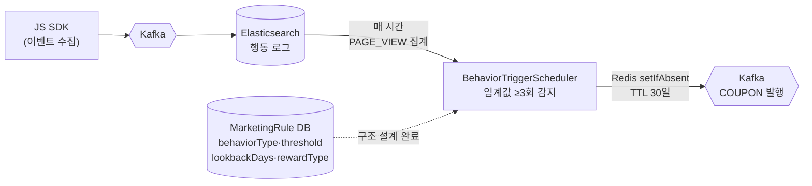

**문제**
- 이벤트로 유입된 고관심 유저를 자동으로 감지하고 리텐션 액션을 트리거하는 수단 없음 — 유입↔관심↔재구매 자동화 루프 부재
- 캠페인 단위 대시보드 조회 시 MySQL에서 activity ID 목록 조회 후 ES에 N번 개별 쿼리 — Activity 수 비례로 쿼리 수 선형 증가, 조회 지연 누적
- 이벤트 수집 항목·트리거 룰(임계값·기간·보상 타입)이 하드코딩되어, 요건 변경 시마다 코드 수정→빌드→배포 사이클 필요

**해결**
- **행동 수집 레이어**: JS SDK가 `campaign_id·activity_id` 메타를 이벤트 페이로드에 포함하여 수집 — Kafka → ES 적재 시 역정규화로 삽입, ES 단일 버킷 집계로 캠페인 단위 통계 산출
- **룰 트리거 레이어**: `BehaviorTriggerScheduler` — ES Term 집계로 MarketingRule 기준 행동 임계값 초과 유저 추출 → `Redis setIfAbsent`(MarketingRule 설정 TTL)로 중복 발급 방지 → Kafka `COUPON` 이벤트 발행
- **Configurable 정책 관리**: 수집 이벤트 스키마를 DB에서 관리하고 JS SDK가 폴링하여 재배포 없이 항목 변경 가능한 구조 구현 — 트리거 룰(`behaviorType`, `thresholdCount`, `lookbackDays`, `rewardType`)도 `MarketingRule` 테이블로 DB에서 관리하는 구조 설계 완료

**결과**
- 행동 수집 → 임계값 감지 → 자동 쿠폰 발행 E2E 파이프라인 구현, 마케팅 리텐션 액션 자동화
- ES N번 왕복 → 데이터 수집시 역정규화하여 단일 버킷 집계 1회로 대체 — 조회 성능 **440% 향상**
- MarketingRule DB 기반 Configurable 구조 — 재배포 없이 감지 기간·임계값·보상 실시간 변경 가능
- JS SDK → Kafka → ES 수집 레이어, BehaviorTriggerScheduler 감지 레이어 구조는 임계값 변경만으로 동일 IP 반복 응모·비정상 빈도 클릭 등 부정 참여 패턴 탐지로 확장 가능한 기반을 갖춤

---

## 10. AI 에이전트: RAG + Function Calling 하이브리드

> **토큰 소모 ~80% 절감 / 수치 Hallucination 방어**

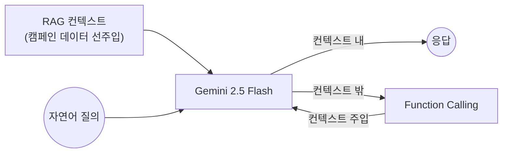

**문제**
- 캠페인 대시보드에서 자연어 질의 시, 전체 데이터를 프롬프트에 Full Context로 주입하면 캠페인 수 비례로 토큰 비용 선형 증가
- LLM이 원천 데이터 없이 수치를 추론할 경우 존재하지 않는 수치를 생성하는 Hallucination 위험

**해결**
- 대시보드 진입 시 해당 캠페인 데이터를 프롬프트에 **미리 주입(RAG)** — 현재 캠페인 질문은 LLM 추가 조회 없이 바로 답변
- 주입된 컨텍스트 밖의 데이터가 필요할 때만 **Function Calling** 호출 — LLM이 질문 의도를 판단하여 3개 Function 중 필요한 것만 선택 실행
- **3가지 프롬프트 모드** — `analyzeQueryType()`이 키워드 분류(얼마/몇 vs 인사이트/전략) → `STATS_ONLY`(수치 직답) / `INSIGHT_ONLY`(Few-shot 예시 포함) / `HYBRID`(수치→인사이트 2-part) 자동 선택

**결과**
- 현재 컨텍스트 내 질문은 Function 호출 없이 처리 — Full Context 대비 토큰 소모 **~80% 절감**
- 구조화된 실측 데이터 기반 추론으로 수치 Hallucination 방어

---

## 11. 비즈니스 가치 창출: 코호트 기반 LTV 분석 파이프라인

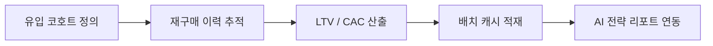

**문제**
- 선착순 이벤트로 유입된 고객의 단기 전환 성과를 넘어, 마케팅 투자가 장기 수익성(LTV)으로 이어지는지 판단할 수 있는 정량적 지표 부재.
- 유입 고객별 재구매 이력을 대시보드 조회 시마다 실시간으로 집계하는 방식은 쿼리 비용과 서비스 가용성 모두 문제.
- 30일/90일/365일 단위의 생애 가치 성장을 시계열로 가공하는 프로세스 부재.

**해결**
- 실시간 집계는 서비스 DB에 부하를 주므로 Read Replica 분리를 검토했으나, LTV 코호트 집계 자체가 전체 구매 이력을 스캔하는 무거운 쿼리라 분리된 읽기 전용 인스턴스에서도 서비스에 영향을 줄 수 있다고 판단 → 서비스 트래픽이 없는 새벽 시간대에 실행하는 **일 단위 배치** 방식으로 결정.
- 유입 시점(Cohort)을 기준으로 고객군을 그룹화하고, 기간별 누적 매출 및 획득 비용(CAC)을 자동 추적하는 **코호트 분석 엔진** 설계.
- 배치 결과를 대시보드 및 AI 에이전트(Section 10)와 연동하여 캠페인 ROI를 정량 수치 기반으로 즉각 판단할 수 있는 의사결정 보조 시스템 구성.

**결과**
- 캠페인 효율성(LTV/CAC Ratio)을 정량화하여 수익성 기반의 마케팅 예산 재분배 의사결정 지원.
- 배치 캐시 활용으로 코호트 분석 조회 시 DB 직접 집계 없이 안정적인 지표 제공 구조 확보.

---

## 12. 배치 연산 최적화: Java 집계 → SQL 오프로딩

> **배치 실행시간 68% 단축 / scanned rows 456 → 1**

선착순 이벤트로 유입된 사람들이 이후에도 구매를 이어가는지 궁금했습니다. 마케팅에서는 이를 **코호트 LTV(Lifetime Value)**로 추적합니다. 특정 시점에 첫 구매한 그룹이 이후 N개월 동안 얼마나 더 구매했는가를 시간 축으로 보는 지표입니다. 선착순 이벤트가 실제 고객을 만드는지, 당첨 후 사라지는 일회성 유입인지 판단하려면 이 분석이 필요했습니다.

직접 구현하면서 바로 풀스캔 문제에 부딪혔습니다.

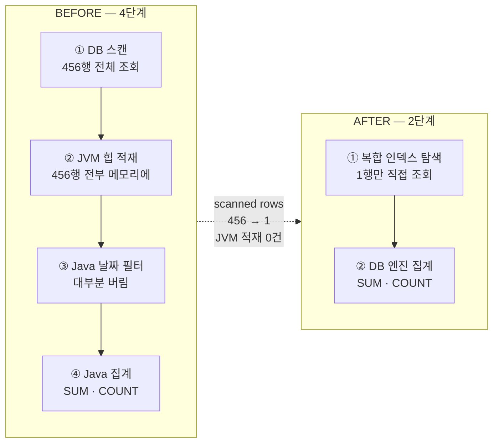

**문제**
- 코호트별 LTV(고객 생애 가치) 배치 계산 시, `findByUserIdIn()`으로 `user_id` 단일 인덱스 기준 전체 구매 이력을 JVM 메모리에 올린 뒤 Java for-loop에서 30일/90일/365일 기간 필터와 매출 집계를 직접 수행
- 복합 인덱스 `(user_id, purchase_at)`가 구성되어 있었지만, 날짜 조건(`purchase_at BETWEEN`)이 Java 레이어에서만 적용되어 인덱스의 두 번째 컬럼이 제대로 활용되지 않는 구조
- 코호트 크기가 클수록 전체 구매 이력이 JVM 힙에 상주하여 GC 압박과 메모리 사용량이 선형으로 증가

**해결**
- Java 루프 집계를 `NamedParameterJdbcTemplate` SQL 집계 쿼리로 이관
  - `SUM(price * quantity)`, `COUNT(*)`, `COUNT(DISTINCT user_id)`를 DB 엔진에서 직접 계산
  - `WHERE purchase_at >= :start AND purchase_at < :end` 조건을 SQL 레이어로 이동하여 복합 인덱스 `(user_id, purchase_at)` 풀 활용
- 증분 계산(offset > 0) 시 누적 LTV를 DB 재집계 없이 이전 달 배치 레코드 값에 이번 달 증분만 덧셈(`prevStat.getLtvCumulative().add(monthlyRevenue)`)하는 방식으로 월별 쿼리 수 최소화

**결과**
- EXPLAIN ANALYZE 기준 scanned rows 456 → 1 — 인덱스가 `user_id` 범위 필터에 이어 `purchase_at` 범위까지 풀 활용
- 배치 처리 시간 약 68% 단축 (로컬 환경 실측)
- 메모리 상주 데이터 제거로 코호트 크기 확장 시에도 JVM 힙 사용량 안정적 유지
- **한계**: 분석 범위가 구매 이력 보유 유저로 한정됨. 캠페인이 계기가 됐지만 아직 구매하지 않은 유저, 이 이벤트로 사이트를 재인지하고 이후 다른 경로로 구매한 유저는 이 코호트에 잡히지 않음. 캠페인의 실제 기여도(Attribution)는 구매 이력 너머까지 봐야 보이는 부분이 남아 있음

---

## 13. 인프라·배포: K8s 직접 운영

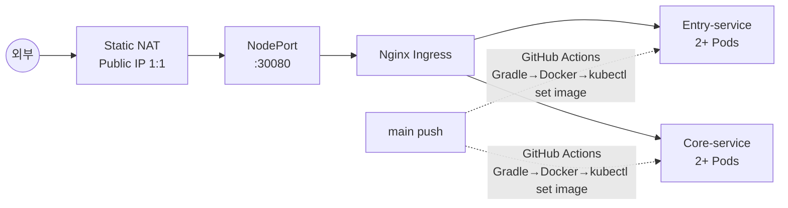

**구조적 선택: 관리형 LB 없이 NodePort + Static NAT**
- KT Cloud K2P 환경에서 관리형 LoadBalancer 서비스 대신 NodePort(30080) + Static NAT 조합으로 외부 트래픽 유입 처리.
- Worker Node 02에 Public IP를 1:1 NAT으로 고정 매핑 → `kube-proxy`가 Ingress Controller로 포워딩 → Nginx가 서비스별 라우팅(`/entry`, `/api`).
- 관리형 LB를 사용하지 않아 인프라 비용 절감, 대신 네트워크 경로와 방화벽 룰(TCP 30080)을 직접 구성·관리.

**CI/CD 파이프라인**
- `main` 브랜치 push 시 GitHub Actions 자동 트리거.
- Gradle bootJar 빌드 → Docker 이미지(커밋 SHA 태그) 빌드 & Docker Hub Push → `kubectl set image`로 클러스터 내 이미지 교체 → `rollout status`로 배포 완료 검증.
- 커밋 SHA를 이미지 태그로 사용하여 배포 버전과 코드 이력의 1:1 추적 가능.

**K8s 내부 미들웨어 연결**
- Redis: `axon-redis-master` (ClusterIP) — FCFS 카운터·캐시·트리거 중복체크
- Kafka: `axon-kafka` (KRaft, Headless) — 서비스 간 비동기 메시지 버스
- Elasticsearch: `elasticsearch-master` (Headless) — 행동 로그 적재·집계
- MySQL: AWS RDS Endpoint (외부 접속) — 캠페인·구매·유저 도메인 영속성

**결과**
- GitHub push → 클러스터 이미지 교체까지 자동화된 무중단 배포 파이프라인 구축.
- 관리형 서비스 없이 네트워크 레이어부터 직접 구성하여 K8s 클러스터 전반에 대한 실질적 운영 이해 확보.

---

## 14. CRM 루프 전주기: FCFS 모객 → 세그멘테이션 → 자동 트리거

> ⚠️ **TODO**: 외부 발송 연동(쿠폰 실제 지급, 알림 발송) 구현 완료 후 결과 수치 및 내용 보완 필요.

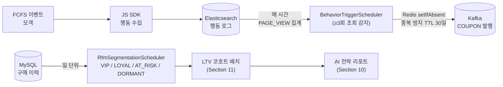

**구현 범위 (현재)**
- **RFM 세그멘테이션**: 구매 이력 기반 4단계 분류 — VIP(Recency≤30일·Frequency≥3·Monetary≥10만), LOYAL, AT_RISK, DORMANT.
- **행동 기반 트리거 감지**: ES에서 7일간 PAGE_VIEW 집계 → 임계값(3회) 초과 유저·상품 추출 → Redis `setIfAbsent`로 30일 내 중복 발급 방지 → Kafka `COUPON` 타입 메시지 발행.
- **MarketingRule DB**: `behaviorType`, `thresholdCount`, `lookbackDays`, `rewardType` 컬럼으로 룰을 DB에서 동적 관리할 수 있는 구조 설계 완료.

**TODO (미구현)**
- 쿠폰 실제 지급 및 외부 알림 발송(이메일·카카오 등) 연동
- MarketingRule 기반 동적 룰 적용 (현재 스케줄러에 하드코딩)

---

## 15. 테스트 전략: TDD 기반 레이어별 검증

> **TestContainers 3-container · 통합 / 동시성 / 단위 계층 분리 · JaCoCo 커버리지**

**통합 테스트 — 실제 인프라로 E2E 검증**
- `AbstractIntegrationTest` 베이스 클래스에 MySQL + Redis + Kafka 실제 컨테이너를 구성, `@DynamicPropertySource`로 포트를 런타임에 주입하여 로컬 환경 의존성 제거
- E2E 핵심 시나리오: 실제 Kafka 메시지 발행 → Core-service 소비 → MySQL 적재까지 전 구간 검증, 모킹 없이 실제 인프라 동작 확인 (`PurchaseFlowIntegrationTest`)
- 결제 복원력: PENDING → RESOLVED 상태 전이, Exception 삼킴 후 정상 처리 여부 검증 (`PaymentResilienceTest`)

**동시성 테스트 — 경쟁 조건 실측**
- `CountDownLatch`로 100 스레드를 동시에 출발시켜 Redisson 분산락의 Race Condition 정합성 확인 — 중복 처리 0건 검증 (`DistributedLockTest`)
- `Awaitility` 비동기 완료 대기 + 100 스레드 동시 메시지 투입으로 마이크로배치 버퍼의 소비 신뢰성 검증 (`CampaignActivityConsumerServiceTest`)

**단위 테스트 — TDD 사이클: 비즈니스 규칙 먼저 명세화**
- RFM 세그멘테이션처럼 외부 의존성이 없는 순수 비즈니스 로직은 구현 전 경계값 시나리오를 테스트 케이스로 먼저 작성하는 **Red → Green → Refactor** 사이클로 개발
- `RfmSegmentationServiceTest`: VIP/LOYAL/AT_RISK/DORMANT 분류 기준 경계값 5개 시나리오(frequency=0 edge case 포함)를 구현 이전에 명세화 — 분류 기준 변경 시 회귀 탐지 역할
- `BehaviorTriggerSchedulerTest`: ES·Redis·Kafka를 모두 Mock 처리 후 "조회 3회 달성 → 미등록 → Kafka COUPON 1회 발행" vs "이미 등록 → 발행 0회(중복 방지)" 두 시나리오로 스케줄러 부작용 격리 검증
- `CampaignControllerTest`: `standaloneSetup()`으로 Spring Security 컨텍스트 없이 컨트롤러 레이어만 격리, `ArgumentCaptor`로 서비스 호출 인자까지 검증

**정합성 검증**
- `CampaignStockSyncSchedulerTest`: Redis ghost(15건) vs MySQL 실제(10건) 불일치 상황을 의도적으로 구성 후 MySQL SSOT(단일 진실 공급원) 기준 정산 동작 검증
- JaCoCo HTML + XML 커버리지 리포트 생성 (`build.gradle` 설정)

---

# OPicnic — 독립 프로젝트 블록

OPIc AL 취득 과정에서 직접 경험한 학습 불편과 주변 학습자 피드백을 반영해 개발한 무료 모의고사 서비스.

- **서비스**: 음성 녹음 → Whisper AI STT 변환 → Gemini AI 채점·피드백의 E2E OPIc 모의고사 파이프라인. OPIc 핵심 기준 기반 채점 및 피드백, 문제 순서(묘사→경험) 데이터 레벨 보장
- **구조**: Spring Boot 3.4 (Core API) ↔ Python FastAPI (STT) ↔ Gemini (LLM) 분산 아키텍처
- **스택**: Java 21, Spring Boot, JPA, PostgreSQL, Python, Whisper AI, Gemini
- **규모**: 500 VU 기준 Peak 659 RPS (k6 실측)

---

## 1. 가상 스레드 구조 파악 + JFR 기반 I/O 병목 수사

> **RPS 96 → 652 (+580%) · Avg 1.1s → 249ms (77%↓)**

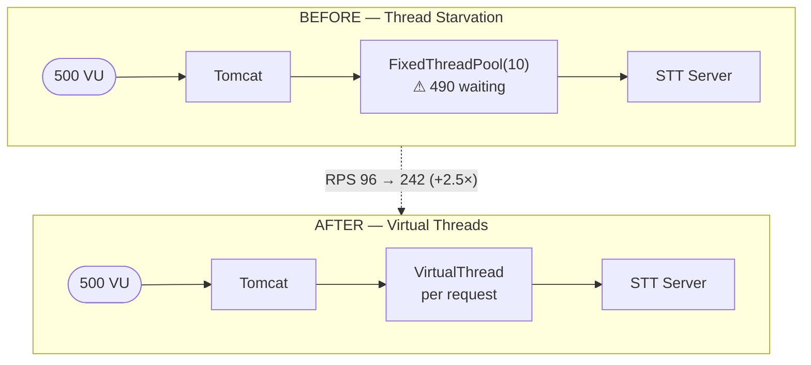

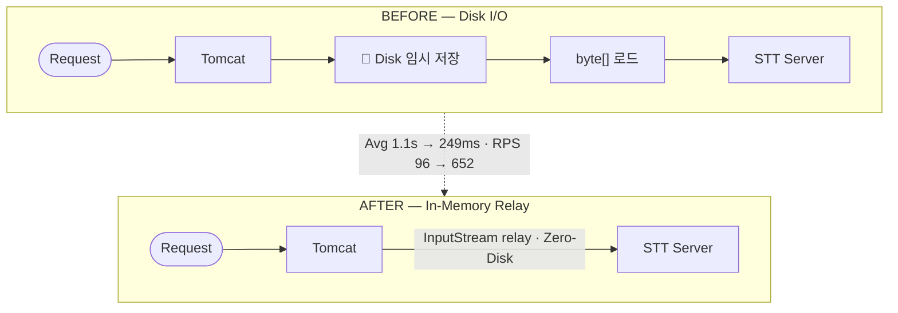

**문제**
- 초기 FixedThreadPool(10) 환경에서 외부 I/O 대기 중 플랫폼 스레드가 점유되어 50명 동시 요청만으로 서버 가용성 상실
- Java 21 Virtual Threads 도입 후에도 성능 변화 0% — Spring VT가 Tomcat 수신 스레드만 교체하고 내부 실행기(executor)는 그대로라는 구조 파악 후 `VirtualThreadPerTaskExecutor`로 교체, RPS 즉시 2.5배 향상
- 그러나 500 VU 부하 시 p95 Latency 1.1s 정체 지속 — DB 커넥션 풀 확장(10→50) 및 가상 스레드 피닝(Pinning) 추적 결과 지표 변화 0건, 원인이 다른 레이어에 있음을 확인

**해결 (가설 2회 기각 → JFR 특정)**
- **JFR(Java Flight Recorder) 프로파일링**: `jdk.ObjectAllocationSample` 분석으로 대규모 `byte[]` 할당과 Native Method 이벤트가 CPU를 점유 중임을 특정
- **병목 확정**: 톰캣 멀티파트 기본 동작(10KB 초과 시 디스크 임시 저장)에 의한 Disk I/O Wait가 핵심 원인임을 식별
- **In-Memory 처리**: `file-size-threshold` 2MB로 상향하여 1MB 오디오 데이터가 디스크를 거치지 않고 RAM에서만 처리되도록 전환; `InputStream` 직접 전달하는 구조로 개편하여 데이터 전송·처리 간 병렬성 확보

**결과**
- RPS 96 → 652 (+580%), Avg 1.1s → 249ms (77%↓)
- 가설 2회 기각 후 JFR로 실제 병목 구간을 데이터로 특정 — DB Pool 확장 등 불필요한 튜닝 리소스 낭비 방지

---

## 2. OPIc 도메인 경험이 만든 두 가지 설계 결정

> OPIc AL을 첫 시도에 취득한 경험을 가지고 있었습니다. 어떤 요소가 실제로 고득점에 기여했는지, 시험이 어떤 순서로 진행되는지를 알고 있었고, 그 경험이 서비스 설계에 직접 쓰였습니다.

**문제**
- 초기 AI 피드백은 문법 정확도·어휘 다양성 중심의 일반 영어 평가 방식 — 자격증 취득 목적의 학습자에게 실용적이지 않은 방향
- 실제 사용자 반응을 통해 파악: 대부분의 OPIc 학습자는 자격증 목적으로 학습하며, 과도한 피드백 항목이 수용을 방해함
- 랜덤 영어 질문이 아닌 OPIc 실제 시험과 같은 알고리즘의 문제 설계 필요
**해결**
- OPIc AL 취득 경험 기반으로 고득점에 실질적으로 기여한 3가지 요소를 AI 피드백 기준으로 재정의
  - **발화량**: 답변 분량과 지속 발화 길이 (AL 기준 60초+ 유창한 발화)
  - **감정표현형용사**: 서술 생동감이 평가자 인상에 직접 영향
  - **시제 일치**: 경험 서술 시 과거형 일관성 유지 (OPIc 빈출 감점 요인)
- Gemini 프롬프트를 이 3가지 기준 중심으로 재설계, Few-shot 예시로 AI 평가 일관성 확보
- 실제 OPIc 시험과 동일한 묘사→경험 출제 순서를 데이터 구조 레벨에서 강제 — 학습자가 실제 시험과 동일한 흐름으로 연습 가능

**결과**
- AI 피드백이 OPIc 시험관 채점 관점에 맞게 집중화 — 학습자가 즉시 적용할 수 있는 실용적 피드백 체계
- 실제 시험 문제를 재현한 모의고사 흐름으로 학습 효율 향상
- 개인 도메인 경험을 서비스 설계에 직접 반영 — 기능 구현을 넘어 사용자 경험 결정에 기여

---
