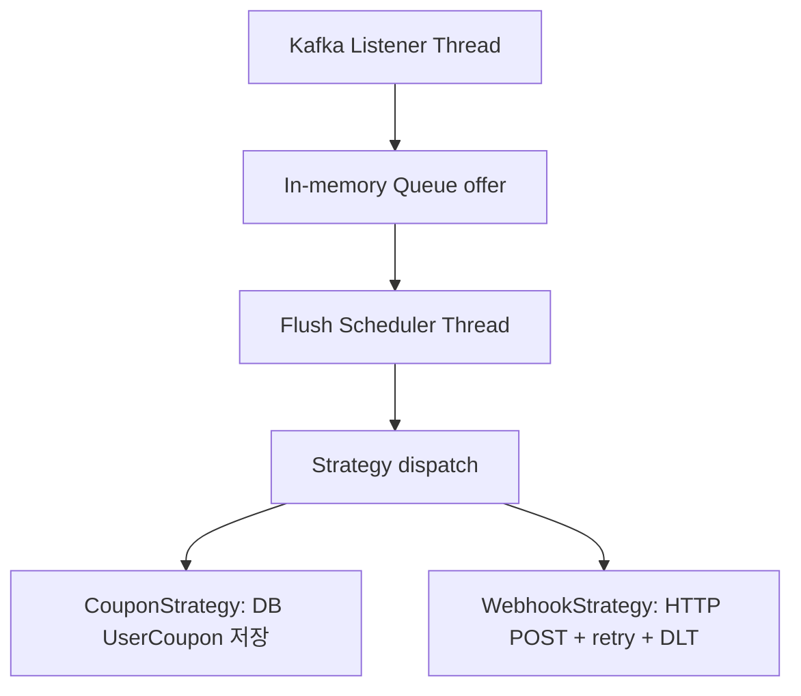
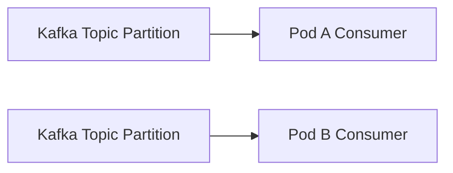
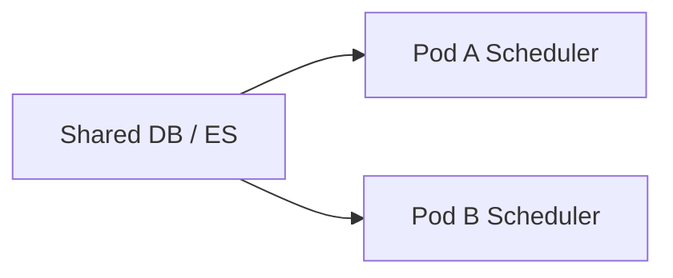
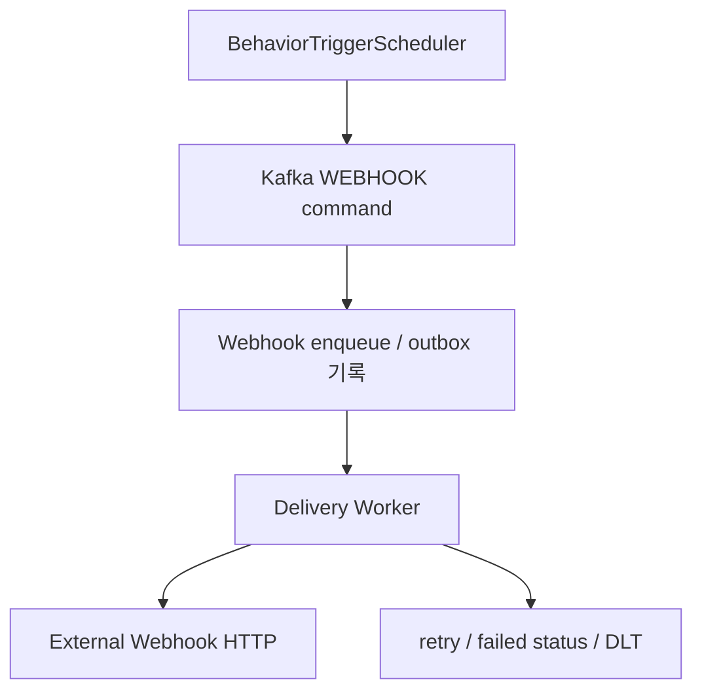
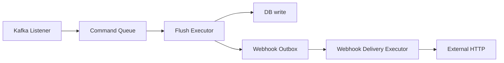

# Webhook Threading Learning Note

> Status: `reference`
>
> Purpose: webhook 고도화 논의 중 정리한 thread, virtual thread, scheduler, Kafka consumer 책임 분리 학습/회고 노트.
>
> Use: 면접/회고/학습용 개념 정리. 현재 구현 사실은 코드와 `docs/plan/2026-h2-portfolio-hardening-roadmap.md`를 우선한다.

## 1. 왜 이 얘기를 했나

행동 기반 트리거는 조건을 만족한 유저를 찾아 Kafka 메시지를 발행하고, Core-service consumer가 전략별 처리를 수행한다.

현재 webhook 확장은 다음 정도까지 구현되어 있다.

- `BehaviorTriggerScheduler`는 외부 HTTP를 직접 호출하지 않고 Kafka `WEBHOOK` 메시지를 발행한다.
- `WebhookStrategy`는 consumer 처리 흐름에서 HTTP webhook을 호출한다.
- HTTP timeout, 제한된 retry, DLT 격리는 있다.

하지만 아직 완전히 분리된 delivery worker/outbox 구조는 아니다.

핵심 고민은 이거였다.

> Webhook HTTP가 느려지면 Kafka command flush/strategy 처리 흐름까지 느려지는가?

답은 "그럴 수 있다"이다. 그래서 thread 개수를 늘리는 문제보다 먼저, 책임을 어디서 끊을지가 중요하다.

## 2. 용어 정리

### OS Thread

운영체제가 실제로 스케줄링하는 thread다.

- 생성 비용이 크다.
- blocking I/O 중이면 해당 OS thread가 대기 상태가 된다.
- traditional Spring MVC/Tomcat 환경의 request thread, scheduler thread, executor thread는 기본적으로 OS thread 위에서 동작한다.

### Java Platform Thread

일반적인 Java `Thread`다. 대부분 OS thread와 1:1에 가깝게 매핑된다.

Spring `@Scheduled`, Kafka listener container thread, 일반 `ThreadPoolTaskExecutor`는 보통 platform thread를 쓴다.

### Java Virtual Thread

Java 21의 lightweight thread다.

- Java runtime이 관리한다.
- blocking I/O 대기 중이면 carrier OS thread를 반납할 수 있다.
- 많은 수의 blocking 작업을 처리할 때 유리하다.
- 하지만 작업의 책임 경계를 자동으로 분리해주지는 않는다.

### Carrier Thread

Virtual thread를 실제로 실행하는 OS thread다.

Virtual thread가 CPU 작업을 수행할 때는 carrier thread 위에서 실행된다. blocking I/O 대기 중에는 carrier를 놓을 수 있지만, 그렇다고 "같은 logical 작업이 끝난 것"은 아니다.

## 3. 가장 헷갈렸던 지점

질문:

> 가상스레드는 오래 걸리면 다른 일을 한다는데, 그러면 flush를 virtual thread로 바꾸면 webhook 지연 문제가 없어지는 것 아닌가?

정리:

- Virtual thread는 blocking 중 carrier thread를 다른 virtual thread에게 양보할 수 있다.
- 하지만 `flushBatch()`라는 logical 작업 자체가 끝난 것은 아니다.
- `flushBatch()` 안에서 webhook HTTP까지 수행하면, 그 flush 작업은 webhook 완료/실패/DLT까지 기다려야 다음 단계로 넘어간다.
- 즉, virtual thread는 "기다리는 동안 OS thread 낭비"를 줄일 수 있지만, "flush 책임이 webhook 책임과 섞인 문제"를 해결하지는 못한다.

핵심:

> Thread model은 자원 사용 방식을 바꾸고, architecture boundary는 장애 전파 범위를 바꾼다.

둘은 다른 문제다.

## 4. 현재 흐름을 단순화하면

여기서 문제는 `Flush Scheduler Thread`가 전략 처리까지 포함하면, 느린 전략이 빠른 전략에도 영향을 줄 수 있다는 점이다.

예를 들어:

- Coupon은 DB 저장만 하면 빠르게 끝날 수 있다.
- Webhook은 외부 HTTP timeout/retry 때문에 느려질 수 있다.
- 둘이 같은 flush/strategy 처리 흐름에 있으면 webhook 지연이 전체 command 처리 지연으로 번질 수 있다.

## 5. Kafka consumer group과 scheduler는 다른 문제

Kafka consumer는 consumer group이 partition ownership을 나눠준다.

같은 group 안에서는 하나의 partition을 동시에 여러 consumer가 읽지 않는다.

반면 Spring `@Scheduled`는 다르다.

멀티파드에서 같은 scheduler bean이 모두 뜨면 각 pod가 같은 DB/ES 상태를 동시에 볼 수 있다.

따라서:

- Kafka 메시지 소비 중복은 consumer group과 DB unique key 관점으로 본다.
- 전역 scheduler 중복 실행은 distributed lock, single-runner, leader election 같은 별도 통제로 본다.

## 6. Webhook에서 진짜 분리해야 하는 것

Webhook은 외부 시스템이다.

외부 시스템은 내부 DB보다 더 느리거나 불안정할 수 있다.

- timeout
- 5xx
- 네트워크 지연
- 수신자 중복 처리 불명확
- retry 중 thread 점유

따라서 "Kafka command 처리"와 "외부 HTTP delivery"를 분리하는 게 더 좋은 구조다.

이 구조에서는 Kafka command 처리 흐름이 "delivery 요청을 남기는 것"까지만 책임지고 끝난다.

외부 HTTP는 별도 worker가 처리한다.

## 7. 왜 outbox/worker가 더 낫나

직접 HTTP 호출:

- 구현은 단순하다.
- 하지만 외부 HTTP 지연이 consumer 처리 시간을 잡아먹는다.
- retry가 길어지면 정상 command flush에도 영향을 줄 수 있다.

Outbox/worker:

- 구현은 더 복잡하다.
- delivery 상태를 DB에 남길 수 있다.
- retry 정책과 worker thread pool을 별도로 조절할 수 있다.
- 실패 건을 운영자가 조회하고 재처리하기 쉽다.

정리:

> 외부 시스템 호출은 내부 트랜잭션/consumer path에 직접 붙이기보다 delivery job으로 분리하는 게 운영적으로 낫다.

## 8. Thread Pool 관점

책임을 나누면 executor도 나눌 수 있다.

각 executor의 성격:

- Kafka listener: 메시지를 받아 내부 queue에 넣고 빠르게 반환.
- Flush executor: 내부 DB write, outbox 기록처럼 bounded한 내부 작업 처리.
- Webhook delivery executor: 외부 HTTP blocking I/O 처리. 여기에는 virtual thread를 고려할 수 있음.

## 9. Virtual Thread를 어디에 쓰면 좋은가

좋은 후보:

- 외부 HTTP 호출
- 파일 I/O
- blocking DB call이 많지만 thread-per-task 모델이 필요한 worker
- latency는 길고 CPU 사용은 낮은 작업

이번 webhook 맥락에서는:

- `WebhookDeliveryWorker`를 별도로 만들고
- worker가 외부 HTTP를 호출하며
- 각 delivery task를 virtual thread로 처리하는 구조가 자연스럽다.

주의:

- virtual thread를 Kafka listener나 scheduler 전체에 무작정 적용하는 것은 핵심 해결책이 아니다.
- CPU 작업이 많거나 synchronized/pinning 이슈가 있으면 장점이 줄 수 있다.
- concurrency limit 없이 많이 띄우면 외부 시스템이나 DB를 때려서 다른 병목을 만들 수 있다.

## 10. 결론

이번 논의의 핵심은 "thread를 늘리자"가 아니다.

정확한 결론:

1. Kafka listener는 빠르게 받아서 내부 queue에 넣고 반환한다.
2. Flush는 내부 DB write/outbox 기록 같은 bounded 작업만 담당하게 한다.
3. 외부 HTTP webhook delivery는 별도 worker로 분리한다.
4. Virtual thread는 외부 HTTP worker에 선택적으로 적용한다.
5. Scheduler 중복 실행과 Kafka consumer 중복 처리는 다른 문제로 구분한다.

면접/회고에서 말할 수 있는 표현:

> 처음에는 virtual thread를 쓰면 blocking 문제가 해결된다고 생각했지만, 실제로는 thread model보다 책임 경계가 먼저였습니다. Virtual thread는 외부 HTTP 대기 중 OS thread 낭비를 줄일 수 있지만, webhook 호출이 Kafka flush 경로 안에 있으면 logical 작업 지연은 그대로 남습니다. 그래서 Kafka command 처리와 외부 delivery를 outbox/worker로 분리하는 방향이 더 적절하다고 판단했습니다.

## 11. 현재 코드와의 경계

현재 코드에서 구현된 것:

- Webhook message type
- Webhook strategy
- HTTP timeout
- retry
- DLT 격리
- idempotency key 포함

아직 구현하지 않은 것:

- Webhook outbox table
- 별도 delivery worker
- delivery status/admin endpoint
- virtual-thread 기반 webhook worker
- 외부 수신 시스템의 end-to-end idempotency 검증

따라서 포트폴리오에서 과장하면 안 되는 표현:

- "외부 연동 플랫폼 완성"
- "운영급 webhook delivery system"
- "virtual thread로 webhook 병목 해결 완료"
- "end-to-end exactly-once webhook 보장"

표현 가능한 범위:

- "외부 HTTP 호출을 내부 트리거 배치에서 직접 수행하지 않고 Kafka 전략으로 분리했다."
- "timeout/retry/DLT/idempotency key로 실패 격리의 최소 경계를 만들었다."
- "향후 outbox/worker로 분리하면 외부 장애가 command flush에 미치는 영향을 더 줄일 수 있다고 판단했다."
