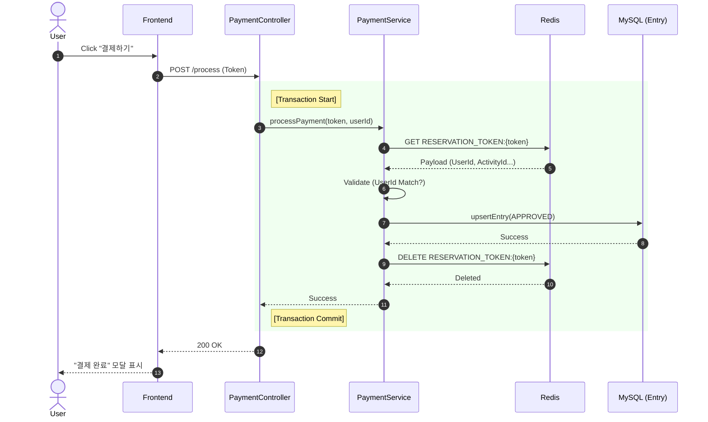
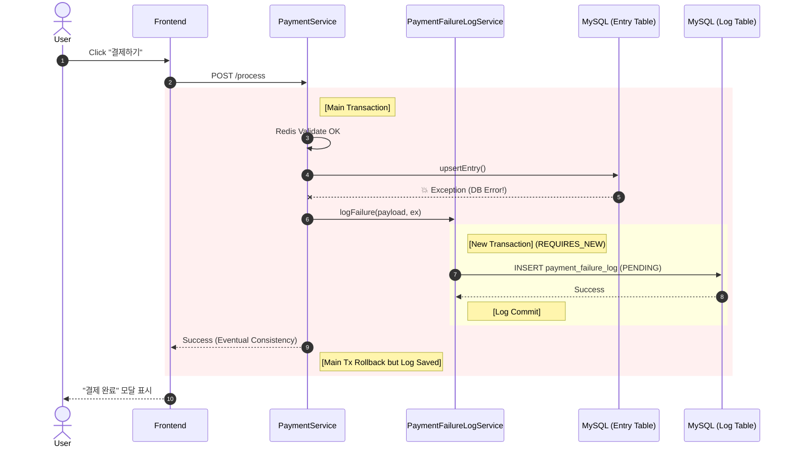
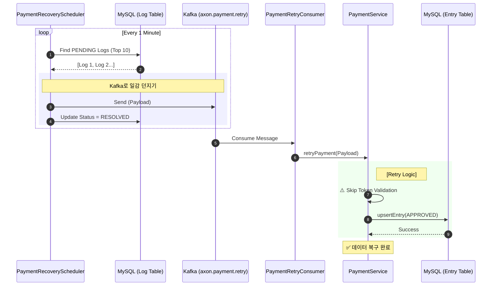
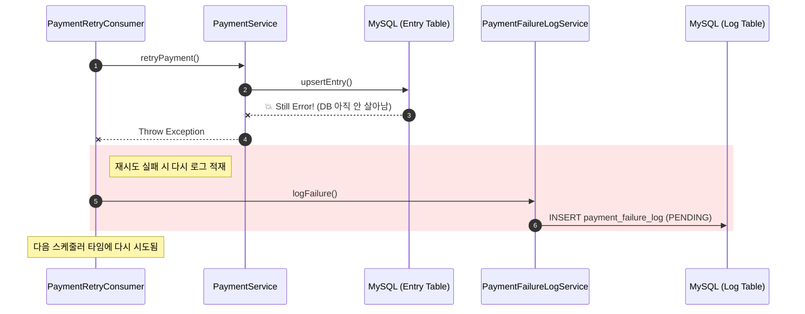

# Payment & Resilience Flow Scenarios

> **문서 목적**: 결제 시스템의 정상 처리 및 장애 발생 시 복구 흐름을 시나리오별로 상세 도식화.

---

## 1. Scenario: Normal Payment (Happy Path)
사용자가 결제를 요청하고, 시스템이 정상적으로 DB에 저장하는 가장 이상적인 흐름입니다.

---

## 2. Scenario: Database Failure (Fail Path)
결제 검증은 통과했으나, DB 저장 시점(`upsertEntry`)에 예기치 못한 오류(Connection Timeout, Deadlock 등)가 발생한 상황입니다.
이때 **시스템은 에러를 반환하지만, 내부적으로는 '실패 로그'를 남겨두어야 합니다.**

---

## 3. Scenario: Auto Recovery (Recovery Path)
실패한 결제 건을 스케줄러가 감지하여 **Kafka를 통해 비동기로 재처리**하는 과정입니다. 사용자는 이미 에러를 봤지만, 시스템이 뒷단에서 데이터를 맞춰줍니다(Eventual Consistency).

---

## 4. Scenario: Retry Failure (Recursive Fail)
재시도를 했는데도 또 실패하는 경우입니다. (예: DB 장애가 1분 이상 지속됨)
이 경우 다시 실패 로그를 쌓아 다음 스케줄러가 처리하게 합니다.

