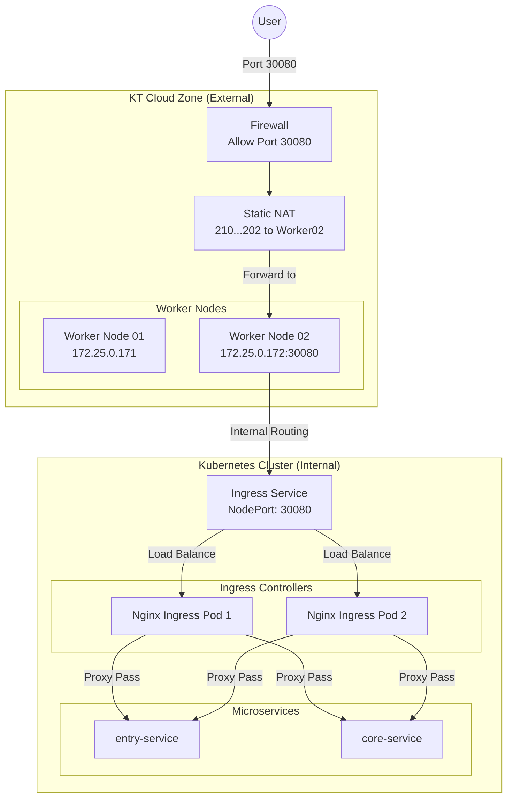

# 🌐 Axon Cloud Network Architecture (KT Cloud K2P)

## 1. External Access Flow (NodePort)
외부 사용자가 도메인(`axon.com`, `nip.io`)을 통해 서비스에 접속하는 경로입니다.

### 📍 Key Components
*   **Public IP:** `210.104.76.202` (Static NAT to Worker 02)
*   **Access URL:** `http://210.104.76.202.nip.io:30080/`
*   **Ingress Controller:** Nginx (NodePort Mode)

### 🌊 Traffic Flow
1.  **User Request**
    *   User accesses `http://210.104.76.202.nip.io:30080/`
    *   DNS resolves to `210.104.76.202`.

2.  **KT Cloud Network (Static NAT)**
    *   **Static NAT:** Public IP `210.104.76.202` is mapped 1:1 to Worker Node 02 (`172.25.0.172`).
    *   **Firewall:** Rule #93 allows TCP traffic on port `30080`.
    *   Traffic is forwarded directly to Worker Node 02's `eth0` interface on port `30080`.

3.  **Worker Node 02 (K8s Service)**
    *   `kube-proxy` listens on port `30080`.
    *   It forwards the packet to the **Ingress Controller Service**.
    *   **Load Balancing:** Due to `externalTrafficPolicy: Cluster`, traffic is distributed to Ingress Pods running on both `worker01` and `worker02`.

4.  **Ingress Controller (Nginx)**
    *   Nginx receives the request.
    *   **Routing:** Based on the path (`/entry`, `/api`), it proxies the request to the corresponding backend ClusterIP Service (`entry-service`, `core-service`).

---

## 2. Network Diagram

## 3. Internal Communication
*   **App -> Middleware:**
    *   **Redis:** `axon-redis-master` (ClusterIP)
    *   **Kafka:** `axon-kafka` (KRaft, Headless)
    *   **Elasticsearch:** `elasticsearch-master` (Headless)
*   **App -> External:**
    *   **MySQL:** AWS RDS Endpoint (Public Access)
